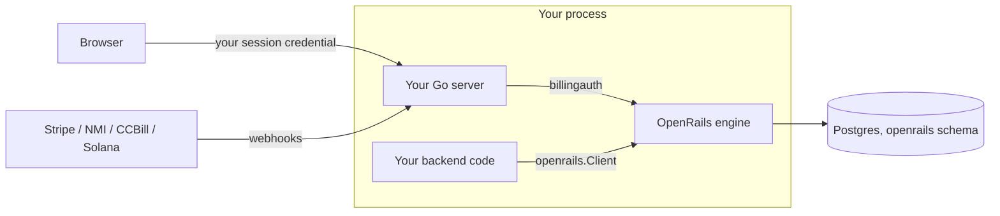

# Embedding OpenRails in your Go server

The full guide to running the OpenRails billing engine in-process. The README's
"Embedded Mode: How To Integrate" is the quickstart; this covers the depth it skips.
All money amounts are **micros** (millionths of a currency unit). Vocabulary: a
**rail** is a gateway kind (`nmi` / `ccbill` / `stripe` / `solana`); a **PSP** is your
concrete account on a rail (e.g. `mobius` on nmi).

### 1. What embedding means

Your Go binary imports the engine and runs it in-process: no second service, no
network hop, no second credential. Concretely:

- The engine owns the `openrails` schema inside **your** Postgres database.
- Its HTTP routes mount on **your** mux under a prefix you choose; your users call
  them with their normal session credential.
- Your backend calls the engine through `rt.Client()` — the **same**
  `openrails.Client` interface a standalone consumer gets from `openrails.NewRemote`.
  Parity is structural: one client implementation, one handler surface, joined by an
  in-process `http.RoundTripper` instead of a socket (enforced by a dual-mode
  conformance test).
- One embedded engine serves **one merchant** (#770).



### 2. Install and migrations

```bash
go get github.com/open-rails/openrails
```

Migrations ship in the module as an embedded FS. Apply them from your own migration
step with [migratekit](https://github.com/open-rails/migratekit):

```go
import (
    "github.com/open-rails/openrails/config"
    postgresmigrations "github.com/open-rails/openrails/migrations/postgres"
)

migratekit.MigrationSource{
    App:    config.MigratekitApp, // tracking key "openrails"
    FS:     postgresmigrations.FS,
    Schema: "openrails",
}
```

The engine never runs migrations itself — it validates the tracking key at boot and
refuses to start if any migration is missing.

### 3. Config

Embedded mode never runs `config.Load` — you build `*config.Config` programmatically.
Start from `config.GetDefaultBillingConfig()` (seeds dev DB/Redis endpoints, logger,
curated `RateLimits`, and `Captcha`), then set your own values. Construction refuses
to boot unless you declare posture explicitly (#745):

| Field | Required | Meaning |
|---|---|---|
| `Env` | yes | `"development"` / `"staging"` / `"production"`. Empty errors — an empty Env reads as dev and would silently disable hard gates (RLS, secret encryption). |
| `TestMode` | yes | `config.CredentialPostureSandbox` or `config.CredentialPostureLive`. The zero value is UNSET and rejected — it can never silently mean "live". |
| `ProviderWriteMode` | recommended | `config.ProviderWriteModeFull` etc.; unset fail-closes to readonly. |
| `MerchantSource` | defaults to `config.MerchantSourceManifest` | Mode 1 (manifest-is-truth, secrets in memory, reboot to change) vs `MerchantSourceAPI` (mode 2: provision via HTTP APIs + persistent secret store). |
| `DB` | yes | Schema defaults to `openrails`. |

Under `TestMode = sandbox` every rail routes to its test environment and live
credentials refuse to boot — no real money can move. NMI accounts get an arm-time
probe: a conclusively-live gateway is refused under sandbox (a probe error only
warns). See [operations.md](operations.md).

**Rate limiting is on by default** (#742): if you leave `RateLimits`/`Captcha` nil,
`embedded.New` seeds the same curated defaults `config.Load` applies — per-IP and
per-authenticated-user buckets, tight on checkout (10/min) to deter card-testing,
Redis-backed when `Redis` is set, in-memory otherwise. Override `cfg.RateLimits`, or
set `cfg.RateLimitsDisabled = true` if your own gateway fronts billing. See
[rate-limiting.md](rate-limiting.md).

### 4. Boot

```go
import (
    "github.com/open-rails/openrails/config"
    "github.com/open-rails/openrails/embed"
    "github.com/open-rails/openrails/pkg/embedded"
)

rt, err := embed.New(ctx, embed.Options{
    Options: embedded.Options{
        Config:  cfg,
        PGXPool: pool, // share your app's pgx/v5 pool; nil = engine opens its own from Config.DB
        Redis:   rdb,  // optional — Redis-backed rate limits; omit for in-memory
    },
    RunWorkers: true,
})
if err != nil { log.Fatal(err) }
defer rt.Close(ctx)
```

| Option | Type | Notes |
|---|---|---|
| `Config` | `*config.Config` | Required. |
| `PGXPool` | `*pgxpool.Pool` | Host-supplied pool (pgx/v5). |
| `Redis` | `*redis.Client` | Optional (rate limits, admission holds). |
| `Cache` | `cache.Cache` | Optional cache override. |
| `RunWorkers` | `bool` | Runs the River background workers (renewals, dunning, credit/hold expiry, reconciliation) on a Runtime-owned goroutine, detached from the ctx you pass to `New` — `Close` stops them. Leave false to drive `rt.RunWorkers(ctx)` yourself. |
| `embed.WithAdminConsole(fs.FS)` | variadic `embed.Option` | Host-built admin console SPA (see §6). |

**Runtime surface**: `rt.Client()` (unified SDK client), `rt.Service()` (engine-native
facade, typed IDs), `rt.Embedded()` (the underlying `*embedded.Embedded` for advanced
wiring), `rt.ActiveRouteSets()` (route groups of the mounted surface),
`rt.RunWorkers(ctx)`, `rt.Close(ctx)`.

**Shared-River pattern** (advanced): a host that already runs its own
[River](https://riverqueue.com) client keeps `RunWorkers: false` and folds OpenRails'
workers + periodic jobs into it — one client, one `public.river_*` table set (River
tables always live in `public`, never the billing schema):

```go
emb := rt.Embedded()
workers := river.NewWorkers()
river.AddWorkerSafely(workers, &MyAppWorker{})
periodic, register, err := embedded.FoldIntoRiver(ctx, emb, workers)

client, err := river.NewClient(driver, &river.Config{
    Workers:    workers,
    Middleware: []rivertype.Middleware{emb.WorkerMiddleware()}, // worker-health rows
    Queues: map[string]river.QueueConfig{
        river.QueueDefault:    {MaxWorkers: 10},
        embedded.QueueBilling: {MaxWorkers: 5}, // MUST be configured or billing jobs never drain
    },
})
if err := register(client); err != nil { ... } // adds periodic jobs + SetRiverClient
client.Start(ctx)
```

Once injected, OpenRails enqueues through your client and never builds its own;
`RunWorkers` becomes a no-op. The three-call form
(`AddWorkersTo` / `GetPeriodicJobs` / `SetRiverClient`) exists for hosts that need
finer control.

### 5. Declaring the merchant

Idempotent — call on every boot: create-if-missing, reconcile-if-present. The first
upsert binds the engine to the merchant; a later call with a different slug errors.
Real fields (`embed.MerchantConfig` aliases `internal/bootstrap.MerchantConfig`;
same shape as `config/merchants_config.example.yaml`):

```go
mid, err := rt.UpsertMerchantConfig(ctx, "myapp", embed.MerchantConfig{
    DisplayName: "My App",
    Profile: embed.MerchantProfileConfig{
        DisplayName: "My App Billing",
        FromEmail:   "billing@myapp.example",
        SupportURL:  "https://myapp.example/support",
    },
    Invoice: &embed.InvoiceConfig{ // optional; amounts in micros
        BillingPeriodBoundary: "calendar_month",
    },
    PSPs: map[string]embed.PSPConfig{ // PSP key -> rail -> account
        "my-nmi-sandbox": {
            "nmi": embed.ProviderRailAccountConfig{
                Environment: "test", // assertion, cross-checked against TestMode
                AccountID:   "000000", // NMI dashboard "Gateway ID"
                Settings: map[string]any{ // non-secret knobs
                    "tokenization_url": "https://secure.networkmerchants.com/token/Collect.js",
                    "tokenization_key": "placeholder-tokenization-key",
                },
                Secrets: map[string]string{
                    "security_key":           "placeholder-security-key",
                    "webhook_signing_secret": "placeholder-webhook-secret",
                },
            },
        },
    },
})
```

Semantics by mode:

- **Mode 1 (`merchant_source=manifest`, the default)**: this call IS the manifest —
  it steamrolls the DB projections and seeds secrets into the runtime's **in-memory**
  plane (never a persistent store) on every run, then arms checkout/vault/webhooks
  immediately. Change credentials = change the config + reboot.
- **Mode 2 (`merchant_source=api`)**: a manifest-shaped upsert (PSPs, profile,
  invoice, remote-application trust) refuses loudly — two truths. Only a bare
  identity bind (slug + top-level `DisplayName`) is legal; provision providers via
  `PUT /v1/merchant/payment-providers` and the catalog APIs instead.

YAML-first hosts can keep the merchant in a file: `embed.ParseMerchantConfig` (one
merchant, strict — unknown fields rejected) or `embed.LoadMerchantConfigManifest`
(multi-merchant manifest + `BILLING_MERCHANTS_*` env overlays, so committed files
hold placeholders and real secrets arrive from the environment).

**Catalog push at boot**: products/prices/entitlements converge from a catalog
manifest via `embedded.PushMerchantCatalog`:

```go
err := embedded.PushMerchantCatalog(ctx, embedded.CatalogPushOptions{
    Config:   cfg,
    PGXPool:  pool,
    Manifest: catalogYAML, // or File: "catalog.yaml"
    Insert:   true,        // zero mutation flags = plan-only
})
```

In mode 1 a mutating push always upgrades to full converge (insert+overwrite+prune —
the YAML is the truth); in mode 2 a mutating push refuses (plan-only diff stays
legal). The manifest is `version: 1` + `catalogs: [{merchant, tier_groups, products,
meters, credit_balances, usage_limits}]`.

### 6. Mounting HTTP

OpenRails never parses your credentials. You implement two small `pkg/billingauth`
interfaces over whatever auth you already have:

- `billingauth.Authenticator` → `UserContext` for checkout/user routes. `UserID` is
  **required and MUST be a UUID** (it becomes the payable customer_id; non-UUID
  subjects 401 on required routes and silently downgrade to anonymous on optional
  ones — map non-UUID native ids to a stable UUID). Optional metadata: `Email`,
  `EmailVerified`, `Username`, `Roles`, `Entitlements`, `Merchant`/`MerchantRoles`.
  Adapt closures with `billingauth.AuthenticatorFunc`.
- `billingauth.DelegatedAuthenticator` → `*billingauth.DelegatedPrincipal` for
  `/v1/me/*` and `/v1/customers/*`. `MerchantID` and `SubjectID` are required —
  explicit mapping, no fallbacks, fail-closed 401. Optional: `MerchantSlug`,
  `Issuer` (audit), `Permissions` (trusted verbatim for in-process hosts — grant
  only what you mean), contact metadata. Adapt with
  `billingauth.DelegatedAuthenticatorFunc`.
- `billingauth.Gate` (merchant-admin routes only): `Authorize(ctx, r, permission)
  (Principal, error)` — checks a live `merchant:*` permission per request.

Mount everything as one framework-neutral `net/http` handler (gin hosts use
`gin.WrapH`, chi `Mount`, …):

```go
handler, err := embedded.MountHandler(rt.Embedded(), embedded.MountOptions{
    MountPrefix:            "/billing", // routes arrive at /billing/v1/*
    Authenticator:          myAuth,
    DelegatedAuthenticator: myDelegatedAuth,
    // RouteSets: nil,      // = EmbeddedDefaultRouteSets
    // Gate:                // required for RouteSetMerchantAdmin
    // ProviderRoutes:      // *embedded.ProviderRoutes{StripePortal, Solana, Webhooks} — nil derives from armed accounts
})
mux.Handle("/billing/", handler)
```

| RouteSet | Mounts | Default? |
|---|---|---|
| `RouteSetCheckout` | Buyer-facing products, prices, config, checkout | yes |
| `RouteSetCustomer` | `/v1/me/*` self-service + `/v1/customers/:id/*` treasury | yes |
| `RouteSetMerchantAdmin` | Human merchant-admin customer/support routes | yes |
| `RouteSetCatalog` | Merchant catalog routes | yes |
| `RouteSetWebhooks` | Merchant-scoped inbound rail webhooks | yes |
| `RouteSetPaymentProviders` | Provider config + secret routes | opt-in |
| `RouteSetMerchantAPI` | The standalone service/API-key surface (`/v1/merchant/*` over the wire) — most embedded hosts use `Client()` instead | opt-in |

Admin routes **fail closed**: without a `Gate` and an attached control plane
(`pkg/embedded/controlplane.Attach(ctx, rt.Embedded().App(), cfg, pool)` for
AuthKit-backed hosts), omit `RouteSetMerchantAdmin` and run admin operations through
the in-process client.

**Admin console** (optional, #754): the engine ships zero frontend bytes. The host
builds the SPA (`scripts/build-admin-console.sh` from the module cache into a
gitignored `dist`, wrapped in a 3-line `//go:embed all:dist` package) and passes it
via `embed.WithAdminConsole(sub)`; gate mounting on `admin_console.enabled`. See
[admin-console.md](admin-console.md).

### 7. Calling the engine

```go
client := rt.Client()
ctx = openrails.WithMerchant(ctx, mid) // per-call pin; must agree with the bound merchant
if err := openrails.Verify(ctx, client); err != nil { log.Fatal(err) } // fail fast at boot
```

The `openrails.Client` interface, grouped by job:

| Group | Methods |
|---|---|
| Admission (hot path) | `AdmitBatch`, `Capture`, `Release`, `GetTrustLevel`, `ReportWastedSpend` |
| Usage | `RecordUsage` (metered events outside the hold/capture cycle) |
| Policy | `GetMerchantSettings`, `SetMerchantSettings`, `SetCustomerSpendDelegations`, `SetCustomerSpendDelegation` |
| Funding / reporting | `DepositCredits`, `SetCreditLimit`, `GetCreditLimit`, `UsageRollup`, `ResourceRevenueDaily` |
| Lookups / entitlements | `Balance`, `GetCreditAccount`, `ListActiveEntitlements`, `ListEntitlements`, `HasEntitlement`, `ListCustomersWithEntitlement`, `ListProductAccess`, `HasProductAccess` |

```go
verdicts, err := client.AdmitBatch(ctx, []openrails.AdmitRequest{{
    CustomerID:      customerID,
    Invoker:         userID,
    EstimatedAmount: 50_000,    // micros
    RequestID:       requestID, // idempotency key
}})
err = client.Capture(ctx, requestID, 43_000, &openrails.CaptureUsage{EventType: "chat.completion"})
ents, err := client.ListActiveEntitlements(ctx, []string{userID}, time.Now())
```

Entitlement lookups address subjects by the ids your auth system already holds
(self-service users are keyed under `openrails.SelfIssuer`); a user who never touched
billing is an empty slice, never an error. Deny verdicts are `(Allowed=false, nil
error)`.

Extras: the embedded client always implements `embed.SingleAdmitter` (single `Admit`,
no wire counterpart) — reach it via type assertion. `embed.WithCurrency` /
`embed.WithRemoteOptions` tune the client (in-process calls have no default deadline;
opt one back in with `openrails.WithTimeout`). `rt.Service()` is the escape hatch for
engine-native types (`identity.CustomerID` etc.) instead of wire types.

### 8. Webhooks and ops

Point each rail's webhook at the webhook routes on **your** server, under your mount
prefix (paths in [api/endpoints.md](api/endpoints.md)). OpenRails verifies rail
signatures and updates subscriptions/entitlements; your app just reads the results.
Local rail sandboxes: [dev/local-webhooks.md](dev/local-webhooks.md).

Further reading: [operations.md](operations.md) (operating modes, safety levers,
dunning, the intents ledger), [rate-limiting.md](rate-limiting.md),
[auth.md](auth.md) (the full one-credential-per-trust-domain rationale),
[self-hosting-mode1.md](self-hosting-mode1.md).
