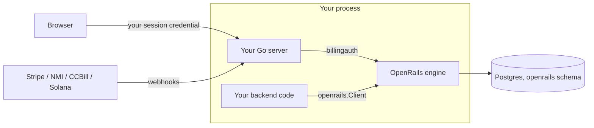

# Embedding OpenRails in your Go server

The full guide to running the OpenRails billing engine in-process;
`examples/embedded` is the runnable quickstart. Money is an integer in the
currency's native units (`GET /v1/currencies`; micros for USD), a decimal string
on the wire ([money-wire.md](money-wire.md)). Vocabulary: a
**rail** is a gateway kind (`nmi` / `ccbill` / `stripe` / `solana`); a **PSP** is your
concrete account on a rail (e.g. `mobius` on nmi).

### 1. What embedding means

Your Go binary imports the engine and runs it in-process: no second service, no
network hop, no second credential. Concretely:

- The engine owns a configurable schema, defaulting to `billing`, inside **your** Postgres database.
- Its HTTP routes mount on **your** mux under a prefix you choose; your users call
  them with their normal session credential.
- Your backend calls the engine through `rt.Client()` — the **same**
  `*openrails.Client` a standalone consumer gets from `openrails.NewRemote`.
  Parity is structural: one client implementation, one handler surface, joined by an
  in-process `http.RoundTripper` instead of a socket (enforced by a dual-mode
  conformance test).
- A runtime constructed with `Options.Merchant` is restricted to that merchant.
  An unrestricted multi-merchant runtime (`examples/multimerchant`) can reuse one
  Client: `WithDefaultMerchant` supplies an immutable default, while each operation
  can select a slug with `WithMerchant` or a stable ID with `ForMerchantID`.
  Selection never grants authority or overrides a runtime restriction.



### 2. Install and migrations

```bash
go get github.com/open-rails/openrails
```

OpenRails owns its migration source and applies it through one explicit
initialization call. Your application supplies a pool that can create its schema
and objects; it does not import migratekit or OpenRails' migration
files:

```go
if err := embed.ApplyMigrations(ctx, appPool, embed.MigrationOptions{}); err != nil {
    return fmt.Errorf("initialize OpenRails database: %w", err)
}
```

Initialize AuthKit separately through AuthKit's own embedded migration API.
`embed.ApplyMigrations` applies OpenRails' billing chain and the River chain
used by `RiverManagedByOpenRails`, in the order OpenRails requires. A
`RiverFromHost` integration is the explicit low-level exception: the host owns
that River client's schema and migration lifecycle. Pass the same `RiverOwnership`
value to `MigrationOptions.River` and `Options.River`; migrations never invoke
host client construction. Set `MigrationOptions.Schema` to match `cfg.DB.SchemaName()` when
using a custom billing schema.

Billing, AuthKit, application tables and River may share `public` or another
namespace. Each component must use its configured qualified tables and an
explicit ownership inventory; a schema name does not imply exclusive ownership.
OpenRails archives contain only billing-owned tables and never include live
River jobs, AuthKit identities or host records. The destructive embedded reset
command still targets only the default `billing` schema and refuses it when
foreign relations are present. It is not a shared-schema reset mechanism.

The engine validates the tracking key at boot and refuses to start if any
OpenRails migration is missing or orphaned.

OpenRails does not create or grant access to AuthKit's `profiles` schema. If
the host enables notification email or CCBill username resolution, pass its
identity adapter explicitly through `embed.Options.UserDirectory` and
`embed.Options.UsernameResolver`; leaving them unset disables those optional
lookups safely.

### 3. Config

Embedded mode never runs `config.Load` — you build `*config.Config` programmatically.
Start from `config.GetDefaultBillingConfig()` (seeds dev DB/Redis endpoints, logger,
curated `RateLimits`, and `Captcha`), then set your own values. Construction refuses
to boot unless you declare posture explicitly (#745):

| Field | Required | Meaning |
|---|---|---|
| `TestMode` | yes | `config.CredentialPostureSandbox` or `config.CredentialPostureLive`. The zero value is UNSET and rejected — it can never silently mean "live". |
| `ProviderWriteMode` | yes | `full`, `limited` (no system-initiated writes: renewals and retries wait) or `readonly` (no provider writes). Unset is rejected: it would silently stop renewals. |
| `SecretBackend` | defaults to `snapshot` | Immutable host credentials, live Vault, or encrypted database custody; independent of metadata and HTTP exposure. |
| `PublicBillingBaseURL` | when generating callbacks or links | External billing mount base, excluding `/v1`; distinct from issuer, DPoP origin and dashboard. |
| `AllowCatalogUpdates` | false | Enables ordinary product, price, catalog and metering writes and their routes, independently of provider credentials. Trusted local operator application remains available when false. |
| `DB` | yes | Schema defaults to `billing`. The injected pool can be the same owning connection used for initialization. |

#### Database ownership and optional separate runtime credentials

The simple setup uses one application login and pool. That login creates and
owns the library's objects during `ApplyMigrations`, then uses them at runtime.
Ownership already supplies access; no self-grants or library-specific roles are
required. AuthKit and a host-owned River client may share that same pool.

If your deployment separates migration and runtime credentials, pass the
existing runtime pool as `MigrationOptions{RuntimePool: appPool}` when initializing
through the migration pool. OpenRails grants its exact runtime table, column,
function and migration-ledger privileges to that pool's user. Managed River
objects are included; host-owned River access remains the host's responsibility.
The CLI exposes this optional provisioning as `--runtime-database-url`.

Merchant isolation uses verified application scope, explicit SQL predicates and
composite relationships. PostgreSQL RLS and username flags are not part of the
authorization boundary. Financial triggers protect ordinary DML invariants even
for an owner; a database owner can deliberately change or drop those guards.

Renaming an existing PostgreSQL role preserves its identity and ownership; update
the connection configuration as needed. Replacing it with a different role needs
the normal PostgreSQL ownership transfer or grants performed by your operator.
The libraries do not manage database accounts or ownership transfers.

Under `TestMode = sandbox` every rail routes to its test environment and live
credentials refuse to boot — no real money can move. NMI accounts get an arm-time
probe: a conclusively-live gateway is refused under sandbox (a probe error only
warns). See [operations.md](operations.md).

**Rate limiting is on by default** (#742): if you leave `RateLimits`/`Captcha` nil,
`embed.New` seeds the same curated defaults `config.Load` applies — per-IP and
per-authenticated-user buckets, tight on checkout (10/min) to deter card-testing,
Redis-backed when `Redis` is set, in-memory otherwise. Override `cfg.RateLimits`, or
set `cfg.RateLimitsDisabled = true` if your own gateway fronts billing. See
[rate-limiting.md](rate-limiting.md).

### 4. Boot

```go
import (
    "github.com/open-rails/openrails/config"
    "github.com/open-rails/openrails/embed"
)

rt, err := embed.New(ctx, embed.Options{
    Config:     cfg,
    PGXPool:    pool, // share your app's pgx/v5 pool; nil = engine opens its own from Config.DB
    Redis:      rdb,  // optional — Redis-backed rate limits; omit for in-memory
    RunWorkers: false, // attach optional components before constructing the worker fleet
})
if err != nil { log.Fatal(err) }
defer rt.Close(ctx)
```

| Option | Type | Notes |
|---|---|---|
| `Config` | `*config.Config` | Required. |
| `Merchant` | `*embed.MerchantDeclaration` | Optional single-merchant declaration: `Slug`, `Config`, and attribution-only `PSPs`. Reconciled before HTTP and worker startup. Obtain its ID from `Client().MerchantID()`. |
| `HTTP` | `*embed.HTTPConfig` | Leave nil for headless mode; HTTP policy is declared only at construction. A non-nil policy exposes discovery and verified provider callbacks; buyer and management capabilities are opt-in. |
| `PGXPool` | `*pgxpool.Pool` | Host-supplied pool (pgx/v5). |
| `Redis` | `*redis.Client` | Optional (rate limits, admission holds). |
| `Cache` | `cache.Cache` | Optional cache override. |
| `River` | `embed.RiverOwnership` | Defaults to managed River in `public`. `RiverManagedByOpenRails("jobs")` selects another schema; `RiverFromHost()` declares host ownership; pass `RiverJobs()` to `riverhelpers.New` after attaching components. |
| `RunWorkers` | `bool` | Managed-only. Runs the River background workers (renewals, dunning, credit/hold expiry, reconciliation) on a Runtime-owned goroutine, detached from the ctx you pass to `New` — `Close` stops them. Leave false to drive `rt.RunWorkers(ctx)` yourself. |
| `ConsoleAssets` | `fs.FS` | Host-built admin console SPA (see §6). |
| `StripeTransport` | `http.RoundTripper` | Test seam under the Stripe API choke point; refused with a live posture. |

**Runtime surface**: `rt.Client()` provides the shared application client;
`rt.HTTPRoutes()`, `rt.RiverJobs()`, readiness/progress checks,
`rt.RunWorkers(ctx)` and `rt.Close(ctx)` own process infrastructure.

Only Postgres can fail `embed.New` or `rt.Ready`. Vault login, PSP posture
checks and Redis reconnect in the background (capped full-jitter backoff,
forever); until then only their feature answers 503. Register their probes
with the host's `github.com/open-rails/helpers/deps` supervisor:

```go
for _, p := range rt.Probes() { // openrails_vault, openrails_psp_posture
	sup.Add(p.Name, deps.Optional, p.Check, nil)
}
``` Merchant
and PSP declarations belong in `Options.Merchant`. One-off manifest and restore
tooling belongs to `embed/operator.New(rt)`; the host transaction extension is
constructed with `embed.NewHostTransactions(rt)`. Storage remains internal.
Hosts that use OpenRails' own AuthKit control plane (standalone-shaped or
hosted products) attach it with `embed/controlplane`:

```go
cp, err := controlplane.Attach(ctx, rt, controlplane.Options{HostedPosture: true, EmailSender: sender})
if err != nil { return err }
handler, err := cp.Handler() // billing + AuthKit routes + admin console
if err != nil { return err }

// Start after attachment, alongside HTTP under the application's errgroup.
workers.Go(func() error { return rt.RunWorkers(ctx) })
```

Keep `RunWorkers: false` through component attachment, then supervise
`rt.RunWorkers(ctx)` alongside the HTTP server (the `workers` errgroup above).
`RunWorkers` blocks until shutdown; propagate its error through that supervisor.
The control plane adds AuthKit maintenance to the same River registry before
client construction, and attaching it after River initialization is refused.
Billing-only hosts using managed River with no optional components to attach may
use `RunWorkers: true` directly. Host-owned River refuses constructor auto-start:
attach the control plane or construct your AuthKit client before binding.

`cp` carries the operator mechanisms (`ProvisionMerchant`, directory reads,
provider configuration, fleet aggregates, retirement, `UserAuthenticator`,
`JWKSHandler`). Hosts that bring their own AuthKit never import it.

**Host-owned River**: declare ownership during migrations and construction, then
attach every component before requesting `RiverJobs()`. The neutral `helpers/river`
composer collects billing and attached control-plane workers, queues and schedules,
then constructs and binds one unstarted client. It rejects removed required
entries, duplicate workers/schedules, and repeated or closed contributions.

```go
import (
    riverhelpers "github.com/open-rails/helpers/river"
    "github.com/riverqueue/river"
)

ownership := embed.RiverFromHost()
// The host migrates and grants access to its River schema separately.
if err := embed.ApplyMigrations(ctx, adminPool, embed.MigrationOptions{River: ownership, RuntimePool: appPool}); err != nil {
    return err
}
rt, err := embed.New(ctx, embed.Options{Config: cfg, PGXPool: pool, River: ownership})
if err != nil { return err }
defer rt.Close(context.WithoutCancel(ctx))

// Attach a control plane here, or construct your own AuthKit client.
// An attached control plane contributes its AuthKit maintenance automatically.
jobs, err := riverhelpers.New(ctx, pool, &river.Config{
    Schema: "host_jobs", // host-migrated; sharing public with billing is supported
    Queues: map[string]river.QueueConfig{embed.QueueBilling: {MaxWorkers: 10}},
}, rt.RiverJobs())
// If using your own AuthKit instead of an attached control plane, include
// auth.RiverJobs() as another contribution to this same call.
if err != nil { return err }
defer jobs.StopAndCancel(context.WithoutCancel(ctx))
// With host-owned AuthKit, check auth.Start(ctx) now.
// Finish product bootstrap before starting consumers.
if err := jobs.Start(ctx); err != nil { return err }

loopsCtx, cancelLoops := context.WithCancel(ctx)
loopsDone := make(chan error, 1)
go func() { loopsDone <- rt.RunWorkers(loopsCtx) }()
// Supervise this result alongside HTTP. On shutdown:
cancelLoops()
if err := <-loopsDone; err != nil && !errors.Is(err, context.Canceled) { return err }
// Deferred cleanup stops the host client before closing the billing runtime.
// Close host AuthKit and the pool only after these consumers have joined.
```

`RunWorkers` runs core non-River loops, including the Solana Pay poller, and
blocks until cancellation; it never starts or stops the host's River client.
Always cancel and join it before stopping River and closing dependent runtimes,
identity clients and pools. `rt.CheckJobProgress(ctx)` gives the live fleet
verdict. Before binding, readiness and worker startup refuse explicitly.

Binding is one startup attempt. Double binding, late component attachment,
and closed runtimes refuse. Hosts cannot substitute an unrelated or already-started
client: construction happens after configuration validation. After a failed
binding, close and recreate the runtime. Managed River's `New → Attach → RunWorkers` order is
unchanged.

**Inserting an engine job.** OpenRails registers its own periodic jobs on the
client you return. The one job a host inserts itself is the invoice sweep:
`jobs.Insert(ctx, embed.InvoiceSweepArgs{FinalizePreviousMonth: true}, nil)`
runs the daily period finalize now (rates reported usage and issues every
payer's previous-period invoice); `Collect: true` runs the collection pass. Runs
are idempotent. Every other job kind is an engine-internal schedule and stays
private.

**No job clock.** Your `river.Config.JobTimeout` (River's default is one minute)
does not apply to OpenRails' workers: each declares `Timeout() = -1` and ends
on observed lack of progress instead — a job that reports no progress past
3× its declared cadence (floored at 30 min) is cancelled with the reason on the
job row. While a job runs it also beats `river_job.attempted_at`, so your
`RescueStuckJobsAfter` measures silence from a dead process, never the age of
a live job (a dunning pass over many merchants may legitimately outlive it).
Both need the pool you gave OpenRails to be able to write River's tables (it is
the pool River itself writes through).

### 5. Declaring the merchant

Declare the merchant at construction: create-if-missing, reconcile-if-present on
every boot. One runtime serves one declared merchant; a client cannot override its
binding. Reconstruct the runtime to change host-owned configuration.
Real fields (`embed.MerchantConfig` aliases `internal/bootstrap.MerchantConfig`;
same shape as `config/merchants_config.example.yaml`):

```go
merchantConfig := embed.MerchantConfig{
    DisplayName: "My App",
    Profile: embed.MerchantProfileConfig{
        DisplayName: "My App Billing",
        FromEmail:   "billing@myapp.example",
        SupportURL:  "https://myapp.example/support",
    },
    Invoice: &embed.InvoiceConfig{ // optional; amounts in micros
        BillingPeriodBoundary: "calendar_month",
    },
    PSPs: map[string]embed.PSPConfig{ // PSP key -> rail -> account
        "my-nmi-sandbox": {
            "nmi": embed.ProviderRailAccountConfig{
                Environment: "test", // assertion, cross-checked against TestMode
                AccountID:   "000000", // NMI dashboard "Gateway ID"
                Settings: map[string]any{ // non-secret knobs
                    "tokenization_url": "https://secure.networkmerchants.com/token/Collect.js",
                    "tokenization_key": "placeholder-tokenization-key",
                },
                Secrets: map[string]string{
                    "security_key":           "placeholder-security-key",
                    "webhook_signing_secret": "placeholder-webhook-secret",
                },
            },
        },
    },
}
rt, err := embed.New(ctx, embed.Options{
    Config: cfg,
    Merchant: &embed.MerchantDeclaration{Slug: "myapp", Config: merchantConfig},
})
if err != nil { return err }
client, err := rt.Client()
if err != nil { return err }
mid := client.MerchantID()
```

To make enabling a provider pure configuration, build each declaration with
`embed.PSPFromEnv(key, os.LookupEnv)`. With `P = upper(key) + "_"` it reads
`P+"RAIL"` (default: the key), `P+"ACCOUNT_ID"`, and `P+upper(name)` for each of
the rail's credential slots and settings, refusing a missing required secret:

| Rail | Secrets (required first) | Settings |
| --- | --- | --- |
| `stripe` | `SECRET_KEY`, `WEBHOOK_SIGNING_SECRET`; `WEBHOOK_SIGNING_SECRET_THIN`, `WEBHOOK_SIGNING_SECRET_PREVIOUS` | `PUBLISHABLE_KEY` |
| `nmi` | `SECURITY_KEY`, `WEBHOOK_SIGNING_SECRET` | `TOKENIZATION_KEY`, `TOKENIZATION_URL`, `ENDPOINT_DEPLOYMENT` |
| `ccbill` | `SALT`, `DATALINK_USERNAME`, `DATALINK_PASSWORD` | |

```go
psps := map[string]embed.PSPConfig{}
for _, key := range strings.Split(os.Getenv("BILLING_PSPS"), ",") {
    psp, err := embed.PSPFromEnv(key, os.LookupEnv)
    if err != nil { return err }
    psps[key] = psp
}
```

The database owns merchant metadata. Startup initializes missing metadata and
reloads host snapshot credentials without overwriting later API edits or reviving
archived accounts. Deliberate metadata changes use
`Client.MerchantConfiguration.Apply` with a stable application ID and reviewed
revision, optionally supplied as `MerchantDeclaration.MetadataApplication`.

`SecretBackend` selects only credential custody. Snapshot values stay in memory;
managed provider credentials are published through `Client.PaymentProviders` with
an operation ID and expected account revision. A local Client works without HTTP
publication. `HTTP.MerchantConfig` opts into the shared settings/provider route
family, with normal authentication and authorization; read-only custody still
rejects credential changes. Standalone uses `merchant_config_http` for this flag.

YAML-first hosts can keep the merchant in a file: `embed.ParseMerchantConfig` (one
merchant, strict — unknown fields rejected) or
`embed.LoadMerchantConfigManifestWithOverlays(manifest, overlays...)` (multi-merchant
manifest plus the host's mounted YAML secret overlays, so committed files hold
placeholders and the host supplies real secrets from its own config tree).

**Catalog authoring**: storage is always the database. `AllowCatalogUpdates`
defaults false and controls ordinary Client mutations and their route inclusion.
When enabled, use the Client (`Products.Create`, `Prices.Create`, `Prices.SetKey`,
and merchant batch application). Trusted local operator application remains
available when ordinary updates are disabled.

For dynamic products with host-owned Stripe credentials, construct the runtime
with `SecretBackend: config.SecretBackendSnapshot` and
`AllowCatalogUpdates: true`, then pass the host's account and secrets
in `Options.Merchant.Config` as above. OpenRails keeps provider credentials in
memory and refuses credential publication into the read-only snapshot. Metadata
and account archival remain independent authorized operations. The host rotates credentials
by updating its configuration and constructing a new runtime. Existing API catalog
rows survive restart. Provider PUT does not change backend selection: it publishes
only through the runtime's already configured writable backend.

Host-supplied provider credentials alone need no encryption master key. Optional
DB-backed alert-webhook URLs and HyperSwitch SDK capture authorization still
require encrypted persistence. Managed provider credentials use the explicitly
selected DB or Vault backend; they never fall back to host credentials on a miss.
`ProviderWriteMode` remains independent: readonly limits provider network writes,
and enabled ordinary catalog writes can still update local definitions.

Catalog application is an ordinary merchant-scoped Client batch operation. YAML
is decoded into the same typed request as JSON; it is never a second read source.
Use `AllowCatalogUpdates: true` to expose ordinary catalog writes. A separate
trusted local operator wrapper can apply bootstrap artifacts while the flag is
false; Runtime does not expose catalog business operations.

Each application has a durable application ID and expected merchant catalog
revision. Keep both pinned across restarts. Reusing a successfully applied ID and
payload returns its original receipt without overwriting subsequent API edits.
Use a new ID and current expected revision for an intentional reapplication.
Omitted records survive by default; explicit `archived: true` retires a known
record, and `prune: true` archives omitted products/prices only in the authorized
target catalog. Price keys name immutable financial-version history; changing a
price never silently reprices existing subscriptions.

### Creator-owned catalogs

One merchant may have a default catalog and catalogs owned by opaque host
subjects. Ordinary `rt.Client()` calls continue to create products in the default
catalog unless an authorized administrator supplies `ProductCreateParams.CatalogID`.
Product and price keys remain unique within the merchant.

For a creator, pass an identity obtained from your authenticated user:

```go
author, err := client.ForCatalogOwner(verifiedSubject)
if err != nil { return err }
product, err := author.Products.Create(ctx, &openrails.ProductCreateParams{
    Key: "post-" + postID, DisplayName: title,
})
```

The subject is a nonempty opaque string; it need not be a UUID or email. The
library owns its catalog mapping and enforces creator scope on product/price
reads, lists, edits, archive actions and price-key history. Prices inherit their
catalog from the product, and a purchased product cannot be moved to another
catalog through an ordinary update. Content ACLs and authentication remain yours.

`ForCatalogOwner` returns a catalog-only client. The server verifies its credential
and requires administrator authority to select a different subject; a scoped
client cannot switch owner or invoke merchant-wide operations. It
supports product display/archive and price terms, not entitlement/tier definitions,
raw provider bindings, provider selection, meters or bulk publishing. The engine
selects applicable configured providers for creator prices. It does not create
separate merchants, provider accounts, payout policies or checkout authority.

HTTP hosts mount these endpoints by configuring `HTTP.Catalog: true`, under
`/v1/catalog`. Native personal operations use the explicitly mapped canonical
`Identity.CustomerID` as the owner key. Explicitly selecting a different owner
requires the existing live catalog administrator check. Advanced delegated gates
must return a verified `Principal.Subject`
and authorize the narrow owner permission. If Subject is absent, the library
uses only that Gate result's `UserContext.UserID`; both absent is a refusal.
An owner ID in a body, query, header or ambient host context never supplies
authority. Remote clients use `openrails.WithOwnCatalog()` with their normal
verified credential; this option only selects the owner paths.

Administrators keep `/v1/merchant/catalog/*` and use `EnsureCatalogForOwner`,
`GetCatalog`, and `ListCatalogs` under `/v1/merchant/catalogs`. Verify the admin
permission separately; never impersonate another creator by constructing a
CatalogClient from an owner read out of a product or content row. The optional
OpenRails control-plane adapter includes a `creator` role with only the two owner
grants; it is not assigned automatically.

### 6. Mounting HTTP

Supply `Options.Auth` with a provider-neutral `billingauth.Integration` at
construction. It is independent of HTTP publication: the same integration protects
explicit credentials on headless Client calls and published routes.

- `Authentication.AuthenticateRequest` verifies the credential and returns typed
  `Identity` provenance. Native users require their original `Issuer` and
  `SubjectID`; personal customer, checkout and own-catalog operations also require
  an explicitly mapped canonical UUID `CustomerID`. Map external identities by
  issuer and subject; OpenRails never guesses or hashes that mapping. Ordinary
  merchant staff do not need a payable customer identity.
- `Authorization.Authorize` checks the exact operation and resolved target live.
  Merchant selection and personal ownership do not grant merchant administration,
  refunds, or access to another catalog owner. Native JWT roles never provide a
  permission fallback. Machine and delegated credentials retain their ceilings
  and cannot become native personal sessions.

The optional AuthKit adapter is `orauthkit.New(orauthkit.Config{...})`. Supply the
host's existing, initialized `VerifyRequest` verifier; an AuthKit Runtime's local
verifier exists after its HTTP configuration has been constructed. Personal
native routes need only that verifier. Privileged operations also need the live
AuthKit `Client` and an explicit `Authority` mapping to a group and permission.
Use `PlatformAuthority` for an intentional operation-specific platform counterpart;
there is no role-name or universal administrator bypass. `AuthorityIssuer` fences
machine credentials to the receiving permission authority. Verification is
memoized only within one unchanged request, including sender proofs; permission
decisions remain live per operation.

`Config.Admission` is an explicit opt-in liveness veto. The default native JWT
path retains login/refresh/expiry ban timing rather than adding a ban lookup to
every request. Applications that already require live admission must retain it.

`CustomerRoutes` defaults to `/v1/me` and resolves its configured merchant slug
when routes are materialized. `Treasury: true` additionally enables the canonical
`/v1/customers` group. A native user can access its canonical personal payer
without a role lookup; selecting the fixed merchant as payer requires live
`CustomerScope` authorization for the exact customer operation and immutable
merchant/payer IDs. Sibling customer IDs remain denied.

Advanced, genuinely delegated audiences can instead supply their own
`CustomerRoutesConfig.DelegatedAuthenticator`. The existing
`NewDelegatedAuthenticator` / `NewVerifierDelegatedAuthenticator` helpers remain
for those explicit integrations, with `WithAdmission` and
`WithPermissionResolver` for host policy. They confer no permissions by default
and never infer authority from token roles. The host must preserve verified
merchant/payer binding, issuer, credential class and invoker restrictions.
An invoker-scoped principal may read its own `/v1/me/spend-limits`; the other
personal and treasury operations continue to refuse it.

Configure HTTP once when constructing the runtime, then mount its configured
routes once on your framework. Enable only the capabilities the application
actually exposes; in-process `Client` and `CatalogClient` access never enables
HTTP management endpoints.

```go
auth, err := orauthkit.New(orauthkit.Config{Verifier: authRuntime.Verifier()})
if err != nil { return err }
rt, err := embed.New(ctx, embed.Options{
    Config: cfg,
    Merchant: &embed.MerchantDeclaration{Slug: "my-store"},
    Auth: auth,
    HTTP: &embed.HTTPConfig{
        CustomerRoutes: []embed.CustomerRoutesConfig{{
            Merchant: "my-store",
            Scope: embed.CustomerBillingManagement,
        }},
    },
})
if err != nil { return err }
// Supply the host database and River options, then compose River before serving.
```

`Options.Auth` supplies provider-neutral authentication and live operation
 authorization independently of HTTP. AuthKit is an optional adapter; native
JWT roles never confer privileges. Checkout needs authentication; management
capabilities also require live authorization through the host's Client and an
explicit operation-to-group permission mapping.

HTTP policy is copied at construction. There is no late HTTP setter. Route
materialization resolves each configured merchant slug to its immutable ID after
explicit bootstrap and refuses missing or conflicting bindings. Native identity
contains issuer/subject; customer operations also require an explicitly mapped canonical customer UUID;
AuthKit maps its verified local user UUID. Other providers must supply their own
issuer-aware mapping. OpenRails does not hash or guess external subjects.

Ordinary customer routes default to `/v1/me`; a host supplies only the outer mount.
`CustomerBillingManagement` includes existing billing management and recovery,
without generic checkout, plan purchases, or Stripe portal. Advanced audience
mounts can use an explicit `CustomerRoutesConfig.DelegatedAuthenticator` for
co-managed payers, preserving live admission and credential ceilings.

Use the adapter for your host. The Gin and Fiber adapters are separate Go modules;
net/http and Chi use the core module's `adapters/http` package.

```go
// net/http: github.com/open-rails/openrails/adapters/http
routes, err := openrailshttp.Routes(rt)
if err != nil { return err }
if err := routes.Mount(mux, "/billing"); err != nil { return err }

// Chi: inside router.Route("/billing", func(group chi.Router) { ... })
// routes.Mount(group)

// Gin: github.com/open-rails/openrails/adapters/gin
routes, err := openrailsgin.Routes(rt)
if err != nil { return err }
if err := routes.Mount(engine.Group("/billing")); err != nil { return err }

// Fiber v3: github.com/open-rails/openrails/adapters/fiber
routes, err := openrailsfiber.Routes(rt)
if err != nil { return err }
if err := routes.Mount(app.Group("/billing")); err != nil { return err }
```

All adapters ship in the root `github.com/open-rails/openrails` module and use
its release version. Import paths stay the same. When upgrading from independently
versioned Gin/Fiber modules, remove their old requirements before updating the
root dependency; retaining those requirements creates ambiguous imports:

```sh
go mod edit -droprequire=github.com/open-rails/openrails/adapters/gin
go mod edit -droprequire=github.com/open-rails/openrails/adapters/fiber
# Select a published root release containing the adapters, then tidy.
go get github.com/open-rails/openrails@<published-root-version>
go mod tidy
```

Historical adapter tags remain available, but new releases use only the root tag.

Each adapter registers ordinary method/path routes. Route inspection sees the
actual endpoints, and unrelated host paths retain the host's normal 404/405
behavior. The host owns prefix, middleware and server lifecycle. Original request
URLs and body bytes reach authentication and webhook verification unchanged.
ServeMux handles implicit HEAD itself; other adapters register HEAD for GET and
browser routes include CORS OPTIONS. Framework case, slash and redirect settings
remain host-owned (Fiber defaults are case-insensitive and non-strict).

| HTTP capability | Exposed surface |
|---|---|
| non-nil `HTTP` | Capability discovery and generic merchant-scoped verified provider callbacks |
| `Checkout` | Buyer products, prices, checkout/config; requires `Options.Auth.Authentication` |
| `CustomerRoutes` | Defaults to `/v1/me/*`; native entries use `Auth` plus `Merchant`; advanced delegated entries supply their own verifier |
| `MerchantAdmin` | Customer/support management; requires `Options.Auth.Authorization` |
| `Catalog` | Merchant and creator catalog HTTP; requires `Options.Auth.Authorization` |
| `PaymentProviders` | Provider configuration reads and supported writes; requires `Options.Auth.Authorization` |
| `MerchantAPI` | Service/API-key routes; requires `Options.Auth.Authorization` (most embedded hosts use `Client` instead) |

Host-owned credentials omit mutation routes regardless of catalog ownership.
Callbacks are registered generically so adding an API-managed provider account
after startup does not require mounting another route. Each request still checks
the configured provider account and signature. API-managed buyer surfaces likewise
retain optional provider paths; account readiness remains a request-time guard.
Manifest-owned buyer surfaces must be materialized after merchant/provider
configuration; provider discovery errors are returned rather than hiding routes.
An unconfigured runtime refuses `Routes` with an explicit disabled error.
Declare HTTP at construction and provision configured merchants before requesting routes. The runtime materializes the inventory once, so remounting cannot reset its
rate limits. Invalid constructor HTTP configuration fails before opening resources.

Migration is a pre-v1 API change: `Runtime.Handler(MountOptions)`, `SelfHandler`,
`RouteSet` selections and mutable `ActiveRouteSets` are removed. Move exposure and
auth into `embed.Options`, obtain the adapter bundle, and mount it once. Remove
catch-all `gin.WrapH`/Fiber fallback glue and separately mounted webhook paths.

**Admin console** (optional, #754): the engine ships zero frontend bytes. The host
builds the SPA (`scripts/build-admin-console.sh` from the module cache into a
gitignored `dist`, wrapped in a 3-line `//go:embed all:dist` package) and passes it
via `embed.Options.ConsoleAssets`; gate mounting on `admin_console.enabled`. See
[admin-console.md](admin-console.md).

### 7. Calling the engine

```go
client, err := rt.Client() // bound to the constructor-declared merchant
if err != nil { log.Fatal(err) }
if err := client.Verify(ctx); err != nil { log.Fatal(err) } // fail fast at boot
```

The shared concrete `*openrails.Client`, grouped by job:

| Group | Methods |
|---|---|
| Admission (hot path) | `Admit`, `AdmitBatch`, `Capture`, `Release`, `ExtendHold`, `GetTrustLevel`, `ReportWastedSpend` |
| Usage | `RecordUsage` (metered events outside the hold/capture cycle) |
| Policy | `GetMerchantSettings`, `SetMerchantSettings`, `SetCustomerSpendDelegations`, `SetCustomerSpendDelegation`, `DeleteCustomerSpendDelegation` |
| Funding / reporting | `DepositCredits`, `GetDeposit`, `SetCreditLimit`, `GetCreditLimit`, `UsageRollup`, `ResourceRevenueDaily` |
| Customers / entitlements | `EnsureCustomer`, `Balance`, `GetCreditAccount`, `ListActiveEntitlements`, `ListEntitlements`, `HasEntitlement`, `ListCustomersWithEntitlement`, `GrantEntitlement`, `RevokeEntitlement`, `ListProductAccess`, `HasProductAccess` |
| Catalog (API hosts) | `Products.Create`, `Products.Update`, `Products.Retrieve`, `Products.RetrieveByKey`, `Products.List`, `Products.Ensure`, `Prices.Create`, `Prices.Update`, `Prices.Retrieve`, `Prices.RetrieveByKey`, `Prices.List`, `Prices.SetKey`, `EnsureUsageMeter`, `GetUsageMeter`, `ListUsageMeters`, `SetDefaultUsageRateCard`, `DeleteDefaultUsageRateCard` |
| Checkout | `CreateCheckoutSession`, `GetCheckoutSession`, `ConfirmCheckoutSession`, `ListCheckoutRailOptions`, `GetCheckoutConfig`, `ResolveEffectiveTier` |
| Subscriptions | `GetSubscription`, `ListSubscriptions`, `CancelSubscription`, `ResumeSubscription`, `ChangeTier`, `PreviewTierChange`, `UpdateSubscriptionPaymentMethod`, `CreatePlanMigration`, `PreviewPlanMigration`, `CancelPlanMigration` |
| Payments | `GetPayment`, `ListPayments`, `HasSettledPayment`, `ListPaymentMethods`, `DeletePaymentMethod` |
| Invoices | `ListMerchantInvoices`, `GetMerchantInvoice`, `ListInvoicePaymentAttempts`, `RecordInvoicePayment`, `RetryInvoiceCollection`, `MarkInvoiceUncollectible`, `VoidInvoice`, `GetCustomerInvoiceProfile`, `SetCustomerInvoiceProfile`, `EnsureCustomerInvoiceProfile` |
| Provider obligations | `OpenOperationAuthorization`, `GetOperationAuthorization`, `ReleaseOperationAuthorization`, `RecordProviderBillingObservation`, `GetProviderBillingQualification` |
| Host feed / import | `ListHostEvents`, `AcknowledgeHostEvent`, `ImportBilling` |

```go
verdicts, err := client.AdmitBatch(ctx, []openrails.AdmitRequest{{
    CustomerID:      openrails.CustomerID(customerID), // the host's subject UUID
    Invoker:         userID,
    EstimatedAmount: 50_000,    // native units (USD: micros)
    ExpiresAt:       &deadline, // required with a hold: the job's deadline
    RequestID:       requestID, // idempotency key
}})
receipt, err := client.Capture(ctx, requestID, 43_000, &openrails.CaptureUsage{EventType: "chat.completion"})
ents, err := client.ListActiveEntitlements(ctx, []string{userID}, time.Now())
```

Entitlement lookups address subjects by the ids your auth system already holds
(self-service users are keyed under `openrails.SelfIssuer`); a user who never touched
billing is an empty slice, never an error. Deny verdicts are `(Allowed=false, nil
error)`.

`Admit` is the batch-of-one convenience on the same client in every mode.
`openrails.WithCurrency` and `openrails.WithTimeout` configure the same call behavior
as the remote constructor. Both modes default to a two-second call deadline;
`openrails.WithTimeout(0)` explicitly delegates the deadline to the caller.

Checkout creation/read/confirmation, checkout provider options and effective-tier
resolution use the shared client too. See [the commerce client](api/commerce.md).

A host that must commit its own provider obligation atomically with the OpenRails
authorization, release or settlement uses `embed.NewHostTransactions(rt)` with a transaction
from its pool. See [provider obligations](architecture/provider-obligation-contract.md).

The in-process transport resolves and pins the selected immutable merchant for
each operation, so application code never scopes connections itself. An
unrestricted multi-merchant runtime can reuse one Client:

```go
client, err := multiMerchantRuntime.Client(openrails.WithDefaultMerchant("store-a"))
if err != nil { return err }
products, err := client.Products.List(ctx, nil, openrails.WithMerchant("store-b"))
// For stored UUIDs use openrails.ForMerchantID(id) instead of a slug selector.
```

The default does not restrict an otherwise unrestricted runtime, and the
per-operation option does not mutate it. A runtime restricted by its merchant
declaration still refuses a different merchant. Both selectors require the same
operation permission; neither acts as authorization.

### 8. Acting on delinquency

For arrears billing, OpenRails decides when a payer's unpaid debt has outlived
the merchant's grace window and refuses their new spend at admission — but only
your app can shut off what your app runs. Transitions land on a durable,
acknowledged feed you drain:

```go
// client is returned by runtime.Client(openrails.WithDefaultMerchant("my-store"))
// or openrails.NewRemote(...); both use the same operations.
for _, kind := range []openrails.HostEventType{
    openrails.HostEventDelinquencyGrace,
    openrails.HostEventDelinquencyEntered,
    openrails.HostEventDelinquencyCleared,
} {
    events, err := client.ListHostEvents(ctx, openrails.HostEventListOptions{Type: kind, Limit: 100})
    if err != nil { return err }
    for _, event := range events {
        if err := applyHostAction(ctx, event.Type, event.Delinquency); err != nil {
            return err // leave the event pending for replay
        }
        if err := client.AcknowledgeHostEvent(ctx, event.ID); err != nil { return err }
    }
}
```

Ack after your action is durable — an unacked event is redelivered. OpenRails
never revokes an entitlement for an unpaid arrears bill. Full boundary and policy:
[arrears-delinquency.md](arrears-delinquency.md).

### 9. Webhooks and ops

Point each rail's webhook at the webhook routes on **your** server, under your mount
prefix (paths in [api/endpoints.md](api/endpoints.md)). OpenRails verifies rail
signatures and updates subscriptions/entitlements; your app just reads the results.
Local rail sandboxes: [dev/local-webhooks.md](dev/local-webhooks.md).

Further reading: [operations.md](operations.md) (operating modes, safety levers,
dunning, the intents ledger), [billing-policies.md](billing-policies.md)
(named spend/credit-line policies and how you bind them),
[arrears-delinquency.md](arrears-delinquency.md),
[rate-limiting.md](rate-limiting.md),
[auth.md](auth.md) (the full one-credential-per-trust-domain rationale),
[self-hosting-mode1.md](self-hosting-mode1.md).


Merchant team and API-key routes are mounted only when their control-plane
managers are attached. A plain embedded billing runtime has no placeholder
management routes; the host continues to own its identity/team UI. Standalone
and SaaS deployments with a control plane retain the same permission-gated
management endpoints.

### Merchant checkout authority

`Client.CreateCheckoutSession` uses the privileged merchant checkout endpoint. The host supplies the customer identity and is trusted to invoke this command for a real customer action. A merchant API key authorizes the host; it does not itself establish that a customer is interacting. Do not use merchant checkout as an unattended way to establish an initial customer-initiated stored-card agreement. Customer-facing self routes retain their authenticated payer boundary.

This receipt/completion cut preserves that existing host contract. The product and authority review before v1 must decide whether merchant checkout should keep this explicit host trust or require verified per-customer interaction credentials. No request boolean can manufacture that verification.
