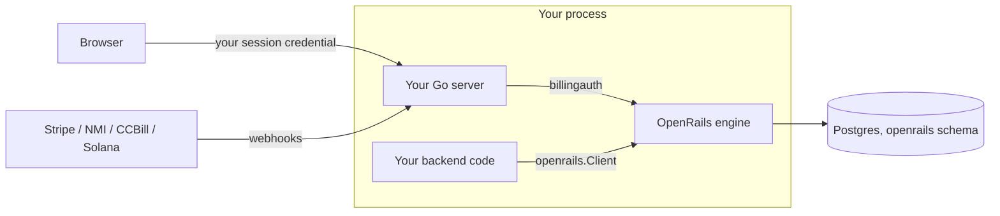

# Embedding OpenRails in your Go server

The full guide to running the OpenRails billing engine in-process;
`examples/embedded` is the runnable quickstart. Money is an integer in the
currency's native units (`GET /v1/currencies`; micros for USD), a decimal string
on the wire ([money-wire.md](money-wire.md)). Vocabulary: a
**rail** is a gateway kind (`nmi` / `ccbill` / `stripe` / `solana`); a **PSP** is your
concrete account on a rail (e.g. `mobius` on nmi).

### 1. What embedding means

Your Go binary imports the engine and runs it in-process: no second service, no
network hop, no second credential. Concretely:

- The engine owns a configurable schema, defaulting to `billing`, inside **your** Postgres database.
- Its HTTP routes mount on **your** mux under a prefix you choose; your users call
  them with their normal session credential.
- Your backend calls the engine through `rt.Client()` — the **same**
  `*openrails.Client` a standalone consumer gets from `openrails.NewRemote`.
  Parity is structural: one client implementation, one handler surface, joined by an
  in-process `http.RoundTripper` instead of a socket (enforced by a dual-mode
  conformance test).
- A runtime constructed with `Options.Merchant` serves **one merchant**; a
  multi-merchant runtime (`examples/multimerchant`) binds each Client with
  `openrails.WithMerchantID`.



### 2. Install and migrations

```bash
go get github.com/open-rails/openrails
```

OpenRails owns its migration source and applies it through one explicit
initialization call. Your application supplies a pool that can create its schema
and objects; it does not import migratekit or OpenRails' migration
files:

```go
if err := embed.ApplyMigrations(ctx, appPool, embed.MigrationOptions{}); err != nil {
    return fmt.Errorf("initialize OpenRails database: %w", err)
}
```

Initialize AuthKit separately through AuthKit's own embedded migration API.
`embed.ApplyMigrations` applies OpenRails' billing chain and the River chain
used by `RiverManagedByOpenRails`, in the order OpenRails requires. A
`RiverFromHost` integration is the explicit low-level exception: the host owns
that River client's schema and migration lifecycle. Pass the same `RiverOwnership`
value to `MigrationOptions.River` and `Options.River`; migrations never invoke
host client construction. Set `MigrationOptions.Schema` to match `cfg.DB.SchemaName()` when
using a custom billing schema.

Billing, AuthKit, application tables and River may share `public` or another
namespace. Each component must use its configured qualified tables and an
explicit ownership inventory; a schema name does not imply exclusive ownership.
OpenRails archives contain only billing-owned tables and never include live
River jobs, AuthKit identities or host records. The destructive embedded reset
command still targets only the default `billing` schema and refuses it when
foreign relations are present. It is not a shared-schema reset mechanism.

The engine validates the tracking key at boot and refuses to start if any
OpenRails migration is missing or orphaned.

OpenRails does not create or grant access to AuthKit's `profiles` schema. If
the host enables notification email or CCBill username resolution, pass its
identity adapter explicitly through `embed.Options.UserDirectory` and
`embed.Options.UsernameResolver`; leaving them unset disables those optional
lookups safely.

### 3. Config

Embedded mode never runs `config.Load` — you build `*config.Config` programmatically.
Start from `config.GetDefaultBillingConfig()` (seeds dev DB/Redis endpoints, logger,
curated `RateLimits`, and `Captcha`), then set your own values. Construction refuses
to boot unless you declare posture explicitly (#745):

| Field | Required | Meaning |
|---|---|---|
| `Env` | yes | `"development"` / `"staging"` / `"production"`. Empty errors; development-only secret-storage relaxations must be explicit. |
| `TestMode` | yes | `config.CredentialPostureSandbox` or `config.CredentialPostureLive`. The zero value is UNSET and rejected — it can never silently mean "live". |
| `ProviderWriteMode` | recommended | `config.ProviderWriteModeFull` etc.; unset fail-closes to readonly. |
| `MerchantConfigSource` | defaults to `config.MerchantConfigSourceManifest` | Mode 1 (manifest-is-truth, secrets in memory, reboot to change) vs `MerchantConfigSourceAPI` (mode 2: provision via HTTP APIs + persistent secret store). |
| `CatalogSource` | empty follows `MerchantConfigSource` | `CatalogSourceManifest` uses `PushCatalog`; `CatalogSourceAPI` permits authorized product, price and metering APIs independently of provider credentials. |
| `DB` | yes | Schema defaults to `billing`. The injected pool can be the same owning connection used for initialization. |

#### Database ownership and optional separate runtime credentials

The simple setup uses one application login and pool. That login creates and
owns the library's objects during `ApplyMigrations`, then uses them at runtime.
Ownership already supplies access; no self-grants or library-specific roles are
required. AuthKit and a host-owned River client may share that same pool.

If your deployment separates migration and runtime credentials, pass the
existing runtime pool as `MigrationOptions{RuntimePool: appPool}` when initializing
through the migration pool. OpenRails grants its exact runtime table, column,
function and migration-ledger privileges to that pool's user. Managed River
objects are included; host-owned River access remains the host's responsibility.
The CLI exposes this optional provisioning as `--runtime-database-url`.

Merchant isolation uses verified application scope, explicit SQL predicates and
composite relationships. PostgreSQL RLS and username flags are not part of the
authorization boundary. Financial triggers protect ordinary DML invariants even
for an owner; a database owner can deliberately change or drop those guards.

Renaming an existing PostgreSQL role preserves its identity and ownership; update
the connection configuration as needed. Replacing it with a different role needs
the normal PostgreSQL ownership transfer or grants performed by your operator.
The libraries do not manage database accounts or ownership transfers.

Under `TestMode = sandbox` every rail routes to its test environment and live
credentials refuse to boot — no real money can move. NMI accounts get an arm-time
probe: a conclusively-live gateway is refused under sandbox (a probe error only
warns). See [operations.md](operations.md).

**Rate limiting is on by default** (#742): if you leave `RateLimits`/`Captcha` nil,
`embed.New` seeds the same curated defaults `config.Load` applies — per-IP and
per-authenticated-user buckets, tight on checkout (10/min) to deter card-testing,
Redis-backed when `Redis` is set, in-memory otherwise. Override `cfg.RateLimits`, or
set `cfg.RateLimitsDisabled = true` if your own gateway fronts billing. See
[rate-limiting.md](rate-limiting.md).

### 4. Boot

```go
import (
    "github.com/open-rails/openrails/config"
    "github.com/open-rails/openrails/embed"
)

rt, err := embed.New(ctx, embed.Options{
    Config:     cfg,
    PGXPool:    pool, // share your app's pgx/v5 pool; nil = engine opens its own from Config.DB
    Redis:      rdb,  // optional — Redis-backed rate limits; omit for in-memory
    RunWorkers: false, // attach optional components before constructing the worker fleet
})
if err != nil { log.Fatal(err) }
defer rt.Close(ctx)
```

| Option | Type | Notes |
|---|---|---|
| `Config` | `*config.Config` | Required. |
| `Merchant` | `*embed.MerchantDeclaration` | Optional single-merchant declaration: `Slug`, `Config`, and attribution-only `PSPs`. Reconciled before HTTP and worker startup. Obtain its ID from `Client().MerchantID()`. |
| `HTTP` | `*embed.HTTPConfig` | Leave nil for headless mode or configure once later with `rt.ConfigureHTTP`. A non-nil policy exposes discovery and verified provider callbacks; buyer and management capabilities are opt-in. |
| `PGXPool` | `*pgxpool.Pool` | Host-supplied pool (pgx/v5). |
| `Redis` | `*redis.Client` | Optional (rate limits, admission holds). |
| `Cache` | `cache.Cache` | Optional cache override. |
| `River` | `embed.RiverOwnership` | Defaults to managed River in `public`. `RiverManagedByOpenRails("jobs")` selects another schema; `RiverFromHost()` declares host ownership; pass `RiverJobs()` to `riverhelpers.New` after attaching components. |
| `RunWorkers` | `bool` | Managed-only. Runs the River background workers (renewals, dunning, credit/hold expiry, reconciliation) on a Runtime-owned goroutine, detached from the ctx you pass to `New` — `Close` stops them. Leave false to drive `rt.RunWorkers(ctx)` yourself. |
| `ConsoleAssets` | `fs.FS` | Host-built admin console SPA (see §6). |
| `StripeTransport` | `http.RoundTripper` | Test seam under the Stripe API choke point; refused with a live posture. |

**Runtime surface**: `rt.Client()` provides the shared application client;
`rt.ConfigureHTTP`, `rt.HTTPRoutes()`, `rt.RiverJobs()`, readiness/progress checks,
`rt.RunWorkers(ctx)` and `rt.Close(ctx)` own process infrastructure. Merchant
and PSP declarations belong in `Options.Merchant`. One-off manifest and restore
tooling belongs to `embed/operator.New(rt)`; the host transaction extension is
constructed with `embed.NewHostTransactions(rt)`. Storage remains internal.
Hosts that use OpenRails' own AuthKit control plane (standalone-shaped or
hosted products) attach it with `embed/controlplane`:

```go
cp, err := controlplane.Attach(ctx, rt, controlplane.Options{HostedPosture: true, EmailSender: sender})
if err != nil { return err }
handler, err := cp.Handler() // billing + AuthKit routes + admin console
if err != nil { return err }

// Start after attachment, alongside HTTP under the application's errgroup.
workers.Go(func() error { return rt.RunWorkers(ctx) })
```

Keep `RunWorkers: false` through component attachment, then supervise
`rt.RunWorkers(ctx)` alongside the HTTP server (the `workers` errgroup above).
`RunWorkers` blocks until shutdown; propagate its error through that supervisor.
The control plane adds AuthKit maintenance to the same River registry before
client construction, and attaching it after River initialization is refused.
Billing-only hosts using managed River with no optional components to attach may
use `RunWorkers: true` directly. Host-owned River refuses constructor auto-start:
attach the control plane or construct your AuthKit client before binding.

`cp` carries the operator mechanisms (`ProvisionMerchant`, directory reads,
provider configuration, fleet aggregates, retirement, `UserAuthenticator`,
`JWKSHandler`). Hosts that bring their own AuthKit never import it.

**Host-owned River**: declare ownership during migrations and construction, then
attach every component before requesting `RiverJobs()`. The neutral `helpers/river`
composer collects billing and attached control-plane workers, queues and schedules,
then constructs and binds one unstarted client. It rejects removed required
entries, duplicate workers/schedules, and repeated or closed contributions.

```go
import (
    riverhelpers "github.com/open-rails/helpers/river"
    "github.com/riverqueue/river"
)

ownership := embed.RiverFromHost()
// The host migrates and grants access to its River schema separately.
if err := embed.ApplyMigrations(ctx, adminPool, embed.MigrationOptions{River: ownership, RuntimePool: appPool}); err != nil {
    return err
}
rt, err := embed.New(ctx, embed.Options{Config: cfg, PGXPool: pool, River: ownership})
if err != nil { return err }
defer rt.Close(context.WithoutCancel(ctx))

// Attach a control plane here, or construct your own AuthKit client.
// An attached control plane contributes its AuthKit maintenance automatically.
jobs, err := riverhelpers.New(ctx, pool, &river.Config{
    Schema: "host_jobs", // host-migrated; sharing public with billing is supported
    Queues: map[string]river.QueueConfig{embed.QueueBilling: {MaxWorkers: 10}},
}, rt.RiverJobs())
// If using your own AuthKit instead of an attached control plane, include
// auth.RiverJobs() as another contribution to this same call.
if err != nil { return err }
defer jobs.StopAndCancel(context.WithoutCancel(ctx))
// With host-owned AuthKit, check auth.Start(ctx) now.
// Finish product bootstrap before starting consumers.
if err := jobs.Start(ctx); err != nil { return err }

loopsCtx, cancelLoops := context.WithCancel(ctx)
loopsDone := make(chan error, 1)
go func() { loopsDone <- rt.RunWorkers(loopsCtx) }()
// Supervise this result alongside HTTP. On shutdown:
cancelLoops()
if err := <-loopsDone; err != nil && !errors.Is(err, context.Canceled) { return err }
// Deferred cleanup stops the host client before closing the billing runtime.
// Close host AuthKit and the pool only after these consumers have joined.
```

`RunWorkers` runs core non-River loops, including the Solana Pay poller, and
blocks until cancellation; it never starts or stops the host's River client.
Always cancel and join it before stopping River and closing dependent runtimes,
identity clients and pools. `rt.CheckJobProgress(ctx)` gives the live fleet
verdict. Before binding, readiness and worker startup refuse explicitly.

Binding is one startup attempt. Double binding, late component attachment,
and closed runtimes refuse. Hosts cannot substitute an unrelated or already-started
client: construction happens after configuration validation. After a failed
binding, close and recreate the runtime. Managed River's `New → Attach → RunWorkers` order is
unchanged.

**Inserting an engine job.** OpenRails registers its own periodic jobs on the
client you return. The one job a host inserts itself is the invoice sweep:
`jobs.Insert(ctx, embed.InvoiceSweepArgs{FinalizePreviousMonth: true}, nil)`
runs the daily period finalize now (rates reported usage and issues every
payer's previous-period invoice); `Collect: true` runs the collection pass. Runs
are idempotent. Every other job kind is an engine-internal schedule and stays
private.

**No job clock.** Your `river.Config.JobTimeout` (River's default is one minute)
does not apply to OpenRails' workers: each declares `Timeout() = -1` and ends
on observed lack of progress instead — a job that reports no progress past
3× its declared cadence (floored at 30 min) is cancelled with the reason on the
job row. While a job runs it also beats `river_job.attempted_at`, so your
`RescueStuckJobsAfter` measures silence from a dead process, never the age of
a live job (a dunning pass over many merchants may legitimately outlive it).
Both need the pool you gave OpenRails to be able to write River's tables (it is
the pool River itself writes through).

### 5. Declaring the merchant

Declare the merchant at construction: create-if-missing, reconcile-if-present on
every boot. One runtime serves one declared merchant; a client cannot override its
binding. Reconstruct the runtime to change host-owned configuration.
Real fields (`embed.MerchantConfig` aliases `internal/bootstrap.MerchantConfig`;
same shape as `config/merchants_config.example.yaml`):

```go
merchantConfig := embed.MerchantConfig{
    DisplayName: "My App",
    Profile: embed.MerchantProfileConfig{
        DisplayName: "My App Billing",
        FromEmail:   "billing@myapp.example",
        SupportURL:  "https://myapp.example/support",
    },
    Invoice: &embed.InvoiceConfig{ // optional; amounts in micros
        BillingPeriodBoundary: "calendar_month",
    },
    PSPs: map[string]embed.PSPConfig{ // PSP key -> rail -> account
        "my-nmi-sandbox": {
            "nmi": embed.ProviderRailAccountConfig{
                Environment: "test", // assertion, cross-checked against TestMode
                AccountID:   "000000", // NMI dashboard "Gateway ID"
                Settings: map[string]any{ // non-secret knobs
                    "tokenization_url": "https://secure.networkmerchants.com/token/Collect.js",
                    "tokenization_key": "placeholder-tokenization-key",
                },
                Secrets: map[string]string{
                    "security_key":           "placeholder-security-key",
                    "webhook_signing_secret": "placeholder-webhook-secret",
                },
            },
        },
    },
}
rt, err := embed.New(ctx, embed.Options{
    Config: cfg,
    Merchant: &embed.MerchantDeclaration{Slug: "myapp", Config: merchantConfig},
})
if err != nil { return err }
client, err := rt.Client()
if err != nil { return err }
mid := client.MerchantID()
```

Semantics by mode:

- **Mode 1 (`merchant_config_source=manifest`, the default)**: the constructor declaration is the manifest —
  it steamrolls the DB projections and seeds secrets into the runtime's **in-memory**
  plane (never a persistent store) on every run, then arms checkout/vault/webhooks
  immediately. Change credentials = change the config + reboot. Provider PUT,
  DELETE and account-archive HTTP routes are omitted; reads and routing dry
  runs remain available. The advertised `secret_write` capability is false,
  including with explicit provider route selections. This does not disable
  separately configured managed alert-webhook URL updates.
- **Mode 2 (`merchant_config_source=api`)**: a manifest-shaped upsert (PSPs, profile,
  invoice, remote-application trust) refuses loudly — two truths. Only a bare
  identity bind (slug + top-level `DisplayName`) is legal; arm providers through
  `embed/controlplane` (`cp.UpsertPaymentProviderConfig`) or
  `PUT /v1/merchant/payment-providers/{provider}` (`RouteSetPaymentProviders`),
  Catalog authoring is selected independently below.

YAML-first hosts can keep the merchant in a file: `embed.ParseMerchantConfig` (one
merchant, strict — unknown fields rejected) or
`embed.LoadMerchantConfigManifestWithOverlays(manifest, overlays...)` (multi-merchant
manifest plus the host's mounted YAML secret overlays, so committed files hold
placeholders and the host supplies real secrets from its own config tree).

**Catalog authoring**: `CatalogSource` selects `manifest` or `api`; when omitted
it follows `MerchantConfigSource`, preserving existing behavior. Manifest catalogs use
`embedoperator.New(rt).PushCatalog`; catalog API writes return 405 `manifest_driven`. API catalogs
use the Client (`CreateProduct`, `CreatePrice`, `SetPriceKey`, ...); mutating
manifest pushes are refused, while plan-only comparisons remain available.

For dynamic products with host-owned Stripe credentials, construct the runtime
with `MerchantConfigSource: config.MerchantConfigSourceManifest` and
`CatalogSource: config.CatalogSourceAPI`, then pass the host's account and secrets
in `Options.Merchant.Config` as above. OpenRails keeps provider credentials in
memory and refuses provider-configuration API writes. The host rotates credentials
by updating its configuration and constructing a new runtime. Existing API catalog
rows survive restart. Do not bootstrap host credentials through a provider PUT:
that operation selects managed persistence when `MerchantConfigSource` is `api`.

Host-supplied provider credentials alone need no encryption master key. Optional
DB-backed alert-webhook URLs and HyperSwitch SDK capture authorization still
require encrypted persistence. Managed provider credentials use the explicitly
selected DB or Vault backend; they never fall back to host credentials on a miss.
`ProviderWriteMode` remains independent: readonly limits provider network writes,
and an API-owned catalog can still update local definitions.

```go
err := rt.PushCatalog(ctx, embed.PushCatalogOptions{
    Manifest: catalogYAML, // or File: "catalog.yaml"
    Insert:   true,        // zero mutation flags = plan-only
})
```

A product may carry several prices (for example two monthly tiers) by giving
each an explicit `key`; the key is the durable handle repricing and checkout
refer to. With `catalog_source=manifest`, a mutating push upgrades to full
converge (insert+overwrite+prune); with `catalog_source=api`, a mutating push
refuses (plan-only diff stays legal). `rt.Converge(ctx, merchantID)` runs the
merchant-wide derive pass on demand after an import. The manifest is
`version: 1` + `catalogs: [{merchant, tier_groups, products, meters}]`.

### Creator-owned catalogs

One merchant may have a default catalog and catalogs owned by opaque host
subjects. Ordinary `rt.Client()` calls continue to create products in the default
catalog unless an authorized administrator supplies `CreateProductRequest.CatalogID`.
Product and price keys remain unique within the merchant.

For a creator, pass an identity obtained from your authenticated user:

```go
author, err := rt.CatalogClient(verifiedSubject)
if err != nil { return err }
catalog, err := author.EnsureOwnCatalog(ctx)
if err != nil { return err }
product, err := author.CreateProduct(ctx, openrails.CreateProductRequest{
    Key: "post-" + postID, DisplayName: title,
})
```

The subject is a nonempty opaque string; it need not be a UUID or email. The
library owns its catalog mapping and enforces creator scope on product/price
reads, lists, edits, archive actions and price-key history. Prices inherit their
catalog from the product, and a purchased product cannot be moved to another
catalog through an ordinary update. Content ACLs and authentication remain yours.

`CatalogClient` captures only `merchant:catalog:read-own` and
`merchant:catalog:update-own`; its options
cannot replace that transport/credential with a merchant administrator's. It
supports product display/archive and price terms, not entitlement/tier definitions,
raw provider bindings, provider selection, meters or bulk publishing. The engine
selects applicable configured providers for creator prices. It does not create
separate merchants, provider accounts, payout policies or checkout authority.

HTTP hosts mount these endpoints by configuring `HTTP.Catalog: true`, under
`/v1/catalog`. Their existing Gate must return a verified `Principal.Subject`
and authorize the narrow owner permission. If Subject is absent, the library
uses only that Gate result's `UserContext.UserID`; both absent is a refusal.
An owner ID in a body, query, header or ambient host context never supplies
authority. Remote clients use `openrails.WithOwnCatalog()` with their normal
verified credential; this option only selects the owner paths.

Administrators keep `/v1/merchant/catalog/*` and use `EnsureCatalogForOwner`,
`GetCatalog`, and `ListCatalogs` under `/v1/merchant/catalogs`. Verify the admin
permission separately; never impersonate another creator by constructing a
CatalogClient from an owner read out of a product or content row. The optional
OpenRails control-plane adapter includes a `creator` role with only the two owner
grants; it is not assigned automatically.

### 6. Mounting HTTP

OpenRails never parses your credentials. You implement two small `pkg/billingauth`
interfaces over whatever auth you already have:

- `billingauth.Authenticator` → `UserContext` for checkout/user routes. `UserID` is
  **required and MUST be a UUID** (it becomes the payable customer_id; non-UUID
  subjects 401 on required routes and silently downgrade to anonymous on optional
  ones — map non-UUID native ids to a stable UUID). Optional metadata: `Email`,
  `EmailVerified`, `Username`, `Roles`, `Entitlements`, `Merchant`/`MerchantRoles`.
  Adapt closures with `billingauth.AuthenticatorFunc`.
- `billingauth.DelegatedAuthenticator` → `*billingauth.DelegatedPrincipal` for
  `/v1/me/*` and `/v1/customers/*`. `MerchantID` and `SubjectID` are required —
  explicit mapping, no fallbacks, fail-closed 401. Optional: `MerchantSlug`,
  `Issuer` (audit), `Permissions` (trusted verbatim for in-process hosts — grant
  only what you mean), contact metadata. Adapt with
  `billingauth.DelegatedAuthenticatorFunc`.
- **Invoker-scoped principals** (or#930). Set `Invoker` when the credential
  spends a payer's money WITHOUT being the payer — your platform's end user
  drawing on your org's balance under a spend delegation. Use the SAME opaque
  invoker string you pass to admission, so the identity that is metered is the
  identity that reads. OpenRails then narrows the principal to exactly one
  thing, `GET /v1/me/spend-limits`; every other `/v1/me/*` and `/v1/customers/*`
  route refuses it `403 invoker_scoped_principal`, because `SubjectID` there
  names an account the invoker does not own. That guard is what makes it safe to
  map an end-user credential onto a payer account at all — without it the
  self-service surface is all-or-nothing, and hosts correctly reject end-user
  tokens outright.
- `billingauth.Gate` (merchant-admin routes only): `Authorize(ctx, r, permission)
  (Principal, error)` — checks a live `merchant:*` permission per request.

AuthKit hosts should not hand-write these. `embed/authkit` ships the
bridges, in two flavours that differ only in where the verifier comes from:

| your situation | use |
|---|---|
| you already have an AuthKit verifier (in-process AuthKit, embedded control plane) | `NewAuthenticator(v, …)` / `NewDelegatedAuthenticator(v, boundMerchantID, …)` |
| you trust a REMOTE issuer over JWKS | `NewVerifierAuthenticator(issuers, aud, …)` / `NewVerifierDelegatedAuthenticator(issuers, aud, boundMerchantID, …)` |

Inject your own verifier whenever you have one: the request is then verified
through `VerifyRequest` — your whole credential chain (API-key branch,
2FA-enrollment gate, issuer enrichment) — so billing cannot end up with a
weaker check than the rest of your app, and an in-process host never refetches
its own keys over HTTP. The merchant pin is YOUR engine's bound merchant in
every flavour, never anything from the caller's token (#913/upstream#1765).

By default `Permissions` comes from the canonical role→permission preset
`permissions.ForRoles` (owner/admin → `merchant:*` + `customer:*`; member → the
customer self-service set; read-only → its `:read` subset). The options
(or#918):

- `WithAdmission(func(ctx, *http.Request, verify.Claims) error)` — a per-request
  veto that runs after verification, before the principal is built. JWT verify
  is stateless, so a **banned or deleted user keeps a valid token until it
  expires**: put your liveness gate here and every delegated principal,
  `/v1/me` included, is checked. A non-nil error is logged and answered 401;
  the message never reaches the client. `WithUserAdmission` is the same veto on
  the non-delegated authenticator.
- `WithPermissionResolver(func(ctx, *http.Request, verify.Claims) ([]string, error))`
  — permissions from the live request instead of the token's roles, for a grant
  that is a DB read ("is this user a billing admin?") and worth scoping to the
  admin path so the hot self path stays lookup-free. Runs after the admission
  veto. An error fails the request closed. Mutually exclusive with
  `WithRolePermissions` (the simple case: your own role vocabulary).
- `WithMerchantSlug(slug)` — required if principals must address the merchant's
  OWN treasury account by slug (or#916); without it the uuid is the only
  address that resolves.
- `WithIssuer(iss)` — override the audit issuer (default: the token's `iss`),
  e.g. `openrails.SelfIssuer` when your customer rows are keyed to it.
- `WithoutTokenRoles()` (non-delegated) — drop the token's role snapshot from
  `UserContext`. It is stale for the token's lifetime; omit it rather than pass
  a snapshot nothing should authorize on.

Configure HTTP once when constructing the runtime, then mount its configured
routes once on your framework. Enable only the capabilities the application
actually exposes; in-process `Client` and `CatalogClient` access never enables
HTTP management endpoints.

```go
rt, err := embed.New(ctx, embed.Options{
    Config: cfg,
    DelegatedAuthenticator: myDelegatedAuth,
    HTTP: &embed.HTTPConfig{
        Checkout: true, Customer: true,
        Authenticator: myAuth,
        // Catalog: true, MerchantAdmin: true, // opt in if the host needs these
        // Gate: myGate, // required for any management capability
    },
})
if err != nil { return err }
// Declare merchant/provider configuration and compose River before serving.
```

When your AuthKit bridge needs the merchant ID returned by provisioning, leave
`Options.HTTP` nil and configure the runtime once afterward:

```go
rt, err := embed.New(ctx, embed.Options{Config: cfg, Merchant: &embed.MerchantDeclaration{Slug: slug, Config: merchantConfig}})
if err != nil { return err }
client, err := rt.Client()
if err != nil { return err }
merchantID := client.MerchantID()
authn, err := orauthkit.NewDelegatedAuthenticator(verifier, merchantID.String())
if err != nil { return err }
if err := rt.ConfigureHTTP(embed.HTTPConfig{
    Customer: true,
    DelegatedAuthenticator: authn,
}); err != nil { return err }
```

`Options.HTTP` and `ConfigureHTTP` share the same validation and copy semantics.
A second configuration attempt is rejected, and requesting routes freezes the
policy. Configuration and route construction after `Close` are also rejected.
Invalid configuration leaves HTTP disabled. `HTTP.DelegatedAuthenticator` can
select the customer HTTP verifier; otherwise the runtime's
`Options.DelegatedAuthenticator` is used, matching in-process customer calls.

Use the adapter for your host. The Gin and Fiber adapters are separate Go modules;
net/http and Chi use the core module's `adapters/http` package.

```go
// net/http: github.com/open-rails/openrails/adapters/http
routes, err := openrailshttp.Routes(rt)
if err != nil { return err }
if err := routes.Mount(mux, "/billing"); err != nil { return err }

// Chi: inside router.Route("/billing", func(group chi.Router) { ... })
// routes.Mount(group)

// Gin: github.com/open-rails/openrails/adapters/gin
routes, err := openrailsgin.Routes(rt)
if err != nil { return err }
if err := routes.Mount(engine.Group("/billing")); err != nil { return err }

// Fiber v3: github.com/open-rails/openrails/adapters/fiber
routes, err := openrailsfiber.Routes(rt)
if err != nil { return err }
if err := routes.Mount(app.Group("/billing")); err != nil { return err }
```

Each adapter registers ordinary method/path routes. Route inspection sees the
actual endpoints, and unrelated host paths retain the host's normal 404/405
behavior. The host owns prefix, middleware and server lifecycle. Original request
URLs and body bytes reach authentication and webhook verification unchanged.
ServeMux handles implicit HEAD itself; other adapters register HEAD for GET and
browser routes include CORS OPTIONS. Framework case, slash and redirect settings
remain host-owned (Fiber defaults are case-insensitive and non-strict).

| HTTP capability | Exposed surface |
|---|---|
| non-nil `HTTP` | Capability discovery and generic merchant-scoped verified provider callbacks |
| `Checkout` | Buyer products, prices, checkout/config; requires `Authenticator` |
| `Customer` | `/v1/me/*` and customer treasury; requires `HTTP.DelegatedAuthenticator` or the runtime verifier |
| `MerchantAdmin` | Customer/support management; requires `Gate` |
| `Catalog` | Merchant and creator catalog HTTP; requires `Gate` |
| `PaymentProviders` | Provider configuration reads and supported writes; requires `Gate` |
| `MerchantAPI` | Service/API-key routes; requires `Gate` (most embedded hosts use `Client` instead) |

Host-owned credentials omit mutation routes regardless of catalog ownership.
Callbacks are registered generically so adding an API-managed provider account
after startup does not require mounting another route. Each request still checks
the configured provider account and signature. API-managed buyer surfaces likewise
retain optional provider paths; account readiness remains a request-time guard.
Manifest-owned buyer surfaces must be materialized after merchant/provider
configuration; provider discovery errors are returned rather than hiding routes.
An unconfigured runtime refuses `Routes` with an explicit disabled error.
Configure HTTP before requesting routes, including when using the late provisioning
form. The runtime materializes the inventory once, so remounting cannot reset its
rate limits. Invalid constructor HTTP configuration fails before opening resources.

Migration is a pre-v1 API change: `Runtime.Handler(MountOptions)`, `SelfHandler`,
`RouteSet` selections and mutable `ActiveRouteSets` are removed. Move exposure and
auth into `embed.Options`, obtain the adapter bundle, and mount it once. Remove
catch-all `gin.WrapH`/Fiber fallback glue and separately mounted webhook paths.

**Admin console** (optional, #754): the engine ships zero frontend bytes. The host
builds the SPA (`scripts/build-admin-console.sh` from the module cache into a
gitignored `dist`, wrapped in a 3-line `//go:embed all:dist` package) and passes it
via `embed.Options.ConsoleAssets`; gate mounting on `admin_console.enabled`. See
[admin-console.md](admin-console.md).

### 7. Calling the engine

```go
client, err := rt.Client() // bound to the constructor-declared merchant
if err != nil { log.Fatal(err) }
if err := client.Verify(ctx); err != nil { log.Fatal(err) } // fail fast at boot
```

The shared concrete `*openrails.Client`, grouped by job:

| Group | Methods |
|---|---|
| Admission (hot path) | `Admit`, `AdmitBatch`, `Capture`, `Release`, `ExtendHold`, `GetTrustLevel`, `ReportWastedSpend` |
| Usage | `RecordUsage` (metered events outside the hold/capture cycle) |
| Policy | `GetMerchantSettings`, `SetMerchantSettings`, `SetCustomerSpendDelegations`, `SetCustomerSpendDelegation`, `DeleteCustomerSpendDelegation` |
| Funding / reporting | `DepositCredits`, `GetDeposit`, `SetCreditLimit`, `GetCreditLimit`, `UsageRollup`, `ResourceRevenueDaily` |
| Customers / entitlements | `EnsureCustomer`, `Balance`, `GetCreditAccount`, `ListActiveEntitlements`, `ListEntitlements`, `HasEntitlement`, `ListCustomersWithEntitlement`, `GrantEntitlement`, `RevokeEntitlement`, `ListProductAccess`, `HasProductAccess` |
| Catalog (API hosts) | `CreateProduct`, `UpdateProduct`, `GetProduct`, `GetProductByKey`, `ListProducts`, `CreatePrice`, `UpdatePrice`, `GetPrice`, `GetPriceByKey`, `ListPrices`, `SetPriceKey`, `EnsureUsageMeter`, `GetUsageMeter`, `ListUsageMeters`, `EnsureUsageProduct`, `SetDefaultUsageRateCard`, `DeleteDefaultUsageRateCard` |
| Checkout | `CreateCheckoutSession`, `GetCheckoutSession`, `ConfirmCheckoutSession`, `ListCheckoutRailOptions`, `GetCheckoutConfig`, `ResolveEffectiveTier` |
| Subscriptions | `GetSubscription`, `ListSubscriptions`, `CancelSubscription`, `ResumeSubscription`, `ChangeTier`, `PreviewTierChange`, `UpdateSubscriptionPaymentMethod`, `CreatePlanMigration`, `PreviewPlanMigration`, `CancelPlanMigration` |
| Payments | `GetPayment`, `ListPayments`, `HasSettledPayment`, `ListPaymentMethods`, `DeletePaymentMethod` |
| Invoices | `ListMerchantInvoices`, `GetMerchantInvoice`, `ListInvoicePaymentAttempts`, `RecordInvoicePayment`, `RetryInvoiceCollection`, `MarkInvoiceUncollectible`, `VoidInvoice`, `GetCustomerInvoiceProfile`, `SetCustomerInvoiceProfile`, `EnsureCustomerInvoiceProfile` |
| Provider obligations | `OpenOperationAuthorization`, `GetOperationAuthorization`, `ReleaseOperationAuthorization`, `RecordProviderBillingObservation`, `GetProviderBillingQualification` |
| Host feed / import | `ListHostEvents`, `AcknowledgeHostEvent`, `ImportBilling` |

```go
verdicts, err := client.AdmitBatch(ctx, []openrails.AdmitRequest{{
    CustomerID:      openrails.CustomerID(customerID), // the host's subject UUID
    Invoker:         userID,
    EstimatedAmount: 50_000,    // native units (USD: micros)
    ExpiresAt:       &deadline, // required with a hold: the job's deadline
    RequestID:       requestID, // idempotency key
}})
receipt, err := client.Capture(ctx, requestID, 43_000, &openrails.CaptureUsage{EventType: "chat.completion"})
ents, err := client.ListActiveEntitlements(ctx, []string{userID}, time.Now())
```

Entitlement lookups address subjects by the ids your auth system already holds
(self-service users are keyed under `openrails.SelfIssuer`); a user who never touched
billing is an empty slice, never an error. Deny verdicts are `(Allowed=false, nil
error)`.

`Admit` is the batch-of-one convenience on the same client in every mode.
`openrails.WithCurrency` and `openrails.WithTimeout` configure the same call behavior
as the remote constructor. Both modes default to a two-second call deadline;
`openrails.WithTimeout(0)` explicitly delegates the deadline to the caller.

Checkout creation/read/confirmation, checkout provider options and effective-tier
resolution use the shared client too. See [the commerce client](api/commerce.md).

A host that must commit its own provider obligation atomically with the OpenRails
authorization, release or settlement uses `rt.HostTransactions()` with a transaction
from its pool. See [provider obligations](architecture/provider-obligation-contract.md).

The in-process Client pins the runtime's bound merchant on every call, so
application code never scopes connections itself; a multi-merchant runtime
binds each Client at construction with `openrails.WithMerchantID`.

### 8. Acting on delinquency

For arrears billing, OpenRails decides when a payer's unpaid debt has outlived
the merchant's grace window and refuses their new spend at admission — but only
your app can shut off what your app runs. Transitions land on a durable,
acknowledged feed you drain:

```go
// client is returned by runtime.Client(openrails.WithMerchantID(mid))
// or openrails.NewRemote(...); both use the same operations.
for _, kind := range []openrails.HostEventType{
    openrails.HostEventDelinquencyGrace,
    openrails.HostEventDelinquencyEntered,
    openrails.HostEventDelinquencyCleared,
} {
    events, err := client.ListHostEvents(ctx, openrails.HostEventListOptions{Type: kind, Limit: 100})
    if err != nil { return err }
    for _, event := range events {
        if err := applyHostAction(ctx, event.Type, event.Delinquency); err != nil {
            return err // leave the event pending for replay
        }
        if err := client.AcknowledgeHostEvent(ctx, event.ID); err != nil { return err }
    }
}
```

Ack after your action is durable — an unacked event is redelivered. OpenRails
never revokes an entitlement for an unpaid arrears bill. Full boundary and policy:
[arrears-delinquency.md](arrears-delinquency.md).

### 9. Webhooks and ops

Point each rail's webhook at the webhook routes on **your** server, under your mount
prefix (paths in [api/endpoints.md](api/endpoints.md)). OpenRails verifies rail
signatures and updates subscriptions/entitlements; your app just reads the results.
Local rail sandboxes: [dev/local-webhooks.md](dev/local-webhooks.md).

Further reading: [operations.md](operations.md) (operating modes, safety levers,
dunning, the intents ledger), [billing-policies.md](billing-policies.md)
(named spend/credit-line policies and how you bind them),
[arrears-delinquency.md](arrears-delinquency.md),
[rate-limiting.md](rate-limiting.md),
[auth.md](auth.md) (the full one-credential-per-trust-domain rationale),
[self-hosting-mode1.md](self-hosting-mode1.md).


Merchant team and API-key routes are mounted only when their control-plane
managers are attached. A plain embedded billing runtime has no placeholder
management routes; the host continues to own its identity/team UI. Standalone
and SaaS deployments with a control plane retain the same permission-gated
management endpoints.

### Merchant checkout authority

`Client.CreateCheckoutSession` uses the privileged merchant checkout endpoint. The host supplies the customer identity and is trusted to invoke this command for a real customer action. A merchant API key authorizes the host; it does not itself establish that a customer is interacting. Do not use merchant checkout as an unattended way to establish an initial customer-initiated stored-card agreement. Customer-facing self routes retain their authenticated payer boundary.

This receipt/completion cut preserves that existing host contract. The product and authority review before v1 must decide whether merchant checkout should keep this explicit host trust or require verified per-customer interaction credentials. No request boolean can manufacture that verification.
