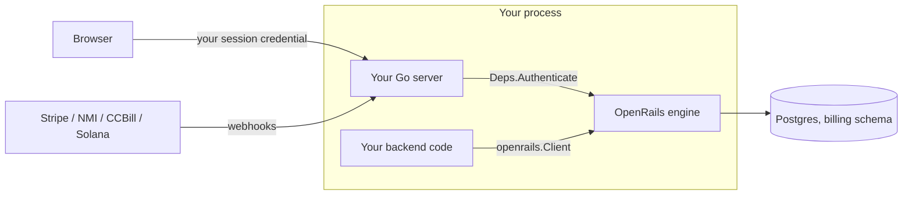

# Embedding OpenRails in your Go server

The full guide to running the OpenRails billing engine in-process;
`examples/embedded` is the runnable quickstart. Money is an integer in the
currency's native units (`GET /v1/currencies`; micros for USD), a decimal string
on the wire ([money-wire.md](money-wire.md)). Vocabulary: a
**rail** is a gateway kind (`nmi` / `ccbill` / `stripe` / `solana`); a **PSP** is your
concrete account on a rail (e.g. `mobius` on nmi).

### 1. What embedding means

Your Go binary imports the engine and runs it in-process: no second service, no
network hop, no second credential. Concretely:

- The engine owns a configurable schema, defaulting to `billing`, inside **your** Postgres database.
- Its HTTP routes mount on **your** router under a prefix you choose; your users call
  them with their normal session credential.
- `openrails.New` returns the **same** `*openrails.Client` a standalone consumer
  gets from `openrails.NewRemote`. Parity is structural: one client
  implementation, one handler surface, joined by an in-process
  `http.RoundTripper` instead of a socket. The embedded Client adds the hosting
  operations: `Start`, `Close`, `Routes`, `RiverJobs`, `Ready` and `Probes`.
- An engine with `Config.Merchant` serves that merchant. One without a declared
  merchant (`examples/multimerchant`) serves many: `WithDefaultMerchant`
  supplies an immutable default, and each operation can select a slug with
  `WithMerchant` or a stable ID with `ForMerchantID`. Selection never grants
  authority or overrides the declared merchant.


```mermaid
flowchart LR
    B[Browser] -- your session credential --> S[Your Go server]
    subgraph P[Your process]
        S -- Deps.Authenticate --> OR[OpenRails engine]
        C[Your backend code] -- openrails.Client --> OR
    end
    OR --> PG[(Postgres, billing schema)]
    R[Stripe / NMI / CCBill / Solana] -- webhooks --> S
```

### 2. Install and migrations

```bash
go get github.com/open-rails/openrails
```

A host imports four kinds of package; everything else is `internal/`:

| Package | Holds |
|---|---|
| `openrails` | `New`, `NewRemote`, `Migrate`, the `*Client`, `Config`, `Deps` |
| `billing` | request/response types, IDs (`billing.MerchantID`, `billing.ParseMerchantID`), errors and codes, permission names (`billing.MerchantAll`) |
| `catalog` | catalog-as-code manifests and charge models (rate cards, meters, prices) |
| `adapters/http`, `adapters/gin`, `adapters/fiber` | mount `client.Routes()` on your router |

OpenRails owns its migrations and applies them through your pool; the pool's
role owns the objects and is the role OpenRails runs as (no grants). Run it on
every boot, before `New`:

```go
if err := openrails.Migrate(ctx, pool, cfg); err != nil {
    return fmt.Errorf("initialize OpenRails database: %w", err)
}
```

`Migrate` reads `cfg.Schema` and `cfg.River`: with `RiverManaged` it also
migrates River in `cfg.RiverSchema` (default `public`); with `RiverHostOwned`
the host migrates River itself (`riverhelpers.ApplyMigrations`). With
`cfg.ControlPlane` it also migrates the control plane's AuthKit schema. A
host's own AuthKit migrates through AuthKit's API.

Billing, AuthKit, application tables and River may share `public` or another
namespace. OpenRails archives contain only billing-owned tables and never include
live River jobs, AuthKit identities or host records. The engine validates its
migration ledger at boot and refuses to start if a migration is missing or
orphaned.

Merchant isolation uses verified application scope, explicit SQL predicates and
composite relationships, not PostgreSQL RLS. OpenRails creates no roles and
issues no grants.

### 3. Config and Deps

`openrails.Config` is plain data; `openrails.Deps` is everything the engine
reaches outside its process. Construction refuses to boot unless posture is
explicit:

| Config field | Required | Meaning |
|---|---|---|
| `TestMode` | yes | `openrails.Sandbox` or `openrails.Live`. The zero value is refused; it never silently means live. |
| `ProviderWriteMode` | yes | `ProviderWritesFull`, `ProviderWritesLimited` (renewals and retries wait) or `ProviderWritesReadOnly` (never charges). |
| `Schema` | default `billing` | The Postgres schema of OpenRails' tables. |
| `Merchant` | no | The merchant this engine serves (section 5). |
| `Catalog` | no | The merchant's declared catalog, applied by `New` (section 5). Requires `Merchant`. |
| `HTTP` | no | The route groups `Client.Routes` publishes (section 6); nil publishes none. |
| `River`, `RiverSchema` | default managed | Who runs the job fleet (section 4). |
| `SecretBackend` | default `snapshot` | Credential custody: host snapshot, Vault or encrypted database. |
| `PublicBillingBaseURL` | for callbacks and links | External billing mount, excluding `/v1`. |
| `AllowCatalogUpdates` | false | Publishes catalog mutations over HTTP (`HTTP.Merchant`, delegated credentials). The in-process Client writes its own catalog without it. A declared `Catalog` stays read-only either way. |
| `ControlPlane` | no | OpenRails' own AuthKit control plane, for hosted products (section 8). |

| Deps field | Meaning |
|---|---|
| `Postgres` | Your pool. Nil opens one from `Config.DB`. |
| `Redis`, `Cache` | Shared rate limits and cache; in memory without them. |
| `Vault`, `ProviderCredentials` | A borrowed Vault client; snapshot credentials for existing PSPs. |
| `AuthKit`, `CustomerFor`, `AuthorityFor` | Your AuthKit client; OpenRails derives authentication, authorization and the recent sign-in check from it (section 6). |
| `Authenticate`, `Authorize`, `RecentSignIn` | The same three as hooks, for hosts with other auth. |
| `ConsoleAssets` | A host-built admin console (section 6). |
| `UserExists`, `UserEmail`, `ResolveUsername` | Optional identity lookups for billing notices and the CCBill username bridge. |
| `EmailSender`, `SMSSender`, `HasVaultedPaymentMethod` | Control-plane hooks (section 8). |
| `StripeTransport`, `NMITransport`, `DNSResolver`, `Clock` | Test seams, refused with `TestMode` live. |

Under `Sandbox` every rail routes to its test environment and live credentials
refuse to boot. NMI accounts get an arm-time probe that refuses a conclusively
live gateway. See [operations.md](operations.md).

**Rate limiting is on by default** (#742): nil `RateLimits`/`Captcha` get the
curated defaults the standalone loader applies (tight on checkout to deter
card-testing; Redis-backed with `Deps.Redis`). Override them, or set
`RateLimitsDisabled` if your own gateway fronts billing. See
[rate-limiting.md](rate-limiting.md).

### 4. Boot, lifecycle and River

```go
client, err := openrails.New(ctx, cfg, openrails.Deps{Postgres: pool, AuthKit: auth})
if err != nil { return err }
defer client.Close(ctx)
```

Only Postgres and a refused `Config.Catalog` can fail `New`. Vault login, PSP
posture checks and Redis reconnect in the background (capped full-jitter
backoff, forever); until then only their features answer 503. `Ready` is the
readiness check (Postgres, the merchant directory, the declared catalog,
River). Register `Probes` with the host's
`github.com/open-rails/helpers/deps` supervisor:

```go
for _, p := range client.Probes() { // openrails_vault, openrails_psp_posture, openrails_job_progress, ...
    sup.Add(p.Name, deps.Optional, p.Check, nil)
}
```

River is required: renewals, dunning, invoices, reconciliation and provider
intents are River jobs. With `River: openrails.RiverManaged` (the zero value)
OpenRails builds its own client and `Start` runs it. With
`River: openrails.RiverHostOwned` the host runs one fleet for its own jobs,
AuthKit's and OpenRails':

```go
if err := riverhelpers.ApplyMigrations(ctx, pool, ""); err != nil { return err } // the fleet is yours
workers, err := riverhelpers.New(ctx, pool, &river.Config{
    Queues: map[string]river.QueueConfig{openrails.QueueBilling: {MaxWorkers: 10}},
}, auth.RiverJobs(), client.RiverJobs())
if err != nil { return err }
if err := workers.Start(ctx); err != nil { return err }
defer workers.StopAndCancel(context.WithoutCancel(ctx))
if err := client.Start(ctx); err != nil { return err } // loops outside River, e.g. the Solana Pay poller
```

A host-owned fleet migrates River itself, once per boot before composing it:
`riverhelpers.ApplyMigrations(ctx, pool, "")` (`""` is River's default schema,
`public`; `openrails.Migrate` leaves River alone). Without it `riverhelpers.New`
fails naming that call, and `Start` refuses a fleet that has not composed
`RiverJobs`. `Close` stops what `Start` started; close the client before the pool. OpenRails also
watches the fleet from outside River: `openrails_job_progress` fails while it is
stalled.

**Inserting an engine job.** The one job a host inserts itself is the invoice
sweep: `workers.Insert(ctx, openrails.InvoiceSweepArgs{FinalizePreviousMonth: true}, nil)`
finalizes every payer's previous period now; `Collect: true` runs the
collection pass. Runs are idempotent.

**No job clock.** `river.Config.JobTimeout` does not apply to OpenRails'
workers: each declares `Timeout() = -1` and ends on observed lack of progress
(3x its cadence, floored at 30 min). A running job beats
`river_job.attempted_at`, so `RescueStuckJobsAfter` measures silence from a dead
process, never the age of a live job.

### 5. Declaring the merchant

`Config.Merchant` is create-if-missing, reconcile-if-present on every boot,
before routes or workers can observe it. The fields are the merchant manifest's
(same shape as `config/merchants_config.example.yaml`):

```go
cfg.Merchant = openrails.MerchantDeclaration{
    Slug:        "myapp",
    DisplayName: "My App",
    Profile: openrails.MerchantProfileConfig{FromEmail: "billing@myapp.example", SupportURL: "https://myapp.example/support"},
    Invoice: &openrails.InvoiceConfig{BillingPeriodBoundary: "calendar_month"}, // amounts in micros
    PSPs: map[string]openrails.PSPConfig{ // PSP key -> rail -> account
        "my-nmi-sandbox": {"nmi": {
            AccountID: "000000", // NMI dashboard "Gateway ID"
            Settings:  map[string]any{"tokenization_key": "placeholder-tokenization-key"},
            Secrets:   map[string]string{"security_key": "placeholder-security-key", "webhook_signing_secret": "placeholder-webhook-secret"},
        }},
    },
}
```

`client.MerchantID()` is the declared merchant's ID. To make enabling a
provider configuration only, build each PSP with
`openrails.PSPFromEnv(key, os.LookupEnv)`. With `P = upper(key) + "_"` it reads
`P+"RAIL"` (default: the key), `P+"ACCOUNT_ID"`, and `P+upper(name)` for each of
the rail's credential slots and settings, refusing a missing required secret:

| Rail | Secrets (required first) | Settings |
| --- | --- | --- |
| `stripe` | `SECRET_KEY`, `WEBHOOK_SIGNING_SECRET`; `WEBHOOK_SIGNING_SECRET_THIN`, `WEBHOOK_SIGNING_SECRET_PREVIOUS` | `PUBLISHABLE_KEY` |
| `nmi` | `SECURITY_KEY`, `WEBHOOK_SIGNING_SECRET` | `TOKENIZATION_KEY`, `TOKENIZATION_URL`, `ENDPOINT_DEPLOYMENT` |
| `ccbill` | `SALT`, `DATALINK_USERNAME`, `DATALINK_PASSWORD` | |

YAML-first hosts keep the merchant in a file: `openrails.ParseMerchantDeclaration`
parses one merchant strictly (unknown fields refused); set its `Slug`.

The database owns merchant metadata. Startup initializes missing metadata and
reloads snapshot credentials without overwriting later API edits or reviving
archived accounts. Deliberate metadata changes use
`Client.MerchantConfiguration.Apply` with a stable application ID and reviewed
revision. Imported billing facts attributed to a PSP without credentials need
its identity first: `client.DeclarePSP(ctx, merchantID, billing.PSPDeclaration{...})`
during setup.

`SecretBackend` selects only credential custody. Snapshot values stay in memory;
managed provider credentials are published through `Client.PaymentProviders` with
an operation ID and expected account revision. `HTTP.Merchant` publishes
these routes with the rest of the merchant API, each gated by its permission.

**Declared catalog**: a host whose `catalog.yaml` is the truth sets
`Config.Catalog` (`billing.ParseCatalogApplicationYAML` of the file). `New`
applies it before returning, so checkout never sells an unapplied catalog:
unchanged it replays, edited it converges, and replicas booting together
converge on one application. A catalog the engine refuses fails `New` with the
reason; a transient database error is retried within `ctx`. The apply makes no
provider writes. It reads a provider only to confirm a new or changed
`psp_links` reference (a Stripe price, an NMI plan, a Solana plan); if that
read gets no answer within seconds, `New` returns and the application finishes
in the background, with `Ready` failing until it commits. While declared, writes
to the merchant's catalog (products, prices, meters, default rate cards,
`Catalog.Apply`) answer 405 `catalog_declared` (`billing.ErrCatalogDeclared`)
from every caller, the host included: the next boot would overwrite them.
Creator-owned catalogs and negotiated payer rates stay writable.

**Catalog authoring** (no `Config.Catalog`): storage is always the database.
The in-process Client is the process owner and writes its catalog directly
(`Catalog.Apply`, or `Products.Create`, `Prices.Create`, `Prices.SetKey`);
`AllowCatalogUpdates` only publishes catalog mutations to HTTP callers. YAML is
decoded into the same typed request as JSON (`billing.ParseCatalogApplicationYAML`).
Omitted records survive by default; explicit `archived: true` retires a known
record, and `prune: true` archives omitted products and prices. Price keys name
immutable financial versions; changing a price never silently reprices existing
subscriptions. For dynamic products with host-owned Stripe credentials use
`SecretBackend: openrails.SecretBackendSnapshot` with the account in
`Config.Merchant`; rotate by updating configuration and constructing a new engine.

### Creator-owned catalogs

One merchant may have a default catalog and catalogs owned by opaque host
subjects. Ordinary Client calls continue to create products in the default
catalog unless an authorized administrator supplies `ProductCreateParams.CatalogID`.
Product and price keys remain unique within the merchant.

For a creator, pass an identity obtained from your authenticated user:

```go
author, err := client.ForCatalogOwner(verifiedSubject)
if err != nil { return err }
product, err := author.Products.Create(ctx, &billing.ProductCreateParams{
    Key: "post-" + postID, DisplayName: title,
})
```

The subject is a nonempty opaque string; it need not be a UUID or email. The
library owns its catalog mapping and enforces creator scope on product/price
reads, lists, edits, archive actions and price-key history. Prices inherit their
catalog from the product, and a purchased product cannot be moved to another
catalog through an ordinary update. Content ACLs and authentication remain yours.

`ForCatalogOwner` returns a catalog-only client. The server verifies its credential
and requires administrator authority to select a different subject; a scoped
client cannot switch owner or invoke merchant-wide operations. It
supports product display/archive and price terms, not entitlement/tier definitions,
raw provider bindings, provider selection, meters or bulk publishing. The engine
selects applicable configured providers for creator prices. It does not create
separate merchants, provider accounts, payout policies or checkout authority.

HTTP hosts mount these endpoints by configuring `HTTP.Merchant: true`, under
`/v1/catalog`. Native personal operations use the explicitly mapped canonical
`Identity.CustomerID` as the owner key. Explicitly selecting a different owner
requires the existing live catalog administrator check. Advanced delegated gates
must return a verified `Principal.Subject`
and authorize the narrow owner permission. If Subject is absent, the library
uses only that Gate result's `UserContext.UserID`; both absent is a refusal.
An owner ID in a body, query, header or ambient host context never supplies
authority. Remote clients use `openrails.WithOwnCatalog()` with their normal
verified credential; this option only selects the owner paths.

Administrators keep `/v1/merchant/catalog/*` and use `EnsureCatalogForOwner`,
`GetCatalog`, and `ListCatalogs` under `/v1/merchant/catalogs`. Verify the admin
permission separately; never impersonate another creator by constructing a
CatalogClient from an owner read out of a product or content row. The optional
OpenRails control-plane adapter includes a `creator` role with only the two owner
grants; it is not assigned automatically.

### 6. Authentication and HTTP

OpenRails has no logins of its own: it asks your auth who is calling. The same
authentication protects explicit credentials on headless Client calls and
published routes.

**With AuthKit**, pass your client: `openrails.Deps{Postgres: pool, AuthKit: auth}`.
OpenRails derives everything from it and the host writes no mapping:

- Authentication is AuthKit's verification of the request. A user pays for
  themselves: the customer is the AuthKit user ID. `Deps.CustomerFor` overrides
  who pays (for example the user's organization); it returns a canonical UUID.
- Authorization is checked live through AuthKit, per operation.
  `Deps.AuthorityFor` names the AuthKit group and permission that authorize a
  staff operation; only the host knows which group holds its billing staff, so
  the merchant route group requires it. Native JWT roles never confer
  privileges.
- The recent sign-in check (operations that move money, grant access or mint
  credentials; `billing.RequiresRecentSignIn`) is AuthKit's: a stale
  sign-in is 403 `step_up_required` with AuthKit's challenge.

**With other auth**, supply the same three as hooks (not together with `AuthKit`):

- `Deps.Authenticate(r)` returns the caller's `openrails.Identity`: `Kind`
  (`openrails.User`, `Machine` or `Delegated`), the original `Issuer` and
  `SubjectID`, and for personal customer, checkout and own-catalog operations
  the explicitly mapped canonical UUID `CustomerID` (who pays). Return
  `openrails.ErrUnauthenticated` for a request without a valid credential.
  OpenRails never guesses or hashes the customer mapping.
- `Deps.Authorize(r, identity, requirement)` checks live that the identity
  holds `requirement.Permission` on `requirement.Target`. Return
  `openrails.ErrForbidden` to refuse. Required for the staff and machine route
  groups.
- `Deps.RecentSignIn(r)` answers whether a native user signed in recently;
  without it native users are refused the operations that need it.

`Config.HTTP` selects the routes `client.Routes()` returns; mount them once with
the adapter for your router:

```go
// net/http or Chi: github.com/open-rails/openrails/adapters/http
if err := openrailshttp.Mount(mux, client, "/billing"); err != nil { return err }
// Gin: github.com/open-rails/openrails/adapters/gin
if err := openrailsgin.Mount(r.Group("/billing"), client); err != nil { return err }
// Fiber v3: github.com/open-rails/openrails/adapters/fiber
if err := openrailsfiber.Mount(app.Group("/billing"), client); err != nil { return err }
```

| `HTTPConfig` | Exposed surface |
|---|---|
| (always) | Capability discovery and signature-checked provider callbacks |
| `Checkout` | Products, prices, checkout config and [hosted checkout](api/commerce.md#hosted-checkout) sessions; requires `Authenticate`. `&CheckoutConfig{}` enables it; `PageURL` and `EmbedOrigins` add a shared payment page |
| `CustomerRoutes` | `/v1/me/*` per profile (`CustomerSelfService`, `CustomerSubscriptionManagement`, `CustomerBillingManagement`) |
| `Merchant` | The merchant API (`/v1/merchant/*`, `/v1/import/*`) and creator catalogs (`/v1/catalog/*`), each route gated by its merchant permission; requires `Authorize` |

A native customer profile serves `Config.Merchant` (or its own `Merchant`
slug). An advanced, delegated audience mounts a profile under its own `Prefix`
with `Delegated: true`; `Deps.AuthenticateCustomer` then authenticates it,
returning an explicit merchant and paying subject. It confers no permissions
by default and keeps verified credential
class and invoker restrictions. An invoker-scoped principal may read only its
own `/v1/me/spend-limits`.

Each adapter registers ordinary method and path routes, so route inspection
sees the real endpoints and unrelated paths keep the host's 404/405 behavior.
Original request URLs and bodies reach authentication and webhook verification
unchanged. Routes are materialized once, so remounting never resets rate limits.

**Admin console** (optional, #754): with `Config.AdminConsole.Enabled`,
`client.AdminConsole()` is the console's handler for the host to mount at
`Config.AdminConsole.Path` (`/admin` by default; e.g. `/billing/admin` when the
host owns `/admin`) on its root router. The console is `Deps.ConsoleAssets` when the host
supplies its own build, else the build embedded in the OpenRails module when
the binary was built with one. See [admin-console.md](admin-console.md).

### 7. Calling the engine

```go
if err := client.Verify(ctx); err != nil { return err } // fail fast at boot
```

The shared concrete `*openrails.Client`, grouped by job:

| Group | Methods |
|---|---|
| Admission (hot path) | `Admit`, `GetAdmission`, `CaptureAdmission`, `ReleaseAdmission`, `ExtendAdmission`, `ReportWastedSpend` |
| Usage | `RecordUsage` (metered events outside the hold/capture cycle), `GetUsage` |
| Policy | `GetMerchantSettings`, `SetMerchantSettings`, `ListSpendDelegations`, `SetSpendDelegations`, `SetSpendDelegation`, `DeleteSpendDelegation`, `GetTrustLevel`, `SetTrustLevel`, `GetCreditLimit`, `SetCreditLimit` |
| Credits | `CreateCreditGrant`, `ListCreditGrants`, `GetCreditGrant`, `RevokeCreditGrant`, `ListCreditTransactions`, `GetBalance` |
| Customers / entitlements | `EnsureCustomer`, `GetCustomer`, `ListCustomers`, `GetCustomerBillingProfile`, `GetCustomerBillingPolicy`, `SetCustomerBillingPolicy`, `ListCustomerDelinquency`, `ListDelinquency`, `ListActiveEntitlements`, `ListEntitlements`, `HasEntitlement`, `ListCustomersWithEntitlement`, `GrantEntitlement`, `RevokeEntitlement`, `ListProductAccess`, `HasProductAccess` |
| Catalog (API hosts) | `Products.Create`, `Products.Update`, `Products.Retrieve`, `Products.RetrieveByKey`, `Products.List`, `Products.Ensure`, `Prices.Create`, `Prices.Update`, `Prices.Retrieve`, `Prices.RetrieveByKey`, `Prices.List`, `Prices.SetKey`, `EnsureUsageMeter`, `GetUsageMeter`, `ListUsageMeters`, `SetDefaultUsageRateCard`, `DeleteDefaultUsageRateCard` |
| Checkout | `CreateCheckoutSession`, `GetCheckoutSession`, `ConfirmCheckoutSession`, `ListCheckoutRailOptions`, `GetCheckoutConfig`, `ResolveEffectiveTier` |
| Subscriptions | `GetSubscription`, `ListSubscriptions`, `CancelSubscription`, `ResumeSubscription`, `ChangeTier`, `PreviewTierChange`, `UpdateSubscriptionPaymentMethod`, `CreatePlanMigration`, `PreviewPlanMigration`, `CancelPlanMigration` |
| Payments | `GetPayment`, `ListPayments`, `CreateOffChannelPayment`, `RefundPayment`, `GetPaymentSettlementStatus`, `ListPaymentAttempts`, `GetPaymentAttempt`, `ListRebillCycles`, `GetRebillCycle`, `ListPurchaseReviews`, `ResolvePurchaseReview`, `ListPaymentMethods`, `DeletePaymentMethod` |
| Invoices | `ListInvoices`, `GetInvoice`, `ListInvoicePayments`, `CreateInvoicePayment`, `RetryInvoiceCollection`, `MarkInvoiceUncollectible`, `VoidInvoice`, `GetCustomerInvoiceProfile`, `SetCustomerInvoiceProfile` (`IfAbsent` to only create) |
| Provider obligations | `OpenOperationAuthorization`, `GetOperationAuthorization`, `ReleaseOperationAuthorization`, `RecordProviderBillingObservation`, `GetProviderBillingQualification` |
| Host feed / import | `ListHostEvents`, `AcknowledgeHostEvent`, `ImportBilling` |

```go
verdicts, err := client.Admit(ctx, []billing.AdmitParams{{
    RequestID:       requestID, // idempotency key
    CustomerID:      billing.CustomerID(customerID), // the host's subject UUID
    Invoker:         userID,
    InvokerType:     billing.InvokerTypeDelegated,
    Currency:        "USD",
    EstimatedAmount: 50_000,    // native units (USD: micros)
    ExpiresAt:       &deadline, // required with a hold: the job's deadline
}})
receipt, err := client.CaptureAdmission(ctx, requestID, billing.CaptureParams{
    Amount: 43_000, Usage: &billing.CaptureUsage{EventType: "chat.completion"},
})
ents, err := client.ListActiveEntitlements(ctx, []string{userID}, time.Now())
```

Entitlement lookups address subjects by the ids your auth system already holds
(self-service users are keyed under `billing.SelfIssuer`); a user who never touched
billing is an empty slice, never an error. Deny verdicts are `(Allowed=false, nil
error)`.

`openrails.WithTimeout` configures the same call behavior as the remote
constructor; the credential and transport options (`WithAPIKey`,
`WithTokenProvider`, `WithCredentialProvider`, `WithHTTPClient`) belong to
`NewRemote` and `New` refuses them. Both modes default to a two-second call deadline;
`openrails.WithTimeout(0)` explicitly delegates the deadline to the caller.

Checkout creation/read/confirmation, checkout provider options and effective-tier
resolution use the shared client too. See [the commerce client](api/commerce.md).

A host that must commit its own provider obligation atomically with the OpenRails
authorization, release or settlement uses the embedded Client's `Tx` operations
(`OpenOperationAuthorizationTx` and siblings) with a transaction from its pool.
See [provider obligations](architecture/provider-obligation-contract.md).

The in-process transport resolves and pins the selected immutable merchant for
each operation. An engine without a declared merchant serves many through one
Client:

```go
client, err := openrails.New(ctx, cfg, deps, openrails.WithDefaultMerchant("store-a"))
if err != nil { return err }
products, err := client.Products.List(ctx, nil, openrails.WithMerchant("store-b"))
// For stored UUIDs use openrails.ForMerchantID(id) instead of a slug selector.
```

The default does not restrict an engine, and the per-operation option does not
mutate it. An engine with a declared merchant refuses a different one. Both
selectors require the same operation permission; neither acts as authorization.

### 8. The control plane (hosted products)

A hosted product runs OpenRails' own AuthKit control plane instead of bringing
its own auth: `Config.ControlPlane` (issuer and keys in `Auth`, `HostedPosture`,
`MerchantCreation`) with `Deps.EmailSender`/`SMSSender` (AuthKit's
`adapters/twilio` provides both). `Routes` is then the standalone surface
(billing, AuthKit and the admin console), mounted at the router's root
(`RoutesRequireRoot`); `HTTP.CustomerRoutes` may add delegated customer
profiles. Its workers join the same fleet through `RiverJobs`.

The control plane's operations are Client methods: `ProvisionMerchant`,
`RenameMerchant`, `SetMerchantDisplayName`, `Set`/`GetMerchantAPIHost`,
`ListUserMerchants`, `ListMerchantsForSubject`, `ListActiveMerchantIDs`,
`ResolveAuthorizedMerchant`, `ResolveMerchantForGroup`, `HasRootPermission`,
`EnsureCustomerPermissionGroup`, `FleetAnalytics`, `FleetTimeseries`,
`ListMerchantRetirementCandidates`, `RetireUnusedMerchant`,
`CompletePendingMerchantRetirements`, `SubjectHasVaultedPaymentMethod`,
`AuthenticateUser`, and `AuthKit()` for the control plane's AuthKit client.
`MerchantCreation.FreeAllowance` gates merchant creation beyond the allowance on
`Deps.HasVaultedPaymentMethod`.

### 9. Acting on delinquency

For arrears billing, OpenRails decides when a payer's unpaid debt has outlived
the merchant's grace window and refuses their new spend at admission — but only
your app can shut off what your app runs. Transitions land on a durable,
acknowledged feed you drain:

```go
// client is openrails.New(...) or openrails.NewRemote(...); both use the same operations.
for _, kind := range []billing.HostEventType{
    billing.HostEventDelinquencyGrace,
    billing.HostEventDelinquencyEntered,
    billing.HostEventDelinquencyCleared,
} {
    events, err := client.ListHostEvents(ctx, billing.HostEventListOptions{Type: kind, Limit: 100})
    if err != nil { return err }
    for _, event := range events {
        if err := applyHostAction(ctx, event.Type, event.Delinquency); err != nil {
            return err // leave the event pending for replay
        }
        if err := client.AcknowledgeHostEvent(ctx, event.ID); err != nil { return err }
    }
}
```

Ack after your action is durable — an unacked event is redelivered. OpenRails
never revokes an entitlement for an unpaid arrears bill. Full boundary and policy:
[arrears-delinquency.md](arrears-delinquency.md).

### 10. Webhooks and ops

Point each rail's webhook at the webhook routes on **your** server, under your mount
prefix (paths in [api/endpoints.md](api/endpoints.md)). OpenRails verifies rail
signatures and updates subscriptions/entitlements; your app just reads the results.
Local rail sandboxes: [dev/local-webhooks.md](dev/local-webhooks.md).

Further reading: [operations.md](operations.md) (operating modes, safety levers,
dunning, the intents ledger), [billing-policies.md](billing-policies.md)
(named spend/credit-line policies and how you bind them),
[arrears-delinquency.md](arrears-delinquency.md),
[rate-limiting.md](rate-limiting.md),
[auth.md](auth.md) (the full one-credential-per-trust-domain rationale),
[self-hosting-mode1.md](self-hosting-mode1.md).


Merchant team and API-key routes are mounted only when their control-plane
managers are attached. A plain embedded billing runtime has no placeholder
management routes; the host continues to own its identity/team UI. Standalone
and SaaS deployments with a control plane retain the same permission-gated
management endpoints.

### Merchant checkout authority

`Client.CreateCheckoutSession` uses the privileged merchant checkout endpoint. The host supplies the customer identity and is trusted to invoke this command for a real customer action. A merchant API key authorizes the host; it does not itself establish that a customer is interacting. Do not use merchant checkout as an unattended way to establish an initial customer-initiated stored-card agreement. Customer-facing self routes retain their authenticated payer boundary.

Set `CheckoutCustomerIdentity.ClientIP` on `CreateCheckoutSession` and `CreatePaymentMethodSession` to the customer request's client address, resolved behind the host's trusted proxies. Declined cards then count per address as well as per customer, as on the customer routes, and a card-testing wave through the host can reach attack mode (`docs/rate-limiting.md`). An invalid address is refused with `400`.

This receipt/completion cut preserves that existing host contract. The product and authority review before v1 must decide whether merchant checkout should keep this explicit host trust or require verified per-customer interaction credentials. No request boolean can manufacture that verification.
