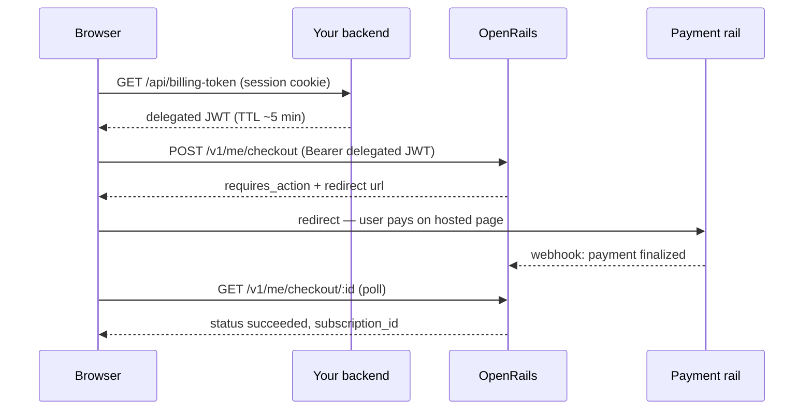

# Frontend Integration Guide

How to build billing UI against OpenRails from the browser. Applies to all three
deployment shapes:

- **Embedded** — OpenRails runs inside the host's Go server; billing routes are mounted
  on that server under a prefix (e.g. `/billing/v1/*`).
- **Standalone** — OpenRails is its own HTTP service; the browser calls it directly.
- **SaaS (hosted)** — identical to standalone from the browser's perspective; everything
  below that says "standalone" applies unchanged.

All money amounts are **micros** (millionths of a currency unit): `$5.00 = 5_000_000`.
A **rail** is the gateway kind (`mobius` = NMI-backed, `ccbill`, `stripe`, `solana`);
your checkout request names the rail the user is paying with.

### Auth: two shapes

| | Embedded | Standalone / SaaS |
|---|---|---|
| Base URL | your own server, under the mount prefix (`/billing/v1/...`) | the OpenRails origin (`https://openrails.example/v1/...`) |
| Credential | your **normal session credential** — cookie/JWT, same as every other call | a short-lived **delegated token** minted by *your* backend |
| Extra frontend work | none | one fetch-and-cache helper (below) |

**Embedded**: there is no second token. The host verifies your session and hands
OpenRails the identity in-process. Just `fetch("/billing/v1/me/status")` with your usual
credentials.

**Standalone**: your session token never leaves your trust domain
([docs/auth.md](auth.md)). Instead, your backend exposes a token-exchange endpoint that
swaps a logged-in session for a delegated JWT (`aud: ["openrails"]`,
`delegated_sub: <your user id>`, TTL of minutes). The browser caches it and sends it as
`Authorization: Bearer <token>` to OpenRails:

```ts
const OPENRAILS = "https://openrails.example";
let cached: { token: string; exp: number } | null = null;

async function delegatedToken(): Promise<string> {
  if (cached && cached.exp - 30_000 > Date.now()) return cached.token;
  // Your backend's exchange endpoint — authenticated with your normal session.
  const res = await fetch("/api/billing-token", { credentials: "include" });
  if (!res.ok) throw new Error("billing token exchange failed");
  const { token, expires_in } = await res.json();
  cached = { token, exp: Date.now() + expires_in * 1000 };
  return token;
}

export async function billing(path: string, init: RequestInit = {}) {
  const call = async () =>
    fetch(`${OPENRAILS}${path}`, {
      ...init,
      headers: { ...init.headers, Authorization: `Bearer ${await delegatedToken()}` },
    });
  let res = await call();
  if (res.status === 401) {          // token expired mid-flight: re-mint, retry once
    cached = null;
    res = await call();
  }
  return res;
}
```

### The self-service surface: `/v1/me/*`

Every route is scoped to the token's own subject (`delegated_sub` standalone, your
session identity embedded). There is **no `:user_id` anywhere** — a browser credential
can only ever act on itself. In embedded mode, prepend the mount prefix to every path.

```
GET  /v1/me/status                        premium status: active subscription, next renewal, entitlements
GET  /v1/me/balance?currency=USD          durable balance (micros for USD)
GET  /v1/me/transactions                  ledger transactions, newest first
GET  /v1/me/usage                         metered usage rolled up by event type
GET  /v1/me/invoices[/:id]                itemized statements
GET  /v1/me/payments                      one-off payment history
GET  /v1/me/entitlements/active           active entitlements
PUT  /v1/me/settings                      self-imposed caps, auto-topup, currency
GET  /v1/me/subscriptions[/:id]           own subscriptions (enriched with product/price)
POST /v1/me/subscriptions/:id/cancel      body {"feedback": "..."} → 202 {"status":"queued"}
POST /v1/me/subscriptions/:id/resume      cancelled Stripe subscriptions → 202
POST /v1/me/subscriptions/:id/change-tier body {"price_id":"price_..."} — upgrades/downgrades
PUT  /v1/me/subscriptions/:id/payment-method  swap the card on an NMI-backed subscription
GET|POST /v1/me/payment-methods           list / add (tokenized card)
PUT|DELETE /v1/me/payment-methods/:id     replace card / soft-delete
POST /v1/me/checkout                      create a checkout session
GET  /v1/me/checkout/:id                  poll session status
POST /v1/me/checkout/:id/confirm          finalize client-completed flows (Solana)
POST /v1/me/billing-portal                → {"url": ...} (Stripe-portal deployments)
GET  /v1/me/notifications[.../unread-count]   billing notifications
```

The public catalog needs no auth: `GET /v1/products` (with embedded active prices) and
`GET /v1/prices?product=prod_...` drive your pricing page.

Rail-specific gotchas the UI must handle:

- **Cancel** is queued (202), not instant — reflect "cancellation pending".
  CCBill subscriptions return `422 { error, support_url }`: cancellation happens in the
  CCBill portal; link the user there.
- **Change-tier** returns `status: succeeded | requires_action | blocked`, plus
  `action: upgrade | downgrade`. Upgrades are immediate with proration; downgrades come
  back `succeeded` with `delayed_start` (takes effect at period end). CCBill upgrades
  return `requires_action` with a top-level `url` — redirect. Solana: 400, unsupported.
- `POST /v1/checkout` (the session-auth surface) rejects a second subscription in the
  same tier group with `status: "blocked"` — send those users to `change-tier`.

### Checkout

One endpoint for every rail. A session moves
`created → requires_action → succeeded | failed | expired` and is single-use.

```json
POST /v1/me/checkout
{
  "price_id": "price_...",
  "mode": "subscription",            // optional; inferred from the price
  "payment": {
    "rail": "mobius | ccbill | stripe | solana",
    "payment_method_id": "pm_...",   // saved card — mobius/stripe
    "payment_token": "tok_...",      // fresh browser-tokenized card — mobius/stripe
    "token_symbol": "USDC",          // solana
    "email": "...", "first_name": "...", "last_name": "...",
    "address1": "...", "city": "...", "state": "...", "zip": "...", "country": "US"
  },                                 // billing fields required for ccbill/stripe
  "metadata": { "source": "web" }
}
```

Send an `Idempotency-Key` header on create — retries with the same key replay the
original response instead of double-charging.

The response's `next_action` tells the frontend what to do next:

**Redirect flow** (hosted payment page — CCBill; Stripe hosted checkout):
1. POST the session with billing fields. Response: `status: "requires_action"`,
   `next_action.type: "redirect_to_url"`, top-level `url`.
2. Redirect the browser to `url`. The user pays on the provider's page (cards never
   touch you or OpenRails) and is redirected back to your site.
3. A provider webhook finalizes the payment server-side. Poll
   `GET /v1/me/checkout/:id` until `status: "succeeded"` (then `payment_id` /
   `subscription_id` are set), and refresh `/v1/me/status`.

**Tokenized-vault flow** (NMI-backed rails, e.g. `mobius`):
1. Load the rail's tokenization script (NMI Collect.js) and render its hosted card
   fields. The card goes browser → gateway; you receive a one-time `payment_token`.
2. POST the session with `payment_token` (or `payment_method_id` of a saved card).
3. OpenRails vaults the token into a reusable payment method, charges immediately, and
   responds synchronously: `status: "succeeded"`, `payment.transaction_id`. The raw
   token is consumed once and never stored.

**Solana** (one-off only — `mode: "subscription"` is a 400):
1. POST with `rail: "solana"`, `token_symbol`, optional `flow`.
2. `flow: "transfer_request"` (default) returns `payment.transaction_url` +
   `payment.reference` — render as a QR code (`next_action.type: "solana_qr"`).
   `flow: "transaction_request"` returns `payment.transaction_data` for the connected
   wallet to sign (`next_action.type: "solana_transaction"`).
3. After the user pays/signs, `POST /v1/me/checkout/:id/confirm` with
   `{ "payment": { "rail": "solana", "signature": "...", "wallet": "..." } }`.
   Confirm is idempotent — safe to retry.



(Embedded mode: drop the token exchange — the browser calls
`/billing/v1/me/checkout` with its normal session credential.)

### Payment methods

`POST /v1/me/payment-methods` takes a Collect.js `payment_token` plus billing details
(`first_name`, `last_name`, `address1`, `city`, `state`, `zip`, `country`, optional
`email`/`phone`) and creates an NMI vault record; `PUT /:id` re-tokenizes a replacement
card. Checkout with a fresh `payment_token` also persists a payment method
automatically. `payment_method_id`s can only be used by their owner — using someone
else's is a 403.

### Shared-customer treasury: `/v1/customers/:customer_id/*`

`/v1/me/*` needs no grants. Acting on a *shared* customer balance (an org/team wallet
the user co-manages) uses `/v1/customers/:customer_id/...` — same handlers, but each
route requires an explicit `customer:*` permission carried by the delegated token:

| Permission | Allows |
|---|---|
| none | `/v1/me/*` as the token's own subject |
| `customer:balance:read` | read balance, transactions, usage, payments, invoices |
| `customer:billing:update` | set billing mode and spend caps (`PUT .../settings`) |
| `customer:payment-methods:update` | manage payment methods + billing portal |
| `customer:checkout:create` | pre-pay / load credits (`POST .../checkout`) |
| `customer:spend-delegations:read` | read the spend-delegation policy |
| `customer:spend-delegations:update` | replace/upsert the spend-delegation policy |

Over-claimed tokens are rejected: your issuer's registered authority bounds what
permissions a delegated JWT may carry.

### Errors and rate limits

Errors use a Stripe-style envelope:

```json
{ "error": { "type": "invalid_request_error", "code": "...", "message": "...", "param": "..." } }
```

Handle in the frontend:

- **401** — delegated token expired/invalid. Re-fetch from your exchange endpoint and
  retry once (the helper above does this). Embedded: your normal session-expiry flow.
- **403** — acting on a resource that isn't yours (foreign checkout session, someone
  else's `payment_method_id`, missing `customer:*` grant).
- **409** — `idempotency_key_reuse` (same key, different body) or
  `idempotency_in_progress` (retry landed while the original is still running).
- **410** — checkout session expired; create a new one.
- **413** — request body over the bucket cap (64 KiB on checkout/subscription/
  payment-method routes). Carries `Retry-After`.
- **429** — rate limited. Fixed 1-minute windows, counted per IP **and** per
  authenticated user; defaults: checkout creation 10/min, subscription mutations
  20/min, payment-methods 40/min, everything else 300/min. Read
  `X-RateLimit-Limit` / `X-RateLimit-Remaining` / `X-RateLimit-Reset` and back off for
  `Retry-After` seconds. The tight checkout limit deters card-testing — don't
  auto-retry checkout POSTs in a loop.
- When captcha escalation is enabled, an IP/user far past its limit must solve a
  challenge and send `X-Captcha-Token` until the challenge TTL expires.

Full HTTP reference: [docs/api/endpoints.md](api/endpoints.md).
