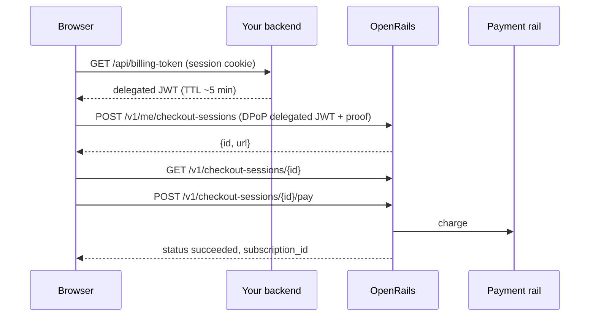

# Frontend Integration Guide

How to build billing UI against OpenRails from the browser. Applies to all three
deployment shapes:

- **Embedded** — OpenRails runs inside the host's Go server; billing routes are mounted
  on that server under a prefix (e.g. `/billing/v1/*`).
- **Standalone** — OpenRails is its own HTTP service; the browser calls it directly.
- **SaaS (hosted)** — identical to standalone from the browser's perspective; everything
  below that says "standalone" applies unchanged.

Money amounts are integers in the currency's native units (micros for USD:
`$5.00 = 5_000_000`), carried as decimal strings — parse with `BigInt`, never
`Number` ([money-wire.md](money-wire.md)).
A **rail** is the gateway kind (`nmi`, `ccbill`, `stripe`, `solana`); a **PSP** is the
merchant's account on a rail, named by its key (`mobius` = an NMI account). A checkout
session lists its `options`, one per PSP that can sell the price, in the merchant's
routing order; the page pays with one of them ([Checkout](#checkout)).

### Authentication

Embedded applications use their normal user credential through the host's
AuthKit request verifier. Cookie-based hosts set `Config.HTTP.CookieOrigin` to
`"https://merchant.example"`; by default the mount strips ambient cookies.
Admission accepts unsafe cookie
requests only from that exact configured origin, including bodyless POSTs;
missing, opaque, cross-origin and sibling origins are refused. Do not wrap
AuthKit's own auth routes, which own their refresh/CSRF cookie protocol.

Standalone and SaaS browser clients use AuthKit v1 browser delegation:

1. Create a non-extractable WebCrypto P-256 signing key in memory.
2. Call the merchant issuer's `POST /api/v1/delegated/token` (AuthKit's
   default mount) using its normal local
   `Authorization: Bearer` credential and a fresh ES256 `DPoP` proof. Include
   `audiences: ["openrails"]` and the application's `requested_grant`. The
   issuer's host authorizer determines the actual grant; the browser does not.
3. Keep the returned `token_type: "DPoP"` token with that key. For every
   OpenRails call use `Authorization: DPoP <token>` plus a newly signed `DPoP`
   proof covering the token hash, HTTP method, externally visible URL without
   query/fragment, issuance time, and unique nonce (`jti`).
4. Clear both token and key on logout or account change. Refresh/remint before
   expiry; a retry needs a fresh proof. Do not automatically repeat a financial
   mutation without its documented durable operation key.

Register the merchant's AuthKit signing application and its bounded grant in
OpenRails. OpenRails uses its configured `auth.request_origin` plus the request
path for proof targets, never arbitrary Host/Forwarded headers. CORS allows
credential-free preflight with `Authorization` and `DPoP`; direct resource
requests use `credentials: "omit"`. CORS is not identity or authorization.

Native clients may use the certificate-bound delegated profile instead:
`Authorization: Bearer` plus the actual TLS client certificate matching
`cnf.x5t#S256`. A proxy header is not a client certificate. Unbound delegated
JWTs and a DPoP token downgraded to Bearer are refused.

See AuthKit's [tokens](https://github.com/open-rails/authkit/blob/master/docs/tokens.md#delegated-tokens)
for the mint and proof fields and the shared replay store.

### The self-service surface: `/v1/me/*`

Every route is scoped to the token's own subject (`delegated_sub` standalone, your
session identity embedded). There is **no `:user_id` anywhere** — a browser credential
can only ever act on itself. In embedded mode, prepend the mount prefix to every path.

```
GET  /v1/me/balance?currency=USD          durable balance (micros for USD)
GET  /v1/me/transactions?currency=USD     credit ledger, newest first
GET  /v1/me/usage?currency=USD            metered usage, grouped by event type (or ?group_by=)
GET  /v1/me/spend-limits?currency=USD     the spend windows THIS invoker is gated on, with live used/reserved/remaining/resets_at
GET  /v1/me/invoices[/{id}]               itemized statements (cursor page)
GET  /v1/me/payments                      payment and refund history (cursor page)
GET  /v1/me/entitlements                  active entitlements
PUT  /v1/me/collection-payment-method     body {"currency","payment_method_id"}: invoice collection method
GET  /v1/me/subscriptions[/{id}]          own subscriptions (cursor page): typed ids, price/product, scheduled change, card, access
POST /v1/me/subscriptions/{id}/cancel      body {"reason": "..."} → the Subscription (next_action when the wallet must sign)
POST /v1/me/subscriptions/{id}/resume      undo a scheduled cancel → the Subscription
POST /v1/me/subscriptions/{id}/change-tier body {"price_id":"price_..."} → a TierChange (upgrades/downgrades)
PUT  /v1/me/subscriptions/{id}/payment-method  swap the saved card → the Subscription
GET|POST /v1/me/payment-methods           list (cursor page) / add a card with a PSP
PUT|DELETE /v1/me/payment-methods/{id}    replace NMI card / provider-aware delete
POST /v1/me/checkout-sessions             mint a checkout session for a price → {id, url, expires_at}
POST /v1/me/billing-portal                → {"url": ...} (Stripe-portal deployments)
GET  /v1/me/notifications[.../unread-count]   billing notifications
```

The public catalog needs no auth: `GET /v1/products` (each product with its current
prices) and `GET /v1/prices?product_id=prod_...` drive your pricing page.

### Discovering payment options: `GET /v1/checkout-config`

Public, unauthenticated, cacheable (`Cache-Control: public, max-age=60`). It answers
"what can this merchant take money with, and what do I need in the browser to do it?"
so you never hard-code a rail or duplicate a tokenization key in your own config. The
merchant is resolved from the request `Host` (its `api_host`), exactly like the public
catalog.

```json
{
  "object": "checkout_config",
  "psps": [
    { "psp_id": "psp_...", "key": "mobius", "rail": "nmi", "custodian": "psp", "display_name": "Credit Card",
      "flow": "tokenize", "checkout": true,
      "config": { "tokenization_key": "<public Collect.js key>",
                  "tokenization_url": "https://secure.networkmerchants.com/token/Collect.js" } },
    { "key": "mobius-bt", "rail": "nmi", "custodian": "basis_theory", "display_name": "Credit Card",
      "flow": "tokenize",
      "config": { "public_api_key": "<public Basis Theory application key>" } },
    { "key": "stripe", "rail": "stripe", "custodian": "psp", "display_name": "Stripe",
      "flow": "elements", "checkout": true, "config": { "publishable_key": "pk_test_..." } },
    { "key": "ccbill", "rail": "ccbill", "custodian": "psp", "display_name": "Credit Card", "flow": "redirect" },
    { "key": "solana", "rail": "solana", "custodian": "psp", "display_name": "Solana", "flow": "wallet" }
  ]
}
```

- Only **armed** PSPs appear — a rail the merchant has no live account on is simply
  absent. Switch on `flow`, not on a hard-coded list of rails:
  - `tokenize` — load `config.tokenization_url`, tokenize with `config.tokenization_key`,
    POST the resulting `payment_token`.
  - `elements` — Stripe with a declared `publishable_key`: save the card in the page
    (`POST /v1/me/payment-method-setups`, Stripe.js `confirmSetup`, then
    `.../confirm`), then pay the checkout session with its `payment_method_id`.
  - `redirect` — nothing needed in the browser; paying answers a `redirect_to_url`
    `next_action` (Stripe without a publishable key, one-off prices only).
- `checkout` is true for PSPs that take new purchases and new cards under the
  merchant's checkout routing (a catch-all `checkout_routing` rule naming one PSP
  makes it the only checkout PSP). Other armed PSPs stay listed for existing cards.
  - `wallet` — the buyer's wallet pays; the document's `solana` object carries the
    network and accepted tokens, and `GET /v1/solana/tokens?wallet=` adds a
    wallet's balances.
- `key` is the selector a merchant checkout attempt sends as `payment.rail`.
- Which of these can sell a given price is answered by the checkout session's
  `options`, or for the merchant by `GetCheckoutConfig` with a price
  (`GET /v1/merchant/checkout-config?price_id=`), see below.
- `custodian` is **who holds the card**, which is not the same question as `rail` (who charges
  it). `psp` means the gateway itself; anything else is a third party whose SDK your page
  tokenizes against — same rail, different script and different public key. Read `flow` and
  `config` and you never have to care; read `rail` alone and you will get this wrong.
- Every value here is public by nature. Secrets (an NMI `security_key`, a Stripe
  `sk_`, a CCBill DataLink password, a Solana signer) are structurally unreachable
  from this endpoint: it serves a fixed whitelist of per-rail public fields, so a new
  setting is private unless someone deliberately publishes it.

Rail-specific gotchas the UI must handle:

- **Cancel** and **resume** answer the `Subscription` in the request. A Solana
  subscription answers it unchanged with `next_action` (`solana_sign_transactions`):
  the wallet signs and sends the transactions, then the same request is repeated with
  `signature`.
- **Change-tier** returns `status: succeeded | processing | requires_action | blocked`, plus
  `action: upgrade | downgrade`. Upgrades are immediate with proration; downgrades come
  back `succeeded` with `delayed_start` (takes effect at period end). `requires_action`
  carries a `next_action`: a `redirect_to_url` (CCBill), wallet transactions to sign
  (Solana), or a card challenge (`payment_authentication` with `operation_id`).
- Paying a checkout session for a second subscription in the same tier group
  answers `status: "blocked"` — send those users to `change-tier`.

### Which rails sell what

A PSP is offered for a price iff it is armed (credentials resolve and its
posture verification did not disarm it) and its rail can make that kind of new
sale, per the rail registry:

| Rail | One-time | New subscription |
|---|---|---|
| NMI, Stripe | yes | engine-collected on a saved card (no trial phase); an NMI token is saved first |
| Solana | yes (Solana Pay) | the price's published on-chain plan |
| CCBill | no | no (imported subscriptions keep working) |

Each checkout option carries `psp_id`, `rail`, `driver` (`collect_js`, `card`,
`stripe_elements`, `redirect`, `solana_pay`) and `public_config` (NMI/Stripe
public keys; Solana `token_symbol`, `token_name`, `network`). `@openrails/billing-ui`
renders them as they are; hosts add no rail logic.
Catalog application refuses an active price that declares PSPs when none of
them, nor any armed rail selling on local terms, can sell it
(`price_not_sellable`); a checkout nothing can serve fails with the per-PSP
skip reasons.

### Checkout

A browser buys through a **checkout session**. Mint one for a price, then read and
pay it by its id; the id is the only credential the payment page needs, so the page
can live on another host. `@openrails/billing-ui`'s
`<Checkout source={client.checkoutSource(id)} />` runs all of this.

```
POST /v1/me/checkout-sessions        {"price_id" | "price_key", "success_url"?} → 201 {id, url, expires_at}
GET  /v1/checkout-sessions/{id}      the offer: plan, amounts, options, saved methods, status
POST /v1/checkout-sessions/{id}/pay  {"option_id", instrument, billing fields} → {status, next_action, operation, failure}
```

The pay body names one of the session's `options` and the instrument its `driver`
takes: `payment_token` (`collect_js`), `card` (`card`: the page posts the card to
OpenRails, which vaults it), `payment_method_id` (a saved card, or `stripe_elements`),
or `token_symbol` (`solana_pay`). Options are listed in the merchant's routing order.
Paying twice with the same attempt charges once; a session takes 10 attempts and is
payable for 30 minutes.

Render `name_on_card` as one visible input with `autocomplete="cc-name"`.
OpenRails keeps that full value canonical and projects it onto provider-specific
first/last fields only at the rail boundary. `first_name` and `last_name` are
not request fields: a body that names them is refused (`unknown_field`).

The chosen PSP and the reason for it are recorded on the checkout attempt
(`checkout_attempts.routing_reason`), so support can answer "why did this customer
get this PSP" without guessing. Merchants can preview a decision without creating
anything: `POST /v1/merchant/psps/routing-preview` (`Client.PreviewPSPRouting`) with
`{"price_id": "...", "country": "US"}` returns the winner, the ranked fallbacks, and
every skipped candidate with its reason.

The pay answer's `status` tells the page what to do next:

- `succeeded` — done; `payment_id` / `subscription_id` are set. Refresh `/v1/me/entitlements`.
- `failed` — a definite decline; `failure` (`{reason, message, field}`) is safe to
  show the buyer, and `field` names the card field to correct. Fraud-related declines
  always read `generic_decline`. Pay again with another card.
- `processing` — re-read the session until it settles; never start another attempt.
- `blocked` — the buyer cannot make this purchase (already a member).
- `requires_action` — one of:
  - `next_action.type: "redirect_to_url"`: open `url` (Stripe hosted Checkout) in the
    top window. The buyer returns to `success_url`; a provider webhook settles the
    payment, and the session reads `succeeded`.
  - `next_action.type: "solana_pay"`: show `url`, a `solana:` Solana Pay transfer
    link, as a QR code or wallet link. OpenRails watches the payment's reference on
    chain and settles.
  - `operation.id`: a card challenge (3-D Secure).
    `GET /v1/me/payment-operations/{id}/authentication` gives the client secret for
    Stripe.js; then `POST .../authentication/confirm`, which verifies with the provider.


```mermaid
sequenceDiagram
    participant B as Browser
    participant Y as Your backend
    participant O as OpenRails
    participant P as Payment rail
    B->>Y: GET /api/billing-token (session cookie)
    Y-->>B: delegated JWT (TTL ~5 min)
    B->>O: POST /v1/me/checkout-sessions (DPoP delegated JWT + proof)
    O-->>B: {id, url}
    B->>O: GET /v1/checkout-sessions/{id}
    B->>O: POST /v1/checkout-sessions/{id}/pay
    O->>P: charge
    O-->>B: status succeeded, subscription_id
```

(Embedded mode: drop the token exchange — the browser mints at
`/billing/v1/me/checkout-sessions` with its normal session credential.)

A merchant's server can charge without a browser session: `CreateCheckoutAttempt`
(`POST /v1/merchant/checkout-attempts`) relays the customer's pay click with a saved
method, an NMI `payment_token` or a Solana wallet, and answers the same statuses
(see [the checkout API](api/commerce.md)). `CreateCheckoutSession`
(`POST /v1/merchant/checkout-sessions`) hands a price to a customer's browser.

CCBill uses the authenticated account's verified email; do not treat a browser
`email` value as identity. Its hosted-card API requires name, country,
and postal code, while street, city, and state are optional. Omitting those
optional fields does not reconfigure the hosted FlexForm:
disable or make its Address Fields optional separately in CCBill FlexForms
Admin when that is the desired customer experience. Stripe hosted Checkout
collects its own customer and billing fields.

### Payment methods

`POST /v1/me/payment-methods` takes the PSP's `psp_id`, a Collect.js `payment_token`
(or, for a PSP whose card entry is server, the `card`) and optional `billing_details`
(`name`, `email`, `phone`, `address` with `line1`, `line2`, `city`, `state`,
`postal_code`, `country`) and creates an NMI vault record. `PUT` on the method replaces an NMI
card with a new `payment_token` or `card`. OpenRails reads the saved card's brand, last
four and expiry from the PSP; the browser never states them. Checkout with a fresh `payment_token` also persists a payment method
automatically. `payment_method_id`s can only be used by their owner — using someone
else's is a 403.

Send `Idempotency-Key` on the create request and retain the key, payment token, and
exact JSON body for an exact-request retry. A different token is a new attempt and
must use a new key. If create returns `provider_outcome_unknown`, refresh the payment
method list before starting another attempt because the provider mutation may have
completed.

Stored-card replacement is durable. A confirmed replacement returns the updated
payment method. `202 Accepted` has no body and means OpenRails is still resolving the
provider outcome; repeat the exact request to inspect the same attempt. A
`409 payment_method_update_retry_required` means that attempt did not update the card
and Collect.js must tokenize it again. OpenRails never blindly resubmits a single-use
Collect.js token after an ambiguous provider response.

Deleting a stored NMI method returns `204 No Content` after provider and local
removal are confirmed, or `202 Accepted` with no body while the durable delete is
still converging. Keep the method visible after `202` and refresh the list later.
Stripe cards remain provider-owned and must be managed through Stripe Billing Portal.

### Errors and rate limits

Errors use a Stripe-style envelope:

```json
{ "error": { "type": "invalid_request_error", "code": "...", "message": "...", "param": "..." } }
```

Handle in the frontend:

- **401** — delegated token expired/invalid. Re-fetch from your exchange endpoint and
  retry once. Embedded: your normal session-expiry flow.
- **403** — acting on a resource that isn't yours (foreign checkout session, someone
  else's `payment_method_id`).
- **409** — `idempotency_key_reused` (same key, different terms),
  `payment_in_progress` (a retry landed while the original is still running) or
  `provider_outcome_unknown` (read the resource before trying again).
- **410** — `checkout_session_expired`; create a new one.
- **413** — request body over the bucket cap (64 KiB on checkout/subscription/
  payment-method routes). Carries `Retry-After`.
- **429** — rate limited. Fixed 1-minute windows, counted per IP **and** per
  authenticated user; defaults: checkout 10/min, subscription mutations
  20/min, payment methods 40/min; other routes are not limited by OpenRails. Read
  `X-RateLimit-Limit` / `X-RateLimit-Remaining` / `X-RateLimit-Reset` and back off for
  `Retry-After` seconds. The tight checkout limit deters card-testing — don't
  auto-retry checkout POSTs in a loop.
- When captcha escalation is enabled, an IP/user far past its limit must solve a
  challenge and send `X-Captcha-Token` until the challenge TTL expires.

Full HTTP reference: [docs/api/endpoints.md](api/endpoints.md).

Cookie origins use canonical browser spelling: lowercase host, no wildcard,
userinfo, path, query, fragment, or explicit default port. HTTPS is required;
HTTP is allowed for explicit localhost/loopback development origins.
