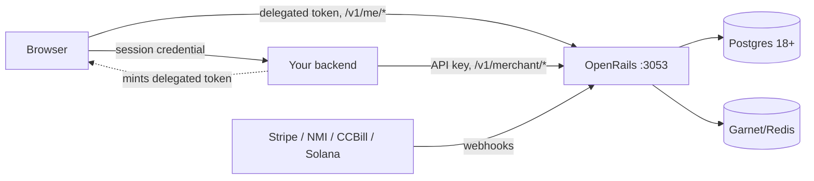

# Standalone Integration Guide

How to deploy OpenRails as its own self-hosted HTTP service and integrate your
application against it. The README's "Standalone Mode: How To Integrate" is the
quickstart; this is the full guide. All money amounts are **micros** (millionths
of a currency unit). Vocabulary: a **rail** is a gateway kind (`nmi`, `ccbill`,
`stripe`, `solana`); a **PSP** is your concrete account on a rail (e.g. `mobius`
on nmi) — declared under `merchants.<slug>.psps.<key>.<rail>`.



### Deployment

**Evaluation.** The compose stack runs everything zero-config:

```bash
task docker-up                                # Postgres + Garnet(Redis) + migrate + OpenRails
curl http://localhost:3053/health/ready       # readiness: Postgres, Redis, AuthKit verifier
```

Host ports (all bound to 127.0.0.1): OpenRails `:3053`, Postgres `:5434`,
Redis `:6380`. The `openrails-migrate` service applies migrations
(`openrails migrate up`) before the server starts. Everything — public catalog,
`/v1/me/*` self-service, `/v1/merchant/*`, and webhooks — shares the one port;
there is no separate private/service listener.

**Production needs:**

- **Postgres 18+.** OpenRails owns the `openrails` schema; it can share your
  app's database. Apply migrations with `openrails migrate up` before each new
  version boots (the server validates and refuses to start on missing migrations).
- **A Redis-compatible service** (we recommend Garnet) — optional, backs
  rate limiting; without it limits are in-memory per-process.
- **HashiCorp Vault** — optional. Two independent uses: KV storage for merchant
  secrets (`secret_backend: vault`) and Transit signing for Solana custody. See
  [vault.md](vault.md).

**Configuration** is a `config.yaml` (see `config.example.yaml` for the full
surface: listener, db, redis, auth issuer, encryption, vault, rate limits,
trusted proxies, captcha, admin console) plus a koanf env overlay — an env var
maps onto the config tree by prefix, e.g. `DB_URL` → `db.url`,
`PROVIDER_WRITE_MODE` → `provider_write_mode`, `SECRET_BACKEND` →
`secret_backend`. For the two operating dials there are also CLI flags.
Precedence: **flag beats env beats yaml.**

```bash
openrails run-server --config /etc/openrails/config.yaml \
  --provider-write-mode full --test-mode live
```

**Required outside development** (config validation refuses boot otherwise):

- `provider_write_mode: full | limited | readonly` — how much OpenRails may do
  against the rails (see [operations.md](operations.md) for the full matrix;
  `limited` parks system-initiated writes like dunning, `readonly` blocks all
  provider writes at the wire). It must be declared explicitly outside
  development; unset in development fail-closes to `readonly`.
- `test_mode: sandbox | live` — the credential axis, orthogonal to the above.
  `sandbox` routes every rail to its test environment and refuses live
  credentials at boot (live Stripe keys rejected, NMI accounts probed), so no
  real money can move. Sandbox is allowed in every environment — credential
  validation, not the env string, keeps it honest.
- Non-default database credentials, and an `https` `auth.issuer`.
- **Merchant-secret storage** (mode 2 / `merchant_source: api` only): a secret
  backend is required outside development — either Vault
  (`secret_backend: vault`) or the DB store with `ENCRYPTION_MASTER_KEY`
  (base64, 32-byte AES-256) for envelope encryption. Mode 1 persists no secrets,
  so this gate does not apply there.
- Behind a load balancer, set `trusted_proxies` to its CIDR range or
  `X-Forwarded-For` is ignored and rate limiting keys on the LB's address.

### Two merchant-source modes

`merchant_source` in config.yaml selects where merchant truth lives:

| | MODE 1 — `manifest` (default) | MODE 2 — `api` |
|---|---|---|
| Source of truth | YAML mounted at boot, held in memory | DB + Vault, mutated over HTTP APIs |
| Change a merchant/credential | edit file(s) + reboot | call the API |
| Secrets at rest | never persisted (in-memory) | Vault KV or DEK-encrypted DB (required outside dev) |
| Merchant/PSP mutation APIs | 405 `manifest_driven` (reads work) | full surface |
| Pick when | one/few merchants you operate yourself; secrets rendered by Vault Agent/k8s | merchants managed at runtime, SaaS-style |

Full MODE 1 walkthrough (file layout, secret-file overlay, precedence
`yaml < secret files < env`, rotation): [self-hosting-mode1.md](self-hosting-mode1.md).
The env overlay for merchant values is `BILLING_MERCHANTS_<MERCHANT>_PSPS_…`,
e.g. `BILLING_MERCHANTS_MYAPP_PSPS_MOBIUS_NMI_SECRETS_SECURITY_KEY`.

### First run

Three file-backed manifests drive provisioning (example shapes:
`config/bootstrap.example.yaml`, `config/merchants_config.example.yaml`,
`config/catalog.example.yaml`). Every push command shares one **mutation-flag
contract**: with no flags it is **plan-only** (prints a terraform-style diff,
mutates nothing); `--insert` creates missing state, `--overwrite` updates
existing state, `--prune` removes target extras absent from the manifest. The
flags compose; full reconciliation is `--insert --overwrite --prune`.

On an empty install, in order:

```bash
# 1. AuthKit root authority: initial operator user(s) + trusted remote apps.
#    First-run only when applied at startup; explicit here.
openrails push-auth-bootstrap --config /etc/openrails/config.yaml --file /etc/openrails/bootstrap.yaml

# 2. Merchants: identity, profile, PSPs (rail accounts + secrets), and your
#    app's issuer registered as merchant OWNER (the manifest's
#    remote_application block).
openrails push-merchant-config --config /etc/openrails/config.yaml --file /etc/openrails/merchants.yaml --insert

# 3. Catalog: products, entitlements, prices, per-PSP links; pushes to
#    providers where supported (Stripe auto-creates; NMI/CCBill are link-only).
openrails push-merchant-catalog --config /etc/openrails/config.yaml --file /etc/openrails/catalog.yaml --insert --overwrite
```

Mode notes: in MODE 1 the server itself loads `/etc/openrails/merchants.yaml`
on every boot and converges it (insert+overwrite+prune, secrets in memory) — so
step 2 is simply "mount the file and boot". If `/etc/openrails/bootstrap.yaml`
is mounted, startup applies it first-run only (gated by AuthKit's bootstrap
marker). Normal restarts never re-apply merchant config or catalog manifests —
changing them is an explicit push (or, MODE 1, an edit + reboot).

**Create an API key.** Backend credentials are merchant-scoped API keys
(`openrails_st_…`) minted through the merchant surface:

```
POST /v1/merchant/api-keys   {"name": "backend", "role": "owner"}
```

Roles are fixed: `viewer` (read-only — right for LLM agents), `support`,
`owner`. Requires `merchant:credentials:manage` (owner-only), so authenticate
the mint with a delegated JWT signed by the issuer you registered in step 2
(issuer-as-owner: your app's tokens administer exactly that one merchant), an
operator session from the bootstrap user, or the admin console
(`admin_console.enabled`). The secret is returned **exactly once** in the mint
response and is never retrievable again. `GET /v1/merchant/api-keys` lists,
`DELETE /v1/merchant/api-keys/{id}` revokes. Details:
[merchant-provisioning.md](merchant-provisioning.md).

### Backend integration

**Go SDK** — the root module's `openrails.Client`, identical interface to
embedded mode:

```go
client := openrails.NewRemote("https://openrails.example",
    openrails.WithAPIKey(os.Getenv("OPENRAILS_API_KEY")), // or WithTokenProvider for minted JWTs
    openrails.WithCurrency("usd"),
    openrails.WithTimeout(2*time.Second), // per-call deadline; default 2s
)
if err := openrails.Verify(ctx, client); err != nil { // authenticated boot probe
    log.Fatal(err)                                    // bad URL, bad key — fail fast
}

verdicts, err := client.AdmitBatch(ctx, []openrails.AdmitRequest{{
    CustomerID:      customerID,
    Invoker:         userID,
    EstimatedAmount: 50_000,    // micros
    RequestID:       requestID, // idempotency key
}})
err = client.Capture(ctx, requestID, 43_000, &openrails.CaptureUsage{EventType: "chat.completion"})
// or client.Release(ctx, requestID) if the work failed
```

Options: `WithAPIKey`, `WithTokenProvider` (per-call minted bearer),
`WithCurrency`, `WithTimeout`, `WithHTTPClient`. The constructor never errors;
a bad base URL or empty key surfaces on the first call.

**Errors** are canonical sentinels (`errors.Is` works identically against a
remote or embedded engine): `ErrUnauthorized`, `ErrInvalid`, `ErrDenied`,
`ErrNotFound`, `ErrConflict`, `ErrInsufficientCredits` (402),
`ErrInternal`, and `ErrUnreachable` — which wraps transport failures,
timeouts, and 5xx. Every error is a `*StatusError` carrying the HTTP status
and wire code/message.

**Fail-open vs fail-closed for admission:** key your policy off
`ErrUnreachable`. A clean deny (`allowed=false`, or `ErrInsufficientCredits`)
is a real verdict — always honor it. `ErrUnreachable` means OpenRails could
not answer: fail-open (serve the request, reconcile later) keeps your product
up when billing is down, fail-closed protects against unmetered spend — choose
per endpoint cost. Keep `WithTimeout` short so a slow OpenRails cannot stall
your hot path.

**Any other stack** calls the same HTTP surface with the API key:

```bash
# Pre-authorize + hold atomically before doing expensive work
curl -X POST https://openrails.example/v1/merchant/admissions \
  -H "Authorization: Bearer openrails_st_..." \
  -d '{"items":[{"customer_id":"...","invoker":"user-123",
       "estimated_amount":50000,"request_id":"req-789"}]}'

# Settle at real cost…
curl -X POST https://openrails.example/v1/merchant/admissions/req-789/capture \
  -H "Authorization: Bearer openrails_st_..." \
  -d '{"amount":43000,"event_type":"chat.completion"}'

# …or release the hold when the work failed
curl -X POST https://openrails.example/v1/merchant/admissions/req-789/release \
  -H "Authorization: Bearer openrails_st_..."
```

The `/v1/merchant/*` surface (admissions, credits, entitlements, usage,
settings, customers, payments, subscriptions) is permission-gated per route —
see [api/endpoints.md](api/endpoints.md) for the full reference and the
permission table. Keys are bound to their merchant and can never act on
another merchant's data.

### Frontend integration

Your users' browsers call OpenRails' self-service surface (`/v1/me/*`:
status, subscriptions, payment methods, checkout, invoices) **directly**, using
a short-lived delegated token your backend mints with its registered issuer
key — your session tokens never leave your trust domain. The token contract,
exchange-endpoint pattern, and checkout flows are in
[frontend-integration.md](frontend-integration.md); the rationale for the
two-token model is in [auth.md](auth.md). CORS requires zero configuration
(see below).

### Webhooks

Point each rail's webhook directly at OpenRails — not through your app:

```
POST https://openrails.example/v1/webhooks/{rail}[/{account_id}]
```

OpenRails resolves the merchant from the payload's (or the path's) PSP account
identity, verifies the rail's signature
with that merchant's own signing secret, and updates
subscriptions/entitlements; your app just reads the results. For local rail
sandboxes see [dev/local-webhooks.md](dev/local-webhooks.md).

**Per-merchant API hosts (#734).** A multi-merchant deployment can give each
merchant a canonical hostname (`merchants.api_host` — a plain row update via
`merchants.Service.SetHostConfig`, resolved live on the next request, no
restart). Host resolution then routes `/v1/webhooks/{rail}`
without the path slug, and enforces Host-merchant == issuer-merchant on every
merchant-scoped route: a token minted for merchant A is rejected on merchant
B's host even though it verifies.

**CORS (#765)** is a fixed, engine-wide policy — not configurable, no origin
registration: browser-facing tiers (checkout, `/v1/me/*`, `/v1/customers/*`)
answer `Access-Control-Allow-Origin: *` (never with credentials — OpenRails
issues no cookies; every browser call is an explicit bearer token), and every
other surface (merchant API, webhooks, admin) emits no CORS headers at all.

### Upgrades and ops

On every upgrade run `openrails migrate up` before the new version serves
traffic — the server refuses to boot on a missing migration. For everything
operational — the `provider_write_mode` matrix, cutover onto production
credentials (boot `limited`, inspect `openrails intents`, then raise to
`full`), the durable provider-intent ledger, `pull-provider` reconciliation,
and dunning — see [operations.md](operations.md).
