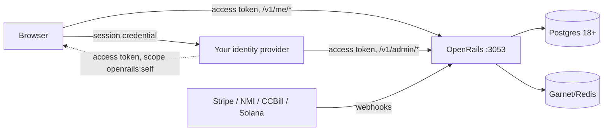

# Standalone Integration Guide

How to deploy OpenRails as its own self-hosted HTTP service and integrate your
application against it ([Backend integration](#backend-integration) shows the Go client, `NewRemote`).
[`examples/standalone`](../examples/standalone) runs all of it: the server from
its image, a merchant from a file, an app whose AuthKit is the trusted issuer,
SCIM contacts, receipts and webhooks. Money
is an integer in the currency's native units (`GET /v1/config`'s `currencies`;
micros for USD), a decimal string on the wire ([money-wire.md](money-wire.md)). Vocabulary:
a **rail** is a gateway kind (`nmi`, `ccbill`,
`stripe`, `solana`); a **PSP** is your concrete account on a rail (e.g. `mobius`
on nmi) — declared under `merchants.<slug>.psps.<key>`, with its `rail:`.


```mermaid
flowchart LR
    B[Browser] -- session credential --> H[Your identity provider]
    H -. access token, scope openrails:self .-> B
    B -- access token, /v1/me/* --> OR[OpenRails :3053]
    H -- access token, /v1/admin/* --> OR
    OR --> PG[(Postgres 18+)]
    OR --> RD[(Garnet/Redis)]
    R[Stripe / NMI / CCBill / Solana] -- webhooks --> OR
```

### Deployment

**Evaluation.** The compose stack runs everything zero-config:

```bash
task docker-up                                # Postgres + Garnet(Redis) + migrate + OpenRails
curl http://localhost:3053/health/ready       # readiness: dependencies, local workers, AuthKit verifier
```

Host ports (all bound to 127.0.0.1): OpenRails `:3053`, Postgres `:5434`,
Redis `:6380`. The server applies its migrations at boot. Everything — public catalog,
`/v1/me/*` self-service, `/v1/admin/*`, and webhooks — shares the one port;
there is no separate private/service listener.

**Production needs:**

- **Postgres 18+.** OpenRails owns one schema (`database.schema` /
  `DATABASE_SCHEMA`, default `billing`); it can share your app's database. The
  server creates or upgrades its tables at boot; `openrails migrate up` does it
  ahead of a rollout. Name it with `db.url` (`DB_URL`), or with `db.host`,
  `db.port`, `db.database` and `db.username` (`db.sslmode` defaults to
  `require`). There is no default: without one the server refuses to start.
- **A Redis-compatible service** (we recommend Garnet) — optional for one
  instance, required for several. It holds rate limits, admin lockouts, captcha
  challenges and card-testing declines, shared by every instance; without it
  they live in the process's memory. Name it with `redis.addr` (`REDIS_ADDR`)
  or a `redis://` / `rediss://` URL (`REDIS_URL`), with `redis.username`
  (`REDIS_USERNAME`, an ACL user), `redis.password`, `redis.tls` and
  `redis.ca_cert` (`REDIS_CA_CERT`, the PEM CA) as it needs. While a declared
  Redis does not answer, each process keeps them in its own memory and
  readiness reports Redis degraded without failing.
- **HashiCorp Vault** — optional. Name a KV mount (`vault.kv_mount`) and Vault
  holds merchant configuration; name only a Transit mount and it only signs
  Solana transactions. See [vault.md](vault.md).

**Configuration** is a `config.yaml` (see `config.example.yaml` for the full
surface: listener, db, redis, auth issuer, vault, rate limits,
trusted proxies, captcha, admin console) plus an environment overlay: an env var
maps onto the config tree by prefix, e.g. `DB_URL` → `db.url`,
`PROVIDER_WRITE_MODE` → `provider_write_mode`, `VAULT_KV_MOUNT` →
`vault.kv_mount`. For the two operating dials there are also CLI flags.
Precedence: **flag beats env beats yaml.** An env var inside a section that
names no key refuses boot, except the variables Kubernetes adds for each
Service in the namespace (`REDIS_SERVICE_HOST`, `DB_PORT=tcp://…`), which are
ignored.

Security defaults apply in sandbox and live deployments. Narrow local auth
exceptions must be explicit; provider posture does not relax storage, issuer,
signing or trusted-proxy requirements.

```bash
openrails run-server --config /etc/openrails/config.yaml \
  --provider-write-mode full --test-mode live
```

**Required configuration** (config validation refuses boot otherwise):

- `provider_write_mode: full | limited | readonly` — how much OpenRails may do
  against the rails (see [operations.md](operations.md) for the full matrix;
  `limited` parks system-initiated writes like dunning, `readonly` blocks all
  provider writes at the wire). Declare it explicitly; unset internal policy fails closed to `readonly`.
- `test_mode: sandbox | live` — the credential axis, orthogonal to the above.
  `sandbox` routes every rail to its test environment and refuses live
  credentials at boot (live Stripe keys rejected, NMI accounts probed), so no
  real money can move. `live` similarly refuses Stripe test keys in every
  environment rather than silently disabling the rail. Sandbox is allowed in
  every environment — credential validation, not the env string, keeps it
  honest.
- An `https` `auth.token.issuer`: the server's own AuthKit
  ([runtime configuration](runtime-configuration.md#authentication)).
- Behind a load balancer, set `trusted_proxies` to its CIDR range or
  `X-Forwarded-For` is ignored and rate limiting keys on the LB's address.

### Where merchant configuration lives

A merchant's configuration (display name, settings, alert webhooks, PSPs and
custodians, credentials included) lives in the merchant manifest or, when a KV
mount is named, in Vault; never in PostgreSQL. With the manifest it is read at
boot and the edit routes are not mounted. With Vault the manifest names
merchants only (a manifest declaring configuration is refused at boot) and
staff edit configuration over HTTP at the revision they read. See
[merchant configuration](merchant-configuration.md) and [vault.md](vault.md).

The server mounts the admin API and the merchant's configuration, guarded by
its merchant persona's permissions ([auth](auth.md#permissions)):
`server.MerchantBillingRead` for reads, `server.MerchantBillingManage` for
actions on customers, `server.MerchantConfigManage` for the configuration
(PSPs, settings, billing import and export), `server.MerchantCatalogManage`
for catalog edits.

Catalogs always use database state, edited over HTTP (the remote Client
included). `openrails apply-catalog` and the
applications route apply documents that share the catalog with those edits: a
document skips a product, price or meter whose field an edit set differently,
reports it and exits non-zero, unless `--force-conflicts` ([catalog
ownership](catalog-ownership.md)). An already applied document replays, so it
never overwrites later edits. This does not change provider permissions,
sandbox/live posture, or `provider_write_mode`.

Manifest walkthrough (file layout, YAML secret overlays via
`merchant_manifest_overlays`, rotation): [self-hosting-mode1.md](self-hosting-mode1.md).

### First run

Three file-backed manifests drive provisioning (example shapes:
`config/bootstrap.example.yaml`, `config/merchants_config.example.yaml`,
`config/catalog.example.yaml`). Every push command shares one **mutation-flag
contract**: with no flags it is **plan-only** (prints a terraform-style diff,
mutates nothing); `--insert` creates missing state, `--overwrite` updates
existing state, `--prune` removes target extras absent from the manifest. The
flags compose; full reconciliation is `--insert --overwrite --prune`.

The merchant manifest (`version: 1`, then `merchants.<slug>`) can instead be
read at every boot, `run-server --merchant-manifest merchants.yaml` (or a
mounted `/etc/openrails/merchants.yaml`): boot creates a merchant and its PSPs
the first time and leaves later API edits alone, so the server needs no
separate first-run step for them. `push-auth-bootstrap` is for the server's own
accounts (`local_sign_in`); with a trusted issuer it has nothing to do.

On an empty install, in order:

```bash
# 1. AuthKit root authority: initial operator user(s) + trusted remote apps.
#    First-run only when applied at startup; explicit here.
openrails push-auth-bootstrap --config /etc/openrails/config.yaml --file /etc/openrails/bootstrap.yaml

# 2. Merchants: identity and your app's issuer registered as merchant OWNER
#    (the manifest's remote_application block). Without Vault the manifest
#    also carries their configuration, read at every boot.
openrails push-merchant-config --config /etc/openrails/config.yaml --file /etc/openrails/merchants.yaml --insert

# 3. Catalog: products, entitlements, prices and validated provider bindings.
#    Provider creation and mutation use their separate workflows.
openrails apply-catalog --merchant your-merchant --config /etc/openrails/config.yaml --file /etc/openrails/catalog.yaml
```

Startup provisions the manifest's missing merchants and, without Vault, reads
their configuration. AuthKit bootstrap is first-run only; catalog application
is always explicit.

**Backend credentials.** Your backend is a client of the issuer you
registered in step 2 (see [trusted issuers](#trusted-issuers-staff-machines-and-customers)):
it requests a client-credentials access token for this deployment's resource
identifier with scope `openrails:merchant`, and its permissions there, within
its application's role, decide what it may do. OpenRails mints no credentials
and serves no route that does; a hosted product mints API keys in the server's
AuthKit (`ak.CreateAPIKey`, [API keys](merchant-provisioning.md#api-keys)).

The remote CLI reads such a token from `--token-file` on every call, so
whatever refreshes it may rewrite the file in place:

```bash
curl -s https://issuer.example/oauth/token -d grant_type=client_credentials \
  -d client_id=billing-backend -d client_secret="$SECRET" \
  -d scope=openrails:merchant -d resource=https://openrails.example.com \
  | jq -r .access_token > /run/openrails/token
openrails get-merchant-config --server-url https://openrails.example \
  --token-file /run/openrails/token --merchant your-merchant
```

### Backend integration

**Go SDK** — the root module's `openrails.Client`, identical interface to
embedded mode:

```go
tokens := (&clientcredentials.Config{ // golang.org/x/oauth2/clientcredentials
    ClientID: "billing-backend", ClientSecret: secret, TokenURL: "https://issuer.example/oauth/token",
    Scopes: []string{"openrails:merchant"}, EndpointParams: url.Values{"resource": {"https://openrails.example.com"}},
}).TokenSource(ctx) // caches the token until it expires
client, err := openrails.NewRemote("https://openrails.example",
    openrails.WithTokenProvider(func(context.Context) (string, error) {
        t, err := tokens.Token()
        if err != nil { return "", err }
        return t.AccessToken, nil
    }),
    openrails.WithMerchantID(merchantID), // the merchant its calls act on
    openrails.WithTimeout(2*time.Second), // per-call deadline; default 2s
)
if err != nil { log.Fatal(err) }         // static config: bad URL, no credential
if _, err := client.GetMerchantConfiguration(ctx); err != nil { // authenticated boot probe
    log.Fatal(err) // unreachable, bad credential — fail fast
}

verdicts, err := client.Admit(ctx, []billing.AdmitParams{{
    RequestID:       requestID, // idempotency key
    CustomerID:      billing.CustomerID(customerID), // the host's subject UUID
    Invoker:         userID,
    InvokerType:     billing.InvokerTypeDelegated,
    Currency:        "USD",
    EstimatedAmount: 50_000,    // native units (USD: micros)
    ExpiresAt:       &deadline, // required with a hold: the job's deadline
}})
receipt, err := client.CaptureAdmission(ctx, requestID, billing.CaptureAdmissionParams{
    Amount: 43_000, Usage: &billing.CaptureUsage{EventType: "chat.completion"},
})
// or client.ReleaseAdmissions(ctx, []string{requestID}) if the work failed
```

Options: `WithTokenProvider` (per-call minted bearer), `WithAPIKey` (a
static key, such as a hosted product's),
`WithMerchantID` ([choosing the merchant](client-merchant-selection.md)),
`WithTimeout`, `WithHTTPClient`. Every request carries its own currency. The
constructor validates static configuration without I/O; `Ready` checks
reachability, and any authenticated call proves the credential.

**Errors** are canonical sentinels (`errors.Is` works identically against a
remote or embedded engine): `ErrUnauthorized`, `ErrInvalid`, `ErrDenied`,
`ErrNotFound`, `ErrConflict`, `ErrInsufficientCredits` (402),
`ErrPaymentRefused` (402 `card_declined` / `payment_method_stale`),
`ErrInternal`, and `ErrUnreachable` — which wraps transport failures,
timeouts, and 5xx. Every server error is a `*StatusError` carrying the HTTP
status and wire code/message ([api/errors.md](api/errors.md)). Identifiers are typed (`billing.CustomerID`,
`ProductID`, `PriceID`, `SubscriptionID`, `PaymentID`, `PaymentMethodID`,
`CheckoutAttemptID`): a zero id, or a blank, whitespace or dot key, is refused
by the Client before any request with the same `400 invalid_param`
`StatusError` the server returns for a malformed identifier, so embedded and
remote callers observe one error.

**Fail-open vs fail-closed for admission:** key your policy off
`ErrUnreachable`. A clean deny (`allowed=false`, or `ErrInsufficientCredits`)
is a real verdict — always honor it. `ErrUnreachable` means OpenRails could
not answer: fail-open (serve the request, reconcile later) keeps your product
up when billing is down, fail-closed protects against unmetered spend — choose
per endpoint cost. Keep `WithTimeout` short so a slow OpenRails cannot stall
your hot path.

**Any other stack** calls the same HTTP surface with its application's
access token (a person's is refused on `/v1/app`), and an `Idempotency-Key` on
each write:

```bash
# Pre-authorize + hold atomically before doing expensive work
curl -X POST https://openrails.example/v1/app/admissions \
  -H "Authorization: Bearer $ACCESS_TOKEN" -H "Idempotency-Key: admit-req-789" \
  -d '{"items":[{"customer_id":"...","invoker":"user-123","estimated_amount":"50000",
       "expires_at":"2026-09-16T12:00:00Z","request_id":"req-789"}]}'

# Settle at real cost…
curl -X POST https://openrails.example/v1/app/admissions/req-789/capture \
  -H "Authorization: Bearer $ACCESS_TOKEN" -H "Idempotency-Key: capture-req-789" \
  -d '{"amount":"43000","usage":{"event_type":"chat.completion"}}'

# …or release the hold when the work failed
curl -X POST https://openrails.example/v1/app/admissions/release \
  -H "Authorization: Bearer $ACCESS_TOKEN" -H "Idempotency-Key: release-req-789" \
  -d '{"request_ids":["req-789"]}'
```

The `/v1/app/*` surface (admissions, usage, provider operations, host events)
and the `/v1/admin/*` surface (credits, entitlements, settings, customers,
payments, subscriptions) are gated per route by their permission — see [api/routes.md](api/routes.md) for every route with its permission and
[api/endpoints.md](api/endpoints.md) for the conventions. A token acts on its issuer's merchant
only, never on another merchant's data.

### Frontend integration

Your users' browsers call OpenRails' self-service surface (`/v1/me/*`:
entitlements, subscriptions, payment methods, checkout sessions, invoices) **directly**, using
a short-lived access token with scope `openrails:self` that your
identity provider mints for OpenRails — your session tokens never leave your
trust domain. The token contract and checkout flows are in
[frontend-integration.md](frontend-integration.md); the trust model is in
[auth.md](auth.md). CORS requires zero configuration (see below).

### Trusted issuers: staff, machines and customers

Your identity provider lets your staff, admin UI, machines and customers call
OpenRails directly, without OpenRails holding accounts for them. The server's
AuthKit is an OAuth 2.0 resource server: it accepts RFC 9068 access tokens
(`typ: at+jwt`) that a merchant's trusted issuer minted for `auth.resource.id`.
A trusted issuer is an AuthKit remote application in the merchant's group: the
merchant manifest's `remote_application` (holding the owner role), or one
registered at run time through AuthKit. One issuer acts for one merchant.

```yaml
auth:
  token:
    issuer: https://openrails.example.com
  resource:
    id: https://openrails.example.com    # the tokens' aud
```

```yaml
merchants:
  example:
    remote_application:
      issuer: https://example.com/auth   # exact iss
      jwks_uri: https://example.com/auth/.well-known/jwks.json
```

- A token's permissions count within its application's role and the token's
  scopes: `openrails:merchant` grants the merchant permissions,
  `openrails:self` none (a customer's own billing, `/v1/me/*`, `sub` a UUID:
  the customer's id).
- A token acts for its issuer's merchant only. The request may name it
  (`OpenRails-Merchant`, or the merchant's API host); naming another is
  `409 merchant_binding_mismatch`.
- A token with `sub` equal to its `client_id` is a machine acting for itself.
- Your console signs staff in at the issuer: register a client with the
  redirect URI `<console URL>/callback` and set `admin_console.issuer` to the
  issuer and its `client_id`. OpenRails' own sign-in is off unless you set
  `local_sign_in: true`.
- A sensitive operation (one that moves money or grants access) needs a
  person's token's `auth_time` within 15 minutes; otherwise `401
  step_up_required` (`WWW-Authenticate: Bearer
  error="insufficient_user_authentication", max_age="900"`) asks the client to
  re-authorize. A client acting for itself has no sign-in to renew.
- With AuthKit as the issuer, the browser gets these tokens by token exchange:
  register a public client with the token-exchange grant and the server as a
  resource, and give billing-ui a `fetch` that calls auth-ui's
  `resourceFetch` with scope `openrails:self`
  ([`clients.ts`](../examples/standalone/web/src/clients.ts)). An application
  without an authorization server signs an RFC 7523 assertion for its user,
  which its frontend redeems at the server's token endpoint
  ([AuthKit](https://github.com/open-rails/authkit/blob/master/docs/resource-server.md)).
- A customer is its issuer's subject: another issuer's token with the same
  `sub` is refused ([auth](auth.md#the-standalone-server)). Its contact comes
  from the merchant's directory in the server's AuthKit, filled by the issuer's
  SCIM push (`{issuer}/directory/scim/v2`) or its tokens' verified contact
  claims, so a user who registers and buys at once gets the receipt
  ([customer contacts](customer-contacts.md)).
- An application's token calls the programmatic routes, `/v1/app/*` with
  `route_groups.programmatic`, each holding its permission
  (`merchant:entitlements:read`, `merchant:catalog:read`,
  `merchant:usage:manage`, `merchant:costs:manage`, `merchant:events:read`); a
  person's token is refused there.
- Refusals: `401 authentication_required` (an untrusted issuer, a bad
  signature, audience or lifetime), `401 credential_expired`,
  `409 merchant_binding_mismatch` (another merchant), `403 permission_required`.
  AuthKit's challenge headers pass through; how sender-constrained tokens are
  proven is AuthKit's
  ([DPoP](https://github.com/open-rails/authkit/blob/master/docs/resource-server.md#dpop)).

Tokens, merchant API keys and the server's own sessions all reach the route
gate through AuthKit's Authenticator, the contract an embedded host
implements. A token's `sub` is the subject (a user) and its invoker; a client
acting for itself and an API key are an application subject. Customer routes
take the customer only from the subject. Each merchant's scope is its AuthKit
group, whose id is the merchant's.

### Webhooks

Point each rail's webhook directly at OpenRails — not through your app:

```
POST https://openrails.example/v1/webhooks/{rail}/{account_id}
```

OpenRails resolves the merchant from the PSP account in the path, verifies the
rail's signature
with that merchant's own signing secret, and updates
subscriptions/entitlements; your app just reads the results. For local rail
sandboxes see [dev/local-webhooks.md](dev/local-webhooks.md).

**Per-merchant API hosts.** The public routes (the catalog, checkout) know
their merchant only from the request's Host, so every merchant needs a
canonical hostname, a single-merchant server's too; a Host no merchant answers
to is `404 merchant_not_found`. The operator declares it (`api_host` in the
merchant manifest, or the server's `SetMerchantAPIHost`), and a hosted
product lets a merchant claim one it proves with a DNS TXT record
(`ClaimMerchantAPIHost`, `VerifyMerchantAPIHost`). `GET /v1/admin/api-host`
reads it. It resolves live on the next request, no restart.
The public routes then resolve the merchant from the Host header, and every
merchant-scoped route refuses a credential bound to another merchant: a token
minted for merchant A is rejected on merchant B's host even though it verifies.

**CORS** is a fixed policy — not configurable, no origin registration: the
API routes (checkout, `/v1/me/*`, `/v1/admin/*`, `/v1/app/*`) answer
`Access-Control-Allow-Origin: *`, allow and expose the headers the server's
AuthKit advertises for its credentials, and never allow credentials (OpenRails
issues no cookies; every browser call is an explicit bearer token). Webhooks
and the console emit no CORS headers.

### Building on the server package

The `openrails` binary is a command line over
`github.com/open-rails/openrails/server`, a module of its own released with the
library under the same version. A product that serves many merchants with
OpenRails' own accounts builds on the same package:

```bash
go get github.com/open-rails/openrails/server@vX.Y.Z
go install github.com/open-rails/openrails/server/cmd/openrails@vX.Y.Z   # the binary
```

```go
srv, err := server.New(ctx, server.Config{
    Engine: openrails.Config{TestMode: openrails.Live, ProviderWriteMode: openrails.ProviderWritesFull},
    Auth: authkit.Config{ // github.com/open-rails/authkit
        Token: authkit.TokenConfig{Issuer: "https://billing.example.com"},
        Keys:  authkit.KeysConfig{Path: "/vault/auth"},
    },
    LocalSignIn: true,
}, server.Deps{Engine: openrails.Deps{Postgres: pool, Redis: rdb}})
if err != nil {
    return err
}
return srv.Run(ctx) // serves Addr (default :3053) and runs the workers until ctx ends
```

`server.New` composes three parts as any host of the library does: the engine
(`openrails.New`); the server's own AuthKit, its tables created or upgraded and
its routes mounted at the issuer's path; and the multi-merchant control plane
(merchants and their names, the AuthKit group each is, fleet analytics), which
is Go methods only: no OpenRails route registers a merchant. The engine's
routes are mounted with `Routes.Auth` the AuthKit's Authenticator, as an
embedded host mounts them, and each merchant's group as its scope.

| `server.Config` | Meaning |
|---|---|
| `Engine` | The engine's `openrails.Config`. `Engine.Catalog` is refused: each merchant manages its catalog through the API. |
| `Auth` | The server's AuthKit (`authkit.Config`), passed through: its issuer (required), keys, registration, rate limits, the resource it serves (`Resource`) and how it issues tokens (`SignIn`). The server sets the product's own: the merchant roles, the API key prefix and audience, the resource's scopes, AuthKit's River schema and HTTP mount; a closed registration and the engine's trusted proxies when unset. |
| `LocalSignIn` | Serve sign-in to the server's own accounts. Without it people sign in at a trusted issuer. |
| `Naming` | The rename policy for merchant names. |
| `MerchantCreation` | The policy for merchants users create (`ProvisionMerchant` with an owner) and rename: reserved names, a pattern and a free allowance. |
| `AdminConsole`, `ConsoleIssuer` | The admin console; `ConsoleIssuer` signs staff in to it at a trusted issuer, for `Auth.Resource.ID`. |
| `Addr` | Where `Run` listens; default `:3053`. |
| `PrivateAddr` | Where `Run` also serves `PrivateHandler`, the operator's `/metrics`; empty serves none (`private_port`). |

`server.Deps` holds the engine's `openrails.Deps` (`Engine`), AuthKit's own
(`Auth`, an `authkit.Deps`: its senders, key source and the rest; nil Postgres
is a pool of the engine's database, nil Redis the engine's, nil Email renders
AuthKit's mail and sends it through the engine's sender) and
`HasVaultedPaymentMethod`, which unlocks merchant creation beyond the free
allowance.

`Run` serves `Handler` and runs the workers; `Serve` serves without them. A
product with its own router mounts `Routes` instead (the surface without
health routes) and composes `RiverJobs` into its River fleet before
`Start(ctx, openrails.WithRiverClient(fleet))`.

The server's methods are the operator's API and a hosted product's
foundation; the `openrails` CLI covers the operator's (`merchants`,
`workers`, `admin-lockouts`):

| Area | Methods |
|---|---|
| Merchants | `ProvisionMerchant` (create, or the merchant a name holds), `ListMerchants`, `GetMerchant`, `DeleteMerchant` (soft), `RestoreMerchant`, `RenameMerchant`, `MerchantByName`, `SetMerchantAPIHost`, `ClaimMerchantAPIHost`, `VerifyMerchantAPIHost`, `ListActiveMerchantIDs`, `ListMerchantsForSubject` |
| Authority | `MerchantScope` (a merchant's AuthKit group, as an `auth.Scope`), `ListUserMerchants` (the merchants a user holds a role in), `AuthKit`, `EnsureCustomerPermissionGroup`; `server.MerchantRoles` and `server.MerchantRole` name the merchant roles |
| Operations | `ListWorkerHealth`, `UnlockAdminLockout`, `PrivateHandler`, `FleetAnalytics`, `FleetTimeseries`, `ListMerchantRetirementCandidates`, `RetireUnusedMerchant`, `CompletePendingMerchantRetirements`, `SubjectHasVaultedPaymentMethod` |

Who a request is, and what it may do, is AuthKit's: a hosted product
authenticates a request with `srv.AuthKit().Authenticator()` and asks the
answer's `Can(ctx, scope, permission)`, with `srv.MerchantScope(ctx, id)` for a
merchant's permissions (`server.MerchantBillingRead` and the others) or
`ak.Scope(ctx, iam.RootGroup())` for the operator's. Teams, invitations and API
keys are AuthKit's (`ak.SetGroupRole`, `ak.CreateAPIKey`, its invitations) in
the merchant's group. `Client` is the engine.

### Upgrades and ops

Each new version applies its migrations as it boots; replicas booting together
take turns, and one whose migration fails crash-loops while the old version
keeps serving. For everything
operational — the `provider_write_mode` matrix, cutover onto production
credentials (boot `limited`, inspect `openrails intents`, then raise to
`full`), the durable provider-intent ledger, `pull-provider` reconciliation,
and dunning — see [operations.md](operations.md).
