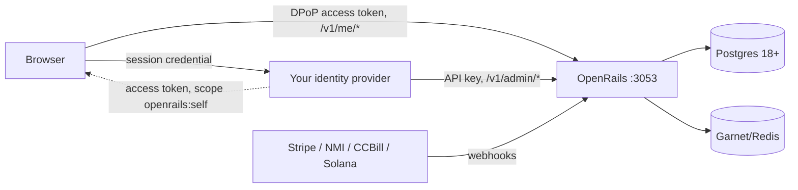

# Standalone Integration Guide

How to deploy OpenRails as its own self-hosted HTTP service and integrate your
application against it; `examples/standalone` is the runnable quickstart. Money
is an integer in the currency's native units (`GET /v1/config`'s `currencies`;
micros for USD), a decimal string on the wire ([money-wire.md](money-wire.md)). Vocabulary:
a **rail** is a gateway kind (`nmi`, `ccbill`,
`stripe`, `solana`); a **PSP** is your concrete account on a rail (e.g. `mobius`
on nmi) — declared under `merchants.<slug>.psps.<key>`, with its `rail:`.


```mermaid
flowchart LR
    B[Browser] -- session credential --> H[Your identity provider]
    H -. access token, scope openrails:self .-> B
    B -- DPoP access token, /v1/me/* --> OR[OpenRails :3053]
    H -- API key, /v1/admin/* --> OR
    OR --> PG[(Postgres 18+)]
    OR --> RD[(Garnet/Redis)]
    R[Stripe / NMI / CCBill / Solana] -- webhooks --> OR
```

### Deployment

**Evaluation.** The compose stack runs everything zero-config:

```bash
task docker-up                                # Postgres + Garnet(Redis) + migrate + OpenRails
curl http://localhost:3053/health/ready       # readiness: dependencies, local workers, AuthKit verifier
```

Host ports (all bound to 127.0.0.1): OpenRails `:3053`, Postgres `:5434`,
Redis `:6380`. The server applies its migrations at boot. Everything — public catalog,
`/v1/me/*` self-service, `/v1/admin/*`, and webhooks — shares the one port;
there is no separate private/service listener.

**Production needs:**

- **Postgres 18+.** OpenRails owns one schema (`database.schema` /
  `DATABASE_SCHEMA`, default `billing`); it can share your app's database. The
  server creates or upgrades its tables at boot; `openrails migrate up` does it
  ahead of a rollout.
- **A Redis-compatible service** (we recommend Garnet) — optional, backs
  rate limiting. If omitted or unreachable, limits are in-memory per-process
  and readiness remains green.
- **HashiCorp Vault** — optional. Two independent uses: KV storage for merchant
  secrets (`secret_backend: vault`) and Transit signing for Solana custody. See
  [vault.md](vault.md).

**Configuration** is a `config.yaml` (see `config.example.yaml` for the full
surface: listener, db, redis, auth issuer, encryption, vault, rate limits,
trusted proxies, captcha, admin console) plus an environment overlay: an env var
maps onto the config tree by prefix, e.g. `DB_URL` → `db.url`,
`PROVIDER_WRITE_MODE` → `provider_write_mode`, `SECRET_BACKEND` →
`secret_backend`. For the two operating dials there are also CLI flags.
Precedence: **flag beats env beats yaml.**

Security defaults apply in sandbox and live deployments. Narrow local auth
exceptions must be explicit; provider posture does not relax storage, issuer,
signing or trusted-proxy requirements.

```bash
openrails run-server --config /etc/openrails/config.yaml \
  --provider-write-mode full --test-mode live
```

**Required configuration** (config validation refuses boot otherwise):

- `provider_write_mode: full | limited | readonly` — how much OpenRails may do
  against the rails (see [operations.md](operations.md) for the full matrix;
  `limited` parks system-initiated writes like dunning, `readonly` blocks all
  provider writes at the wire). Declare it explicitly; unset internal policy fails closed to `readonly`.
- `test_mode: sandbox | live` — the credential axis, orthogonal to the above.
  `sandbox` routes every rail to its test environment and refuses live
  credentials at boot (live Stripe keys rejected, NMI accounts probed), so no
  real money can move. `live` similarly refuses Stripe test keys in every
  environment rather than silently disabling the rail. Sandbox is allowed in
  every environment — credential validation, not the env string, keeps it
  honest.
- An `https` `auth.issuer`.
- **Credential custody**: explicitly select `secret_backend: snapshot`, `vault`,
  or `db`. Managed DB storage requires `ENCRYPTION_MASTER_KEY` (base64, 32-byte
  AES-256) even in sandbox. Snapshot credentials stay in process memory.
- Behind a load balancer, set `trusted_proxies` to its CIDR range or
  `X-Forwarded-For` is ignored and rate limiting keys on the LB's address.

### Credential custody and configuration publication

Merchant metadata lives in PostgreSQL. `secret_backend` selects snapshot, Vault
or encrypted DB credential custody. The server mounts the admin API and the
merchant's configuration, guarded by its merchant persona's permissions:
`server.MerchantRead` for reads, `server.MerchantWrite` for actions on
customers, `server.MerchantAdmin` for the configuration (PSPs, settings,
catalog edits, billing import and export). Credential mutation additionally
requires a writable backend.

Startup initializes missing identities and metadata and reloads snapshot values.
It preserves subsequent API edits and archived providers. Explicit metadata
applications carry a stable ID and revision precondition; managed credentials use
separate publication operations. See [metadata applications](merchant-configuration-applications.md).

Catalogs always use database state. Catalog mutations over HTTP (the remote
Client included) follow the merchant's source: with `secret_backend: vault` or
`db` (managed through the API) they are allowed; with `snapshot` (the files are
the truth) they are refused read-only (`403 catalog_updates_disabled`). Reads
remain available.
Trusted operator application is still permitted and uses durable application IDs
so an unchanged artifact does not overwrite later edits. This does not change
provider permissions, sandbox/live posture, or `provider_write_mode`.

Snapshot walkthrough (file layout, YAML secret overlays via
`merchant_manifest_overlays`, rotation): [self-hosting-mode1.md](self-hosting-mode1.md).

### First run

Three file-backed manifests drive provisioning (example shapes:
`config/bootstrap.example.yaml`, `config/merchants_config.example.yaml`,
`config/catalog.example.yaml`). Every push command shares one **mutation-flag
contract**: with no flags it is **plan-only** (prints a terraform-style diff,
mutates nothing); `--insert` creates missing state, `--overwrite` updates
existing state, `--prune` removes target extras absent from the manifest. The
flags compose; full reconciliation is `--insert --overwrite --prune`.

On an empty install, in order:

```bash
# 1. AuthKit root authority: initial operator user(s) + trusted remote apps.
#    First-run only when applied at startup; explicit here.
openrails push-auth-bootstrap --config /etc/openrails/config.yaml --file /etc/openrails/bootstrap.yaml

# 2. Merchants: identity, profile, PSPs (rail accounts + secrets), and your
#    app's issuer registered as merchant OWNER (the manifest's
#    remote_application block).
openrails push-merchant-config --config /etc/openrails/config.yaml --file /etc/openrails/merchants.yaml --insert

# 3. Catalog: products, entitlements, prices and validated provider bindings.
#    Provider creation and mutation use their separate workflows.
openrails apply-catalog --merchant your-merchant --config /etc/openrails/config.yaml --file /etc/openrails/catalog.yaml
```

Startup loads a configured merchant snapshot into process memory and initializes
missing metadata. Existing API edits and archived accounts survive restarts.
AuthKit bootstrap is first-run only; catalog application is always explicit.
Use metadata applications for deliberate versioned configuration changes.

**Create an API key.** Backend credentials are merchant-scoped API keys
(`openrails_st_…`) minted through the merchant surface:

```
POST /v1/merchant/api-keys   {"name": "backend", "role": "owner"}
```

Roles are fixed: `viewer` (reads, `server.MerchantRead` — right for LLM agents),
`support` (also acts on customers, `server.MerchantWrite`), `owner` (also the
merchant's configuration, `server.MerchantAdmin`). Minting needs AuthKit's
credentials-manage permission on the merchant (owner-only), so authenticate
the mint with an access token from the issuer you registered in step 2
(issuer-as-owner: its tokens administer exactly that one merchant), an
operator session from the bootstrap user, or the admin console
(`admin_console.enabled`). The secret is returned **exactly once** in the mint
response and is never retrievable again. `GET /v1/merchant/api-keys` lists,
`DELETE /v1/merchant/api-keys/{id}` revokes. Details:
[merchant-provisioning.md](merchant-provisioning.md).

### Backend integration

**Go SDK** — the root module's `openrails.Client`, identical interface to
embedded mode:

```go
client, err := openrails.NewRemote("https://openrails.example",
    openrails.WithAPIKey(os.Getenv("OPENRAILS_API_KEY")), // or WithTokenProvider for minted JWTs
    openrails.WithMerchantID(merchantID),                 // the merchant its calls act on
    openrails.WithTimeout(2*time.Second), // per-call deadline; default 2s
)
if err != nil { log.Fatal(err) }         // static config: bad URL, no credential
if _, err := client.GetMerchantConfiguration(ctx); err != nil { // authenticated boot probe
    log.Fatal(err) // unreachable, bad key — fail fast
}

verdicts, err := client.Admit(ctx, []billing.AdmitParams{{
    RequestID:       requestID, // idempotency key
    CustomerID:      billing.CustomerID(customerID), // the host's subject UUID
    Invoker:         userID,
    InvokerType:     billing.InvokerTypeDelegated,
    Currency:        "USD",
    EstimatedAmount: 50_000,    // native units (USD: micros)
    ExpiresAt:       &deadline, // required with a hold: the job's deadline
}})
receipt, err := client.CaptureAdmission(ctx, requestID, billing.CaptureAdmissionParams{
    Amount: 43_000, Usage: &billing.CaptureUsage{EventType: "chat.completion"},
})
// or client.ReleaseAdmissions(ctx, []string{requestID}) if the work failed
```

Options: `WithAPIKey`, `WithTokenProvider` (per-call minted bearer),
`WithMerchantID` ([choosing the merchant](client-merchant-selection.md)),
`WithTimeout`, `WithHTTPClient`. Every request carries its own currency. The
constructor validates static configuration without I/O; `Ready` checks
reachability, and any authenticated call proves the credential.

**Errors** are canonical sentinels (`errors.Is` works identically against a
remote or embedded engine): `ErrUnauthorized`, `ErrInvalid`, `ErrDenied`,
`ErrNotFound`, `ErrConflict`, `ErrInsufficientCredits` (402),
`ErrPaymentRefused` (402 `card_declined` / `payment_method_stale`),
`ErrInternal`, and `ErrUnreachable` — which wraps transport failures,
timeouts, and 5xx. Every server error is a `*StatusError` carrying the HTTP
status and wire code/message ([api/errors.md](api/errors.md)). Identifiers are typed (`billing.CustomerID`,
`ProductID`, `PriceID`, `SubscriptionID`, `PaymentID`, `PaymentMethodID`,
`CheckoutAttemptID`): a zero id, or a blank, whitespace or dot key, is refused
by the Client before any request with the same `400 invalid_param`
`StatusError` the server returns for a malformed identifier, so embedded and
remote callers observe one error.

**Fail-open vs fail-closed for admission:** key your policy off
`ErrUnreachable`. A clean deny (`allowed=false`, or `ErrInsufficientCredits`)
is a real verdict — always honor it. `ErrUnreachable` means OpenRails could
not answer: fail-open (serve the request, reconcile later) keeps your product
up when billing is down, fail-closed protects against unmetered spend — choose
per endpoint cost. Keep `WithTimeout` short so a slow OpenRails cannot stall
your hot path.

**Any other stack** calls the same HTTP surface with the API key:

```bash
# Pre-authorize + hold atomically before doing expensive work
curl -X POST https://openrails.example/v1/admin/admissions \
  -H "Authorization: Bearer openrails_st_..." \
  -d '{"items":[{"customer_id":"...","invoker":"user-123","estimated_amount":"50000",
       "expires_at":"2026-09-16T12:00:00Z","request_id":"req-789"}]}'

# Settle at real cost…
curl -X POST https://openrails.example/v1/admin/admissions/req-789/capture \
  -H "Authorization: Bearer openrails_st_..." \
  -d '{"amount":"43000","usage":{"event_type":"chat.completion"}}'

# …or release the hold when the work failed
curl -X POST https://openrails.example/v1/admin/admissions/release \
  -H "Authorization: Bearer openrails_st_..." \
  -d '{"request_ids":["req-789"]}'
```

The `/v1/admin/*` surface (admissions, credits, entitlements, usage,
settings, customers, payments, subscriptions) is gated per route by its
permission — see [api/routes.md](api/routes.md) for every route with its permission and
[api/endpoints.md](api/endpoints.md) for the conventions. Keys are bound to their merchant and can never act on
another merchant's data.

### Frontend integration

Your users' browsers call OpenRails' self-service surface (`/v1/me/*`:
entitlements, subscriptions, payment methods, checkout sessions, invoices) **directly**, using
a short-lived, DPoP-bound access token with scope `openrails:self` that your
identity provider mints for OpenRails — your session tokens never leave your
trust domain. The token contract and checkout flows are in
[frontend-integration.md](frontend-integration.md); the trust model is in
[auth.md](auth.md). CORS requires zero configuration (see below).

### Trusted issuers: staff, machines and customers

Your identity provider lets your staff, admin UI, machines and customers call
OpenRails directly, without OpenRails holding accounts for them. OpenRails is an
OAuth 2.0 resource server: it accepts RFC 9068 access tokens (`typ: at+jwt`)
that a trusted issuer minted for this deployment's resource identifier (`aud`).
A merchant's manifest `remote_application` is a trusted issuer for that
merchant too, within its owner role; it needs `resource_server` declared.

```yaml
resource_server:
  identifier: https://openrails.example.com
  dpop_nonce_key: ""            # >= 32 bytes, the same on every replica
  trusted_issuers:
    - name: example
      issuer: https://example.com/auth   # keys from <issuer>/.well-known/jwks.json, or pin them with keys:
      merchants: [example]
      permissions: ["merchant:*"]        # the ceiling
      allowed_origins: [https://admin.example.com]
```

- `scope` selects the surface: `openrails:merchant` for the admin API and
  `GET /v1/merchants` (the merchants the token reaches, with its role and
  permissions there), `openrails:self` for a customer's own billing
  (`/v1/me/*`, DPoP-bound, `sub` a UUID: the customer's id). Another scope is
  answered `403 insufficient_scope`.
- A token's `permissions` claim is what it grants, within the issuer's ceiling
  (`permissions`), on the issuer's `merchants` only. A token never names its
  merchant: it acts for the one the request selects (`OpenRails-Merchant`), or
  the issuer's only merchant. An issuer that cannot mint OpenRails permissions
  maps the roles in its tokens' `roles` claim to merchant roles with
  `group_roles` (`owner`, `support`, `viewer`).
- A token with `sub` equal to its `client_id` is a machine acting for itself.
- Your console signs staff in at the issuer: register a public client with the
  redirect URI `<console URL>/callback` (authorization code and refresh, DPoP)
  and set `admin_console.issuer` to the issuer and its `client_id`. OpenRails'
  own sign-in is off unless you set `local_sign_in: true`.
- A sensitive operation (one that moves money or grants access) needs the
  token's `auth_time` within 15 minutes; otherwise `403 step_up_required`
  (metadata `max_age: 0`) asks the client to re-authorize.
- Staff your issuer grants nothing are invited by email:
  `POST /v1/merchant/federated-grants {"email","role"}` (owners). The invitee
  signs in at an issuer trusted for the merchant, lists
  `GET /v1/merchants/invites` and accepts `POST /v1/merchants/invites/{id}/accept`
  with a token carrying that `email` and `email_verified: true`. The role then
  joins the token's own permissions, within the ceiling, until
  `DELETE /v1/merchant/federated-grants/{id}`.
- A token bound to a DPoP key (`cnf.jkt`) is accepted only with
  `Authorization: DPoP <token>` and a fresh proof carrying the server nonce; the
  first proof without one is answered `401 use_dpop_nonce` with a `DPoP-Nonce`
  header to retry with.
- Browsers on `allowed_origins` may call the admin API across origins.
  Credentials mode stays off: tokens travel in the `Authorization` and `DPoP`
  headers, never cookies.
- Refusals: `access_token_issuer_unknown` (untrusted `iss`),
  `access_token_invalid` (signature, audience or lifetime), `credential_expired`,
  `access_token_merchant_not_bound` (another merchant), `insufficient_scope`,
  `permission_required`.

These tokens, merchant API keys and the control plane's own sessions answer the
same `openrails.Auth` contract an embedded host implements, through the same
route gate: a token's `sub` is the subject (a user), and its invoker; a client
acting for itself and an API key are an application subject. Customer routes
take the customer only from the subject. A trusted issuer's user token is vouched
for by its issuer: the standalone server asks it for no recent sign-in.

### Webhooks

Point each rail's webhook directly at OpenRails — not through your app:

```
POST https://openrails.example/v1/webhooks/{rail}/{account_id}
```

OpenRails resolves the merchant from the PSP account in the path, verifies the
rail's signature
with that merchant's own signing secret, and updates
subscriptions/entitlements; your app just reads the results. For local rail
sandboxes see [dev/local-webhooks.md](dev/local-webhooks.md).

**Per-merchant API hosts.** A multi-merchant deployment can give each
merchant a canonical hostname (the owner claims it with `PUT /v1/admin/api-host`
and proves control of the domain with a TXT record, then
`POST /v1/admin/api-host/verify`; operators bind directly with the
server's `SetMerchantAPIHost`). It resolves live on the next request, no restart.
The public routes then resolve the merchant from the Host header, and every
merchant-scoped route enforces Host-merchant == issuer-merchant: a token minted
for merchant A is rejected on merchant B's host even though it verifies.

**CORS** is a fixed, engine-wide policy — not configurable, no origin
registration: browser-facing tiers (checkout, `/v1/me/*`)
answer `Access-Control-Allow-Origin: *` (never with credentials — OpenRails
issues no cookies; every browser call is an explicit bearer token), and every
other surface (admin API, webhooks, admin) emits no CORS headers at all.

### Building on the server package

The `openrails` binary is a command line over
`github.com/open-rails/openrails/server`, a module of its own released with the
library under the same version. A product that serves many merchants with
OpenRails' own accounts builds on the same package:

```bash
go get github.com/open-rails/openrails/server@vX.Y.Z
go install github.com/open-rails/openrails/server/cmd/openrails@vX.Y.Z   # the binary
```

```go
srv, err := server.New(ctx, server.Config{
    Engine:      openrails.Config{TestMode: openrails.Live, ProviderWriteMode: openrails.ProviderWritesFull},
    Auth:        server.AuthConfig{Issuer: "https://billing.example.com", KeysPath: "/vault/auth"},
    LocalSignIn: true,
}, server.Deps{Engine: openrails.Deps{Postgres: pool, Redis: rdb}})
if err != nil {
    return err
}
return srv.Run(ctx) // serves Addr (default :3053) and runs the workers until ctx ends
```

`server.New` composes three parts as any host of the library does: the engine
(`openrails.New`); the server's own AuthKit client, its tables created or
upgraded and its routes mounted at the issuer's path; and the multi-merchant
control plane (merchant provisioning and names, teams, merchant API keys,
federated grants, trusted issuers, fleet analytics). The engine's routes are
gated by the server's own `openrails.Auth`: it accepts merchant API keys, the
server's sessions and trusted issuers' access tokens, and resolves the merchant
each acts for.

| `server.Config` | Meaning |
|---|---|
| `Engine` | The engine's `openrails.Config`. `Engine.Catalog` is refused: each merchant manages its catalog through the API. |
| `Auth` | The server's AuthKit: `Issuer` (required), signing keys, `Naming`, its tables' `Schema` (default `profiles`), development allowances. |
| `Registration`, `LocalSignIn`, `PasswordlessLogin`, `PasswordlessAutoRegistration` | Who may create accounts and sign in at the server itself. Without `LocalSignIn` people sign in at a trusted issuer. |
| `FrontendBaseURL`, `TrustedProxies`, `CloudflareProxies`, `AuthRateLimits` | AuthKit's emailed links, client-IP posture and rate limits. |
| `MerchantCreation` | Lets signed-in users create merchants: reserved names, a pattern and a free allowance. |
| `ResourceServer` | The trusted issuers whose access tokens the admin API accepts (above). |
| `AdminConsole`, `ConsoleIssuer` | The admin console; `ConsoleIssuer` signs staff in to it at a trusted issuer. |
| `Addr` | Where `Run` listens; default `:3053`. |

`server.Deps` holds the engine's `openrails.Deps` (`Engine`), AuthKit's
senders (`SMS`; `AuthEmail` for your own templates, else AuthKit's mail is
rendered and sent through the engine's sender) and `HasVaultedPaymentMethod`,
which unlocks merchant creation beyond the free allowance.

`Run` serves `Handler` and runs the workers; `Serve` serves without them. A
product with its own router mounts `Routes` instead (the surface without
health routes, plus customer surfaces with their own `Auth`; one without a
`Merchant` serves the merchant each request selects, which its `Auth` reads
with `openrails.RequestMerchant`) and composes
`RiverJobs` into its River fleet before `Start(ctx,
openrails.WithRiverClient(fleet))`. The operator's operations are methods of
the server: `ProvisionMerchant`, `SetMerchantAPIHost`,
`ListMerchantsForSubject`, `ListActiveMerchantIDs`, `ListUserMerchants`,
`ResolveAuthorizedMerchant`, `ResolveMerchantForGroup`, `HasRootPermission`,
`EnsureCustomerPermissionGroup`, `FleetAnalytics`, `FleetTimeseries`,
`ListMerchantRetirementCandidates`, `RetireUnusedMerchant`,
`CompletePendingMerchantRetirements`, `SubjectHasVaultedPaymentMethod` and
`AuthenticateUser`. `AuthKit` is the server's AuthKit client and `Client` the
engine.

### Upgrades and ops

Each new version applies its migrations as it boots; replicas booting together
take turns, and one whose migration fails crash-loops while the old version
keeps serving. For everything
operational — the `provider_write_mode` matrix, cutover onto production
credentials (boot `limited`, inspect `openrails intents`, then raise to
`full`), the durable provider-intent ledger, `pull-provider` reconciliation,
and dunning — see [operations.md](operations.md).
